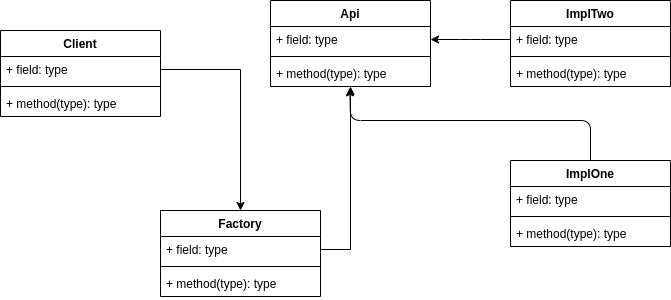

# 一. 创建型模式之简单工厂
---

- 学习简单工厂
- 一：简单工厂模式的介绍-定义、结构、参考实现、场景问题
- 二：简单工厂模式的典型疑问与优缺点评价
- 三：简单工厂模式的应用案例与思考

## 1.1 接口？ 什么是针对接口编程？
---

- 接口从语法层面上来说，是一种特殊的抽象类，是一个纯虚的类。从软件设计的意义上来说，我们通常用接口来定义实现类的外观，就相当于一份契约，根据外部应用需要的功能，约定了实现类应该要实现的功能。
- 软件开发中永恒的主题是“变化”，“只有变化才是永恒不变”，接口最重要的一个设计语义就是封装变化。所谓“封装变化”就是隔离变化。
- 从软件的整体结构上看，只要接口不变，内部实现的变化就不会影响到外部应用，从而使得系统更灵活，且有更好的扩展性和可维护性。

### 1.1.1 场景
---

- 比如，通常的，我们设计了一组API，一个程序需要使用这些API完成功能。我们如何规划API的设计？


### 1.1.2 简单工厂的定义

---

- 提供一个创建对象实例的功能，而无需关心其具体实现。被创建的类型可以是接口、抽象类，也可以是具体类。

<B>设计</B>

<div align=center>
    
</div>

<B>分析</B>

> ImplOne和ImplTwo两个具体的实现类继承Api，Api是一个接口，定义了一个纯虚函数test()。Factory负责Api派生类的创建，根据不同的type创建不同的Api派生类，返回的对象是一个Api指针，指向Api的派生类。
>
> 在这种设计中，如果添加一个新的派生类，客户端不需要知道派生类的具体实现，通过传递指定的type，即可获得指向新派生类的对象指针。Factory需要添加对新派生类的支持，根据指定的type创建一个指向新派生类的对象。这种设计基本实现了“接口不变，内部实现的变化“的原则。
>
> 使用场景：传入参数1，可以实现从数据库读入的功能；传入参数2，可以实现从文本文件读入的功能。新添加一个修改的功能，客户端只需要做简单的修改，createF()传入3，即可实现修改数据库的功能，由Factory和ImplThree去做具体实现。隔离了变化。
>
> 如果不使用简单工厂模式，那么客户端需要`Api* pApi = new ImpleThree()` 才能获得新的功能。
>
> 实现了客户端调用和ImplOne，ImplTwo的解耦合，Factory类实现了变化隔离。
>
> 以上的设计，客户端和工厂的唯一关联是需要通过输入不同的type值去得到不同的功能。是一个低耦合的设计，但不是完全解耦合。

<B>示例如下：</B>

```cpp
#include <string>
#include <iostream>

class Api
{
public:
    virtual void test(std::string s) = 0;
protected:
    Api() {}
};


class ImpleOne : public Api {
public:
    void test(std::string s) override {
        std::cout << "ImpleOne::test() " << s << std::endl;    
    }
};


class ImpleTwo : public Api {
public:
    void test(std::string s) override {
        std::cout << "ImpleTwo::test() " << s << std::endl;    
    }
};


class Factory       // 负责实现类的创建
{
public:
    static Api* createApi(int type)
    {
        Api* pApi = nullptr;
        if (type == 1)
        {
            pApi = new ImpleOne();
        }
        if (type == 2)
        {
            pApi = new ImpleTwo();
        }
        return pApi;
    }
};


/**
 * 使用场景：
 * 传入参数1，可以实现从数据库读入的功能
 * 传入参数2，可以实现从文本文件读入的功能
*/

int main(void)
{
    Api* pApi = Factory::createApi(1);  // 客户端，还是知道工厂的细节
    pApi->test("SimpleFactor");
    return 0;
}

// 实现了客户端调用和ImplOne，ImplTwo的解耦合。
// Factory类实现了变化隔离，但
```

以上工厂设计实现了主程序与具体实现类的解耦合，但不是完全的解耦合，因为工厂类和具体实现类之间还存在依赖关系，客户端还是需要知道工厂的细节。

<B>需求:</B> 能否做到完全解耦合，以上方法灵活实现，想要ImpleOne就返回ImplOne，想要ImpleTwo就返回ImplTwo。就像下面一样：

```cpp
static Api* createApi()
{
    return new ImpleOne();  // ImplOne, ImplTwo? 想要返回什么就返回什么？
}
```

<B>实现方法：动态创建</B>

实现流程：

1. 设计工厂类

```cpp
typedef void* (*Constructor) ();    // 仿函数

class CObjectFactory
{
public:
    static void registerClass(std::string className, Constructor constructor) {
        constructors()[className] = constructor;
    }

    static void* createObject(const std::string& className) {
        Constructor constructor = nullptr;
        if (constructors().find(className) != constructors().end()) {
            constructor = constructors().find(className)->second;
        }
        if (constructor == nullptr)
            return nullptr;
        return (*constructor)();
    }
private:
    // string->key：动态创建的类的类名，value是构建
    inline static std::map<std::string, Constructor>& constructors() {
        static std::map<std::string, Constructor> instance;
        return instance;
    }
};
```

> 以上设计一个工厂类CObjectFactory，通过registerClass可以注册新的实现类，通过createObject可以创建需要的派生类对象。

再来看看如何注册新的派生类：

```cpp
class ImpleTwoHelper {
public:
    ImpleTwoHelper() {
        CObjectFactory::registerClass("ImpleTwo", ImpleTwoHelper::createObjFunc);
    }
    static void* createObjFunc() {
        return new ImpleTwo;
    }
};

class ImpleOneHelper {
public:
    ImpleOneHelper() {
        CObjectFactory::registerClass("ImpleOne", ImpleOneHelper::createObjFunc);
    }
    static void* createObjFunc() {
        return new ImpleOne;
    }
};
```

上面是一个派生类的创建辅助类，这个程序由新建派生类的时候实现，它的构造函数调用了工厂类的注册函数来将该派生类注册到工厂类的map中。


客户端使用：

```cpp
ImpleTwo* pTwo = static_cast<ImpleTwo*>(ImpleTwoHelper::createObjFunc());
pTwo->test("SimpleFactor");

ImpleOneHelper impleOneHelper;
ImpleTwoHelper impleTwoHelper;

ImpleTwo* pTwo = static_cast<ImpleTwo*>(CObjectFactory::createObject("ImpleTwo"));
pTwo->test("RegClass");
ImpleOne* pOne = static_cast<ImpleOne*>(CObjectFactory::createObject("ImpleOne"));
pOne->test("RegClass");

// 上述两种使用方式都可以通过工厂获得派生类对象，需要注意：派生类的Helper以及派生类都由派生类创建者自己完成，这样就可以实现工厂与客户端完全解耦。
```

上述设计，已经完成了客户端与工厂的完全解耦，但我们可以设计的更方便一些，使用宏来代替派生类的Helper类，这样派生类创建者直接省了一个Helper类，客户端使用也方便了：

```cpp
#define REG_CLASS(class_name) \
class class_name##Helper { \
public: \
    class_name##Helper() { \
        CObjectFactory::registerClass(#class_name, class_name##Helper::createObjFunc); \
    } \
    static void* createObjFunc() { \
        return new class_name; \
    }\
}; \
class_name##Helper class_name##helper;
```

客户端使用：

```cpp
REG_CLASS(ImpleOne);
REG_CLASS(ImpleTwo);

int main2(int argc, char* argv[])
{
    ImpleTwo* pTwo = static_cast<ImpleTwo*>(CObjectFactory::createObject("ImpleTwo"));
    pTwo->test("RegClass");
    ImpleOne* pOne = static_cast<ImpleOne*>(CObjectFactory::createObject("ImpleOne"));
    pOne->test("RegClass");
    return 0;
}
```

通过使用宏，已经完成了工厂类与客户端的完全解耦合，但是还未能实现客户端与派生类之间的完全解耦合，因为客户端需要知道派生类创建者创建的派生类对象：

```cpp
class AutoFactory
{
public:
    static Api* createApi() {
        Api* pApi = nullptr;
        pApi = static_cast<Api*>(CObjectFactory::createObject("ImpleTwo"));
        return pApi;
    }
};

int main(int argc, char* argv[])
{
    Api* pApi = AutoFactory::createApi();
    pApi->test("AutoFactory");
    return 0;
}
```

> 上面的设计已经完成实现了客户端和派生类之间的完全解耦合，和工厂也实现了完全解耦合。但是有一个疑惑，这样设计的话，AutoFactory只能让客户端获取一个派生类对象，而无法获取多个派生类对象，如果需要获取多个派生类对象，那么就需要在客户端创建多个AutoFactory类，这样就违背了设计。
> 可以看到AutoFactory是通过一个字符串来确定获取的派生类对象，那么可以使用配置文件的方式来动态修改获取的派生类对象，这样就可以实现获取多个派生类对象。

---


# 二. 创建型模式之单例模式

学习单例模式

1. 单例模式的介绍-定义、结构、参考实现、场景问题
2. 单例模式的典型疑问与优缺点评价：饿汉、懒汉与多线程安全
3. 单例的应用案例与思考：缓存

比如：程序中的配置文件，需要一个对象来读取配置文件，如果设计为整个程序有且仅有一个对象来读取配置文件，则效率会高很多。

## 1. 首先看一个基本的单例模式：

```cpp
#include <iostream>

class Singleton
{
private:
    Singleton() {
        m_singer = NULL;
        std::cout << "构造一个Singleton对象" << std::endl;
    }
public:
    // 懒汉式交互，在调用的时候才开始创建对象，延迟加载
    // 缺点：线程不安全，多个线程时，容易被创建多个线程
    static Singleton* getInstance() {
        if (m_singer == NULL) {
            m_singer = new Singleton;
        }
        return m_singer;
    }
private:
    static Singleton *m_singer;
};

Singleton* Singleton::m_singer = NULL; // new Singleton; 在c++中，构造函数不是线程安全的

int main(int argc, char* argv[])
{
    // Singleton *p = new Singleton;   // error, inaccessible
    Singleton *p1 = Singleton::getInstance();
    Singleton *p2 = Singleton::getInstance();

    std::cout << "&p1 = " << p1 << std::endl;
    std::cout << "&p2 = " << p2 << std::endl;
    printf("p1 = %x, p2 = %x\n", p1, p2);

    /*
    result:
       
    */
    return 0;
}
```

运行结果：

```bash
构造一个Singleton对象
&p1 = 0x556cd1f41eb0
&p2 = 0x556cd1f41eb0
p1 = d1f41eb0, p2 = d1f41eb0
```

> 上述示例是一个基本的单例模式，同时单例模式根据创建的时机可分为：懒汉式和饿汉式。上述示例是一个懒汉式单例模》式，即在调用的时候才开始创建对象，延迟加载。
>
> 基本的懒汉式单例模式存在线程不安全的问题，即多个线程同时调用getInstance()方法时，可能被创建多个对象。如下所示：


## 2. 懒汉式线程不安全示例

---


```cpp
#include <iostream>
#include <thread>

class Singleton
{
private:
    Singleton() {
        m_singer = NULL;
        std::cout << "构造一个Singleton对象" << std::endl;
    }
public:
    // 懒汉式交互，在调用的时候才开始创建对象，延迟加载
    // 缺点：线程不安全，多个线程时，容易被创建多个线程
    static Singleton* getInstance() {
        if (m_singer == NULL) {
            m_singer = new Singleton;
        }
        return m_singer;
    }
private:
    static Singleton *m_singer;
};

Singleton* Singleton::m_singer = NULL; // new Singleton; 在c++中，构造函数不是线程安全的

void constructorSingleton(int i) {
    std::cout << "ptr of single: " << Singleton::getInstance() << ", i = " << i << std::endl;
}

int main(int argc, char* argv[])
{
    for (int i = 0; i < 10; i++) {
        std::thread t(constructorSingleton, i);
        t.detach();
    }

    getchar();

    return 0;
}
```

运行结果：

```bash
构造一个Singleton对象
ptr of single: 0x7f2b58000f70, i = 0
ptr of single: 0x7f2b58000f70, i = 2
ptr of single: 0x7f2b58000f70, i = 3
造一个Singleton对象
ptr of single: 0x7f2b50000b60, i = 4
ptr of single: 0x7f2b58000f90, i = 7
ptr of single: 0x7f2b58000f90, i = 5
构构造一个Singleton对象
ptr of single: 0x7f2b40000b60, i = 6
ptr of single: 0x7f2b50000b60
ptr of single: 0x7f2b58000f90, i = 7
构造一个Singleton对象
ptr of single: 0x7f2b40000b60, i = 8
ptr of single: 0x7f2b40000b60, i = 9
```

> 从结果中可以看到，存在多个不同的Singleton对象。在实际项目中，这是一个很致命的问题，工程中使用 double check 来保证线程安全。


## 3. Double check解决懒汉式线程安全问题

```cpp
#include <iostream>
#include <thread>
#include <mutex>

std::mutex mux;

class Singleton
{
private:
    Singleton() {
        m_singer = NULL;
        std::cout << "构造一个Singleton对象" << std::endl;
    }
public:
    // 懒汉式：double check，临界区保护
    static Singleton* getInstance() {
        if (m_singer == NULL) {
            mux.lock();
            if (m_singer == NULL) {
                m_singer = new Singleton;
            }
            mux.unlock();
        }
        return m_singer;
    }
private:
    static Singleton *m_singer;
};

Singleton* Singleton::m_singer = NULL; // new Singleton; 在c++中，构造函数不是线程安全的

void constructorSingleton(int i) {
    std::cout << "ptr of single: " << Singleton::getInstance() << ", i = " << i << std::endl;
}

int main(int argc, char* argv[])
{
    for (int i = 0; i < 10; i++) {
        std::thread t(constructorSingleton, i);
        t.detach();
    }

    getchar();

    return 0;
}
```

运行结果：

```bash
构造一个Singleton对象
ptr of single: 0x7ff6c0000f70, i = 0
ptr of single: 0x7ff6c0000f70, i = 1
ptr of single: 0x7ff6c0000f70, i = 2
ptr of single: 0x7ff6c0000f70, i = 3
ptr of single: 0x7ff6c0000f70, i = 4
ptr of single: 0x7ff6c0000f70, i = 5
ptr of single: 0x7ff6c0000f70, i = 6
ptr of single: 0x7ff6c0000f70, i = 7
ptr of single: 0x7ff6c0000f70, i = 8
ptr of single: 0x7ff6c0000f70, i = 9
```

> 从结果中可以看到整个过程只构建了一个对象，使用互斥锁来保护临界区。Double check中第一个check是用来给创建完对象后，跳出尝试创建对象，第一次check是线程不安全的；第二次check是当对象还未创建时，使用互斥锁避免重复创建对象。
> 
> 为什么不是一次check，使用互斥锁保护第一次check。这样会导致效率很低，即使已经创建了对象，但是由于互斥锁的存在，导致其他线程无法访问，会导致效率低下。


## 4. 单例模式中-饿汉式

代码示例：

```cpp
#include <iostream>

class Singleton
{
private:
    Singleton() {
        m_singer = NULL;
        std::cout << "构造一个Singleton对象" << std::endl;
    }
public:
    // 懒汉式交互，在调用的时候才开始创建对象，延迟加载
    // 缺点：线程不安全，多个线程时，容易被创建多个线程
    static Singleton* getInstance() {
        if (m_singer == NULL) {
            m_singer = new Singleton;
        }
        return m_singer;
    }
private:
    static Singleton *m_singer;
};

Singleton* Singleton::m_singer = new Singleton; // 饿汉式

void constructorSingleton(int i) {
    std::cout << "ptr of single: " << Singleton::getInstance() << ", i = " << i << std::endl;
}

int main(int argc, char* argv[])
{

    for (int i = 0; i < 10; i++) {
        std::thread t(constructorSingleton, i);
        t.detach();
    }

    getchar();


    return 0;
}
```

运行结果如下：

```cpp
构造一个Singleton对象
ptr of single: 0x55a2fb235eb0, i = 0
ptr of single: 0x55a2fb235eb0, i = 1
ptr of single: 0x55a2fb235eb0, i = 2
ptr of single: 0x55a2fb235eb0, i = 3
ptr of single: 0x55a2fb235eb0, i = 4
ptr of single: 0x55a2fb235eb0, i = 5
ptr of single: 0x55a2fb235eb0, i = 7
ptr of single: 0x55a2fb235eb0, i = 6
ptr of single: 0x55a2fb235eb0, i = 8
ptr of single: 0x55a2fb235eb0, i = 9
```

> 如上所示：在没有使用double check的情况下，饿汉式单例模式依然不会错误的生成多个对象。这是因为饿汉式在对象调用之前就已经生成了对象，不会出现多个线程争抢临界区的的可能。


## 5. 单例模式的扩展与工程应用-缓存

> 既然我们可以控制全局生成一个对象，那么有没有需要生成一个以上的对象呢？
>
> 解决策略： 缓存设计与Singleton的扩展
>

先来看一个使用缓存保存单例对象的例子：

### 5.1 缓存-单例

```cpp
// 回避多线程的安全问题
#include <iostream>
#include <map>
#include <stdio.h>

class Singleton;
static std::map<std::string, Singleton*> myMap = std::map<std::string, Singleton*>();

// 懒汉-延迟加载
class Singleton
{
private:
    Singleton() {
        m_singer = NULL;
        std::cout << "单例正在被构建" << std::endl;
    }
public:
    static Singleton* getInstance() {
        if (myMap.find(DEFAULT_KEY) != myMap.end())
            return myMap.find(DEFAULT_KEY)->second;
        if (m_singer == NULL) {
            m_singer = new Singleton;
            myMap[DEFAULT_KEY] = m_singer;
        }
        return m_singer;
    }
private:
    static Singleton* m_singer;
    static std::string DEFAULT_KEY;
};

Singleton* Singleton::m_singer = NULL;
std::string Singleton::DEFAULT_KEY = "One";


int main(int argc, char* argv[])
{
    Singleton* p1 = Singleton::getInstance();
    Singleton* p2 = Singleton::getInstance();

    std::cout << "&p1 = " << p1 << ", &p2 = " << p2 << std::endl;

    return 0;
}
```

运行结果：

```bash
单例正在被构建
&p1 = 0x55e7d4d30eb0, &p2 = 0x55e7d4d30eb0
```

> 单例对象被保存在map容器中。


### 5.2 多个单例对象实现

在下面例子中，使用map来保存多个单例对象。

```cpp
#include <string>
#include <iostream>
#include <map>

// 缓存的实例个数
const static int NUM_MAX = 5;
class Singleton;
static std::map<int, Singleton*> myMap = std::map<int, Singleton*>();

class Singleton
{
private:
    Singleton() {
        m_singer = NULL;
        std::cout << "正在构建Singleton" << std::endl;
    }
public:
    static Singleton* getInstance() {
        m_singer = myMap[m_InstanceCount];

        if (m_singer == NULL) {
            m_singer = new Singleton;
            myMap[m_InstanceCount] = m_singer;
        }
        m_InstanceCount++;
        if (m_InstanceCount > NUM_MAX) {
            m_InstanceCount = 1;
        }
        return m_singer;
    }
private:
    static Singleton *m_singer;
    static int m_InstanceCount; // 存放实例的个数
}; 

Singleton* Singleton::m_singer = NULL;
int Singleton::m_InstanceCount = 1;

int main(int argc, char* argv[])
{
    Singleton* p1 = Singleton::getInstance();
    Singleton* p2 = Singleton::getInstance();
    Singleton* p3 = Singleton::getInstance();
    Singleton* p4 = Singleton::getInstance();
    Singleton* p5 = Singleton::getInstance();

    printf("p1 = %x, p2 = %x, p3 = %x, p4 = %x, p5 = %x\n", p1, p2, p3, p4, p5);

    Singleton* p6 = Singleton::getInstance();
    Singleton* p7 = Singleton::getInstance();
    Singleton* p8 = Singleton::getInstance();
    Singleton* p9 = Singleton::getInstance();
    Singleton* p10 = Singleton::getInstance();

    printf("p6 = %x, p7 = %x, p8 = %x, p9 = %x, p10 = %x\n", p6, p7, p8, p9, p10);

    getchar();
    return 0;
}
```

运行结果：

```bash
正在构建Singleton
正在构建Singleton
正在构建Singleton
正在构建Singleton
正在构建Singleton
p1 = 80629ef0, p2 = 8062a360, p3 = 8062a3c0, p4 = 8062a420, p5  = 8062a480
p6 = 80629ef0, p7 = 8062a360, p8 = 8062a3c0, p9 = 8062a420, p10 = 8062a480
```

> 可以看到，多个单例模式在超出最大缓存数量之后会重复利用对象。