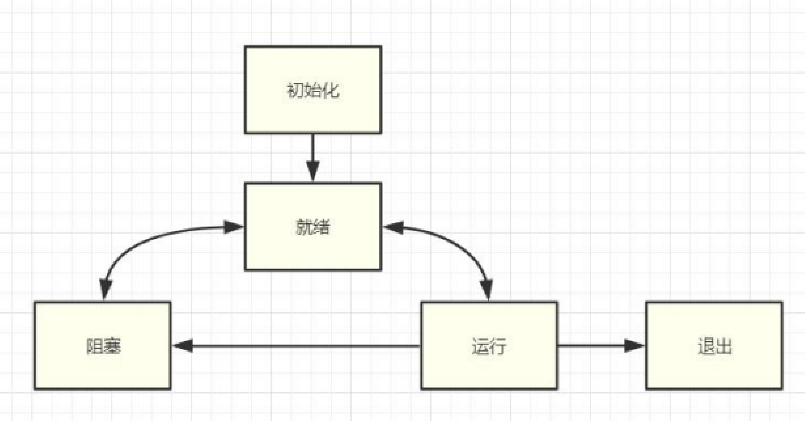
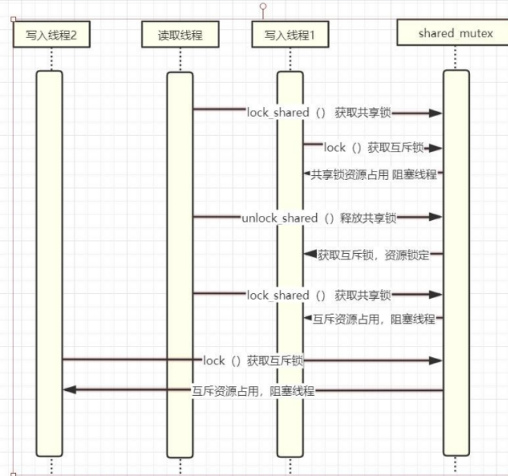

<div align="center">
    
</div>


# C++11 14 17多线程从原理到线程池实战

---

## 一. 为什么要用多线程

1. 任务分解

> 耗时的操作，任务分解，实时响应；


2. 数据分解

> 充分利用多核CPU处理数据

3. 数据流分解

> 读写分离，解耦合设计

## 二. C++11多线程快速入门

### 1. 多线程示例

```c++
#include <thread>
#include <iostream>

using namespace std;

void ThreadMain()
{
    cout << "Begin ThreadMain" << endl;
    cout << "ThreadMain ID = " << std::this_thread::get_id() << endl;
    for (int i = 0; i < 10; i++)
    {
        cout << "in thread " << i << endl;
        this_thread::sleep_for(chrono::seconds(1)); // 睡眠1秒钟
    }
    
}

int main(int argc, char* argv[])
{
    cout << "main thread ID = " << std::this_thread::get_id() << endl;
    // 线程创建启动
    std::thread th(ThreadMain);
    cout << "begin wait sub thread!" << endl;
    th.join();   // 阻塞等待子线程退出
    cout << "end wait sub thread!" << endl;
    return 0;
}
```

CMakeLists.txt 文件配置：

```cmake
cmake_minimum_required(VERSION 3.1)
project(first_thead)

set(CMAKE_CXX_STANDARD 11)

find_package(Threads REQUIRED)

add_executable(first_thread 101first_thread.cpp)

target_link_libraries(first_thread Threads::Threads)
```

<B>PS:</B> `th.join()` 阻塞等待子线程退出

创建线程对象，同时把处理函数传递给线程对象，调用`join()`方法阻塞等待线程退出。注意：线程对象创建的时候会自动启动线程，不需要调用`start()`方法。

### 2. std::thread 对象生命周期和线程等待和分离

对于线程函数，以及头文件如下：

```c++
#include <thread>
#include <iostream>

using namespace std;

void ThreadMain()
{
    std::cout << "begin ThreadMain ID = " << std::this_thread::get_id()  << std::endl;
    for (int i = 0; i < 10; i++)
    {
        std::cout << "in thread " << i << std::endl;
        std::this_thread::sleep_for(std::chrono::seconds(1));
    }
    std::cout << "end ThreadMain ID = " << std::this_thread::get_id()  << std::endl;
    
}
```

CMakeLists.txt 文件配置：

```cmake
cmake_minimum_required(VERSION 3.1)
project(thread_detach VERSION 0.1.0)

set(CMAKE_CXX_STANDARD 11)

find_package(Threads REQUIRED)

add_executable(thread_detach 102thread_detach.cpp)

target_link_libraries(thread_detach Threads::Threads)
```

示例1：

```c++
int main(int argc, char *argv[])
{
    // 示例1
    {   // 大括号结束之后，th这个线程对象就被系统自动销毁了，但此时子线程已经被执行了且没有执行完。
        std::thread th(ThreadMain); // 出错，thread对象被销毁，子线程还在运行
    }
    // 出现错误：
    // terminate called without an active exception
    // Aborted (core dumped)

    return 0;
}
```

执行结果如下所示：

```bash
terminate called without an active exception
Aborted (core dumped)
```

分析：

> 程序中，大括号结束之后，th这个线程对象就被系统自动销毁了，但此时子线程已经被执行了且没有执行完。解决方案：使用`join()`函数等待子线程执行完再销毁。

示例2：`join()`方法

```c++
// 示例2
{   // 使用join()函数，会等待子线程执行完，大括号里面的内容才算结束，所以在子线程执行完之前，线程对象th不会被销毁。
    std::thread th(ThreadMain);
    this_thread::sleep_for(std::chrono::seconds(1));
    is_exit = true; // 通知子线程退出
    std::cout << "主线程阻塞，等待子线程退出！" << std::endl;
    th.join();  // 主线程会被阻塞，等待子线程退出
    std::cout << "子线程已经退出！" << std::endl;
}
```

> 这种情况，程序可以正常执行，但依然存在一个问题，主程序被阻塞了，只有子线程执行完，主线程才会继续执行。解决方案：使用`detach()`让子线程和主线程分离，这样，主线程可以继续执行，子线程独立运行。

示例3：`detach()`方法

```c++
// 示例3
{   // 子线程与主线程分离
    thread th(ThreadMain);
    th.detach();    // 子线程与主线程分离，相当于守护线程
}
// 存在的问题：就得保证子线程不能去访问主线程的资源，否则会有错误。
// 解决方案：1.子线程不访问主线程的资源 2.用一个全局变量去通知子线程，主线程要退出了。
```

> 这种情况，大括号执行完之后，因为子线程和子线程分离了，所以不存在因为线程对象被销毁而导致子线程无法运行的情况。但是依然存在一个问题：主线程退出后，子线程不一定退出。如果子线程要访问主线程的资源就会发生错误，即使不访问主线程的资源在程序退出的时候依然会有错误。最好的解决方案就是：用一个全局变量去通知子线程，主线程要退出了。

示例4：`detach()`方法改进

```c++
bool is_exit = false;

void ThreadMain()
{
    std::cout << "begin ThreadMain ID = " << std::this_thread::get_id()  << std::endl;
    for (int i = 0; i < 10; i++)
    {
        if (is_exit) break;
        std::cout << "in thread " << i << std::endl;
        std::this_thread::sleep_for(std::chrono::seconds(1));
    }
    std::cout << "end ThreadMain ID = " << std::this_thread::get_id()  << std::endl;
    
}

int main(int argc, char *argv[])
{
    // 示例3
    {   // 子线程与主线程分离
        thread th(ThreadMain);
        th.detach();    // 子线程与主线程分离，相当于守护线程
    }

    return 0;
}
```

至此，就可以比较完美的解决线程分离的问题。


完整文件：

```cpp
#include <thread>
#include <iostream>

using namespace std;

bool is_exit = false;

void ThreadMain()
{
    std::cout << "begin ThreadMain ID = " << std::this_thread::get_id()  << std::endl;
    for (int i = 0; i < 10; i++)
    {
        if (is_exit) break;
        std::cout << "in thread " << i << std::endl;
        std::this_thread::sleep_for(std::chrono::seconds(1));
    }
    std::cout << "end ThreadMain ID = " << std::this_thread::get_id()  << std::endl;
    
}

int main(int argc, char *argv[])
{
    // 示例1
    {   // 大括号结束之后，th这个线程对象就被系统自动销毁了，但此时子线程已经被执行了且没有执行完。
        // std::thread th(ThreadMain); // 出错，thread对象被销毁，子线程还在运行
    }
    // 出现错误：
    // terminate called without an active exception
    // Aborted (core dumped)

    // 示例3
    {   // 子线程与主线程分离
        thread th(ThreadMain);
        th.detach();    // 子线程与主线程分离，相当于守护线程
    }
    // 存在的问题：主线程退出后，子线程不一定退出。就得保证子线程不能去访问主线程的资源，否则会有错误。
    // 解决方案：1.子线程不访问主线程的资源 2.用一个全局变量去通知子线程，主线程要退出了。

    // 示例2
    {   // 使用join()函数，会等待子线程执行完，大括号里面的内容才算结束，所以在子线程执行完之前，线程对象th不会被销毁。
        std::thread th(ThreadMain);
        this_thread::sleep_for(std::chrono::seconds(1));
        is_exit = true; // 通知子线程退出
        std::cout << "主线程阻塞，等待子线程退出！" << std::endl;
        th.join();  // 主线程会被阻塞，等待子线程退出
        std::cout << "子线程已经退出！" << std::endl;
    }
    // 此时存在的问题是主线程会被阻塞。

    // getchar();

    return 0;
}
```


### 3. C++11线程创建的多种方式和参数传递

#### 1). 普通全局函数作为线程入口

<B>如何传递参数</B>

基于模板函数，优点：任何类型都可以传递。

<B>头文件</B>

1. 值传递

```c++
#include <thread>
#include <iostream>
#include <string>

class Para
{
public:
    Para() { std::cout << "Create Para" << std::endl; }
    Para(const Para& p) { std::cout << "Copy Para" << std::endl; this->name = p.name; }  // 拷贝构造函数
    ~Para() { std::cout << "Drop Para " << std::endl; }
    std::string name;
};


void ThreadMain(int p1, float p2, std::string str, Para p4)
{
    std::this_thread::sleep_for(std::chrono::milliseconds(100));    // 延时 100ms，等待大括号结束，float f2局部变量注销, 这个时候因为是拷贝的参数，所以不会有影响
    std::cout << "ThreadMain: " << p1 << " " << p2 << " " << str << " " << p4.name << std::endl;
}

int main(int argc, char* argv[])
{
    std::thread th;
    {
        float f2 = 12.1f;
        Para p;
        p.name = "test Para class";
        // 所有参数据做复制
        th = std::thread(ThreadMain, 101, f2, "test string para", p);   // 在这里参数的传递是复制
    }
    th.join();

    /*
        三次拷贝：
            1. main函数里面，大括号内，把声明的Para对象p给std::thread()构造函数形参时，会产生一次拷贝；
            2. 回调的时候，会将std::thread()函数的p拷贝到ThreadMain()函数的形参p4
            3. 还有一次是什么？？？？
            我这里出现了1次构造，3次拷贝，4次析构
    */
    return 0;
}
```

运行结果如下：

```bash
Create Para
Copy Para
Copy Para
Drop Para 
Drop Para 
Copy Para
ThreadMain: 101 12.1 test string para test Para class
Drop Para 
Drop Para 
```

可以发现，在std::thread()函数里面发生了3次拷贝，1次构造，4次析构，为什么会有3次拷贝呢？？？

<span style="background-color:red"><B>为什么是3次拷贝？</B></div>

2. 传递引用和指针变量

```cpp
#include <thread>
#include <iostream>
#include <string>

class Para
{
public:
    Para() { std::cout << "Create Para" << std::endl; }
    Para(const Para& p) { std::cout << "Copy Para" << std::endl; this->name = p.name; }  // 拷贝构造函数
    ~Para() { std::cout << "Drop Para " << std::endl; }
    std::string name;
};

// 指针传递
void ThreadMainPtr(Para* p)
{
    std::this_thread::sleep_for(std::chrono::milliseconds(100)); 
    std::cout << "ThreadMainPtr: " << p->name << std::endl;
}

// 引用传递
void ThreadMainRef(Para& p)
{
    std::this_thread::sleep_for(std::chrono::milliseconds(100)); 
    std::cout << "ThreadMainPtr: " << p.name << std::endl;
}

int main(int argc, char* argv[])
{
    {
        // 传递引用
        Para p;
        p.name = "test ref";
        std::thread th(ThreadMainRef, std::ref(p)); // 为什么要使用std::ref()，因为这里是一个回调，系统无法确定p的类型，如果是普通函数，则可以直接使用p
        th.join(); // 等待线程结束，主线程阻塞
    }

    getchar();

    {
        Para p;
        p.name = "test ThreadMainPtr name";
        std::thread th(ThreadMainPtr, &p);
        th.join();  // 等待线程结束，主线程阻塞
    }

    return 0;
}
```

<B>参数传递的一些坑</B>

> 传递空间已经销毁
> 多线程共享访问一块空间
> 传递的指针变量的生命周期小于线程

```cpp
{
    // 传递线程指针
    Para p;
    p.name = "test ThreadMainPtr name";
    std::thread th(ThreadMainPtr, &p);  // 错误，线程访问的p空间会提前释放
    th.detach();
}
// Para 已经释放了
// ThreadMainPtr: �        �Vtr name // 乱码，
```

上面的例子，传递的指针变量的生命周期小于线程。

运行结果如下;

```bash
Create Para
Drop Para 
ThreadMainPtr: P�{�Utr name
```

会出现乱码！

使用成员函数作为线程入口，可以保证参数的生命周期与线程生命周期相同。


#### 2). 成员函数作为线程入口

<B>接口调用和参数传递</B>

```cpp
#include <thread>
#include <iostream>
#include <string>

class MyThread
{
public:
    // 入口线程函数
    void Main()
    {
        std::cout << "MyThread Main " << name << ":" << age << std::endl;
    }
    string name;
    int age = 100;
};

int main(int argc, char* argv[])
{
    MyThread myth;
    myth.name = "Test name 001";
    myth.age = 20;
    std::thread th(&MyThread::Main, &myth); // myth是对象地址
    th.join();
    return 0;
}
```

<B>PS：</B>使用成员函数作为线程入口，`std::thread th(&MyThread::Main, &myth)`，第一个参数是类名::成员函数地址，第二个参数是对象指针。

<B>线程基类封装</B>

```cpp
#include <thread>
#include <iostream>
#include <string>

/*
    设计一个基类，完成线程的启动，停止，等待退出功能
    基类中三个实现的虚函数：Start(), Stop(), Wait()
    线程的业务，在基类函数中，用纯虚函数定义接口
    子类继承父类，并实现业务函数：Main()
*/
class XThread
{
public:
    virtual void Start()
    {
        is_exit_ = false;
        th_ = std::thread(&XThread::Main, this);    
    }
    
    // 设计一个stop函数，线程未完成强制退
    virtual void Stop()
    {
        is_exit_ = true;
        Wait();
    }

    // 必须要一个等待线程，等待线程结束，否则会有段错误：terminate called without an active exception
    virtual void Wait()
    {
        if (th_.joinable()) // 可以join说明程序还未退出
            th_.join();
    }

    bool is_exit() { return is_exit_; }
private:
    virtual void Main() = 0;    // 纯虚函数，派生类必须要实现
    std::thread th_;
    bool is_exit_ = false;
};

class TestXThread : public XThread
{
public:
    void Main() override // override关键字，在编译阶段就可以检查是否父类有相应的函数，检测重写
    {
        std::cout << "TestXThread Main" << std::endl;
        while (!is_exit())  // 上面已经完成业务，等待手动/延时退出
        {
            std::this_thread::sleep_for(std::chrono::milliseconds(100));
            std::cout << "." << std::flush;
        }
    }
    std::string name;
};

int main(int argc, char* argv[])
{

    TestXThread testTh;
    testTh.name = "TestXThread name";
    testTh.Start();
    // getchar();  // 等待，手动退出线程
    std::this_thread::sleep_for(std::chrono::seconds(1)); // 等待，手动退出线程
    testTh.Stop();  // 线程退出
    testTh.Wait();
    return 0;
}
```

<B>PS：</B> override关键字，在子类中用来标识这个函数是重写函数，在编译阶段编译器就会去检测是否父类中该虚函数。


#### 3). lambda 临时函数作为线程入口函数

> lambda 函数，其基本格式如下
> [捕捉列表](参数) mutable -> 返回值类型 {函数体}

mutable关键字: 如果需要在const成员方法中修改一个成员变量的值，那么需要将这个成员变量修饰为mutable。即用mutable修饰的成员变量不受const成员方法的限制。

```cpp
#include <thread>
#include <iostream>
#include <string>


class TestLambda
{
public:
    void Start()
    {
        std::thread th([this]() {std::cout << "name = " << name << std::endl; });
        th.join();
    }
    std::string name = "test lambda";
};

int main(int argc, char* argv[])
{
    std::thread th([](int i) { std::cout << "test lambda " << i << std::endl; }, 123);
    th.join();

    TestLambda test;
    test.Start();

    return 0;
}
```


## 三. 多线程通信和同步

### 3.1 多线程状态

#### 3.1.1 线程状态说明

- 初始化(Init)：该线程正在被创建
- 就绪(Ready)：该线程在就绪列表中等待CPU调度。
- 运行(Running)：该线程正在运行。
- 阻塞(Blocked)：该线程被阻塞挂起。Blocked状态包括：pend(锁、事件、信号量等阻塞)、suspend(主动 pend)、delay(延时阻塞)、pendtime(因为锁、事件、信号量时间等超时等待)。
- 退出(Exit)：该线程运行结束，等待父线程回收其控制块资源。

<div align="cener">
    
</div>

#### 3.1.2 竞争状态(Race Condition)和临界区(Critical Section)

> 竞争状态（Race Condition）

多线程同时读写共享数据

> 临界区

读写共享数据的代码片段。

避免竞争状态策略，对临界区进行保护，同时只能有一个线程进入临界区。

### 3.2 互斥体和锁 mutex

#### 3.2.1 互斥锁 mutex

- 不用锁的情况演示
- 期望输出一整段内容
- lock 和 try_lock()
- unlock()

先来看一个没有互斥锁的情况：

```cpp
#include <thread>
#include <iostream>
#include <string>
#include <mutex>

static std::mutex  mux;

void TestThread()
{
    std::cout << "================================" << std::endl;
    std::cout << "test 001" << std::endl;
    std::cout << "test 002" << std::endl;
    std::cout << "================================" << std::endl;
    mux.unlock();
}


int main(int argc, char* argv[])
{
    // 开 10 个线程，运行上面函数
    for (int i = 0; i < 10; ++i)
    {
        std::thread th(TestThread);
        th.detach();
    }

    return 0;
}
```

运行结果如下所示：

```bash
================================================================
test 001
test 002
================================

test 001
test 002
================================
================================================================
================================test 001
test 002

================================
test 001
test 002
================================

test 001
test 002
================================
================================
test 001
test 002
================================================================
================================test 001
================================
test 001

test 002
================================

test 001
test 002
================================
test 002
================================
test 001
test 002
================================
================================
```

线程函数中的输出存在不能完整输出的情况，因为此时有10个线程在竞争这些资源。

加上互斥锁的情况：

```cpp
#include <thread>
#include <iostream>
#include <string>
#include <mutex>

static std::mutex  mux;

void TestThread()
{

    // 获取锁资源，如果没有则阻塞等待，lock()保护的代码块就是临界区
    // 尽管申请，尽早释放，临界区越小越好
    mux.lock(); // 一旦有资源，进入就绪状态，等待cpu调度
    std::cout << "================================" << std::endl;
    std::cout << "test 001" << std::endl;
    std::cout << "test 002" << std::endl;
    std::cout << "test 003" << std::endl;
    std::cout << "================================" << std::endl;
    mux.unlock();
}


int main(int argc, char* argv[])
{
    // 开 10 个线程，运行上面函数
    for (int i = 0; i < 10; ++i)
    {
        std::thread th(TestThread);
        th.detach();
    }

    getchar();

    return 0;
}
```

运行结果如下：

```bash
================================
test 001
test 002
test 003
================================
================================
test 001
test 002
test 003
================================
================================
test 001
test 002
test 003
================================
================================
test 001
test 002
test 003
================================
================================
test 001
test 002
test 003
================================
================================
test 001
test 002
test 003
================================
================================
test 001
test 002
test 003
================================
================================
test 001
test 002
test 003
================================
================================
test 001
test 002
test 003
================================
================================
test 001
test 002
test 003
================================
```

lock()函数保护的代码块就是临界区，每个线程访问时都会去尝试拿互斥锁，拿到后才能运行临界区的代码，否则线程进入阻塞状态，继续等待资源。

再看看try_lock()的情况：

```cpp
#include <thread>
#include <iostream>
#include <string>
#include <mutex>

static std::mutex  mux;

void TestThread()
{
    for(;;)
    {
        // 获取锁资源，如果没有则阻塞等待，lock()保护的代码块就是临界区
        // 尽晚申请，尽早释放，临界区越小越好
        // mux.lock(); // 一旦有资源，进入就绪状态，等待cpu调度
        // lock()在没获取到资源的时候，就会退出，没有资源消耗。
        // try_lock() 会有资源消耗，所以try_lock()之后必须得等待一段时间，不然会把资源消耗完。
        // try_lock() 的优势，尝试去锁，如果没有获取到锁，也可以做一些操作，比如：休眠、刷新页面等。
        if (!mux.try_lock())
        {
            std::cout << "." << std::flush;
            std::this_thread::sleep_for(std::chrono::milliseconds(100));
            continue;
        }
        std::cout << "================================" << std::endl;
        std::cout << "test 001" << std::endl;
        std::cout << "test 002" << std::endl;
        std::cout << "test 003" << std::endl;
        std::cout << "================================" << std::endl;
        mux.unlock();
        std::this_thread::sleep_for(std::chrono::milliseconds(100));    // 睡眠一会儿，防止资源被消耗完。
    }
}


int main(int argc, char* argv[])
{
    // 开 10 个线程，运行上面函数
    for (int i = 0; i < 10; ++i)
    {
        std::thread th(TestThread);
        th.detach();
    }

    getchar();

    return 0;
}
```

10个线程都进入for循环里面，10个线程同时竞争互斥锁。使用try_lock()去尝试获取锁，如果没有获取到锁，则进行休眠100ms，相当于间隔100ms尝试获取一次锁，不需要太频繁的去获取锁。同时try_lock()相比lock()会有资源消耗，所以需要休眠100ms，否则容易将资源消耗完。


#### 3.2.2 互斥锁的坑_线程抢占不到资源

上面例子中，理论上：1个线程抢占了资源，其他9个线程都在等待。等这个线程运行完之后释放锁，其他9个线程的其中一个可以获取到锁，进入就绪状态等待CPU调度。

但现实中，有可能出现，1个线程抢占了资源，另外9个线程都在等待。这个线程执行完释放锁后，又再次获取到锁了，又继续运行，从而可能出现只有一个线程在运行，其他9个线程一直在等待。

代码如下：

```cpp
#include <thread>
#include <iostream>
#include <string>
#include <mutex>

static std::mutex  mux;

void ThreadMainMux(int i)
{
    for(;;)
    {
        mux.lock();
        std::cout << i << "[in]" << std::endl;
        std::this_thread::sleep_for(std::chrono::seconds(1));
        mux.unlock();
    }
}

int main(int argc, char* argv[])
{
    for (int i = 0; i < 3; ++i)
    {
        std::thread th(ThreadMainMux, i+1);
        th.detach();
    }

    getchar();

    return 0;
}
```

运行结果，如下所示：

```bash
1[in]
1[in]
1[in]
1[in]
1[in]
1[in]
1[in]
1[in]
1[in]
1[in]
1[in]
1[in]
1[in]
1[in]
1[in]
1[in]
1[in]
1[in]
1[in]
1[in]
1[in]
1[in]
1[in]
1[in]
1[in]
1[in]
```

在这个运行过程中，始终只有一个线程能获取得到互斥锁。线程1在unlock()之后又进入了lock()并获得了资源。

改进方式：

```cpp
#include <thread>
#include <iostream>
#include <string>
#include <mutex>

static std::mutex  mux;

void TestThread()
{
    for(;;)
    {
        // 获取锁资源，如果没有则阻塞等待，lock()保护的代码块就是临界区
        // 尽晚申请，尽早释放，临界区越小越好
        // mux.lock(); // 一旦有资源，进入就绪状态，等待cpu调度
        // lock()在没获取到资源的时候，就会退出，没有资源消耗。
        // try_lock() 会有资源消耗，所以try_lock()之后必须得等待一段时间，不然会把资源消耗完。
        // try_lock() 的优势，尝试去锁，如果没有获取到锁，也可以做一些操作，比如：休眠、刷新页面等。
        if (!mux.try_lock())
        {
            std::cout << "." << std::flush;
            std::this_thread::sleep_for(std::chrono::milliseconds(100));
            continue;
        }
        std::cout << "================================" << std::endl;
        std::cout << "test 001" << std::endl;
        std::cout << "test 002" << std::endl;
        std::cout << "test 003" << std::endl;
        std::cout << "================================" << std::endl;
        mux.unlock();
        std::this_thread::sleep_for(std::chrono::milliseconds(100));    // 睡眠一会儿，防止资源被消耗完。
    }
}

void ThreadMainMux(int i)
{
    for(;;)
    {
        mux.lock();
        std::cout << i << "[in]" << std::endl;
        std::this_thread::sleep_for(std::chrono::seconds(1));
        mux.unlock();
        // unlock() 之后，一定要留一部分时间，给系统处理时间。让当前线程还来不及去抢占互斥锁，给其他线程更多的机会能获取到互斥锁。
        std::this_thread::sleep_for(std::chrono::milliseconds(1));
    }
}
```

 unlock() 之后，留一部分时间，给系统处理时间。让当前线程还来不及去抢占互斥锁，给其他线程更多的机会能获取到互斥锁。


 #### 3.2.3 超时锁应用 timed_mutex(避免长时间死锁)

 - 可以记录锁获取情况，多次超时，可以记录日志，获取错误情况。

 隔一段时间去尝试获取一下锁，长时间抢占失败后，记录日志。

 try_lock() + sleep(), 在C++17之后，有一个函数：`try_lock_for(milliseconds(1000))`可以完成这两个操作。

 ```cpp
#include <thread>
#include <iostream>
#include <string>
#include <mutex>

std::timed_mutex tmux;
void ThreadMainTime(int i)
{
    for (;;)
    {
        if (tmux.try_lock_for(std::chrono::milliseconds(5000)))
        {
            std::cout << i << "[try_lock_for timeout]" << std::endl;
            continue;
        }
        std::cout << i << "[in]" << std::endl;
        tmux.unlock();
        std::this_thread::sleep_for(std::chrono::milliseconds(1));
    }
}

int main(int argc, char* argv[])
{
    for (int i = 0; i < 3; ++i)
    {
        std::thread th(ThreadMainTime, i+1);
        th.detach();
    }
    getchar();

    return 0;
}
 ```


#### 3.2.4 递归锁(可重入)recursive_mutex和recursive_timed_mutex用于业务组合

- 同一个线程中的同一把锁可以锁多次，避免了一些不必要的死锁；
- 组合业务 用到同一个锁

正常情况下，一个互斥锁只能lock()一次。
调用多次lock()时，会出现阻塞等待锁的情况；递归锁可进行多次lock()，每次lock()，计数器+1，一个lock() 对应一个unlock()。

```cpp
#include <thread>
#include <iostream>
#include <string>
#include <mutex>

std::recursive_mutex rmux;
void Task1()
{
    rmux.lock();
    std::cout << "task1 [in]" << std::endl;
    rmux.unlock();
}

void Task2()
{
    rmux.lock();
    std::cout << "task2 [in]" << std::endl;
    rmux.unlock();
}

void ThreadMainRec(int i)
{
    for (;;)
    {
        // 在这个业务流程中，希望Task1()和Task2()以及中间的业务一起执行。如果是互斥锁，则要求Task1()在获取互斥锁之前必须先被释放。
        // 在释放后，就会存在一个问题：在释放时可能会被其他线程抢占资源，从而导致Task1()、Task2()以及中间的业务不能一块执行。
        rmux.lock();
        // rmux.unlock();  // 如果是互斥锁，在这里要执行unlocck()，否则Task1()里面将进入死锁。
        Task1();    // 在Task1()里面又进行了一次lock()，相当于可重入锁。
        std::cout << i << "[in]" << std::endl;
        std::this_thread::sleep_for(std::chrono::seconds(2));   // 延迟 2 s
        Task2();
        rmux.unlock();
        std::this_thread::sleep_for(std::chrono::milliseconds(1));
    }
}

int main(int argc, char* argv[])
{
    for (int i = 0; i < 3; ++i)
    {
        std::thread th(ThreadMainRec, i+1);
        th.detach();
    }
    getchar();

    return 0;
}
```

> 在这个业务流程中，希望Task1()和Task2()以及中间的业务一起执行。如果是互斥锁，则要求Task1()在获取互斥锁之前必须先被释放。
> 
> 在释放后，就会存在一个问题：在释放时可能会被其他线程抢占资源，从而导致Task1()、Task2()以及中间的业务不能一块执行。

#### 3.2.5 共享锁 shared_mutex

- c++14 共享超时互斥锁 shared_timed_mutex
- c++17 共享互斥 shared_mutex
- 如果只有写时需要互斥，读取时不需要，用普通的锁的话如何做？
- 按照如下代码，读取只有一个线程进入，在很多业务场景中，没有充分利用 cpu 资源。

使用场景：
    一个线程要读资源，一个线程要写入资源；多个线程读资源的时候，可同时读取资源，但是多个线程写入资源就会存在问题。

    只要有一个线程在写，则其他所有的线程不能读也不能写；
    相反，有一个线程在读，则其他所有线程可以读，但都不能写；一定要等所有线程读完才能写。

<div align="center">
    
</div>

示例：

```cpp
#include <thread>
#include <iostream>
#include <string>
#include <mutex>
#include <shared_mutex>

std::shared_timed_mutex stmux;

void ThreadRead(int i)
{
    for (;;)
    {
        stmux.lock_shared();
        std::cout << i << " Read" << std::endl;
        std::this_thread::sleep_for(std::chrono::milliseconds(500));
        stmux.unlock_shared();
        std::this_thread::sleep_for(std::chrono::milliseconds(1));
    }
}

void ThreadWrite(int i)
{
    for (;;)
    {
        stmux.lock_shared();
        // 读取数据
        stmux.unlock_shared();
        stmux.lock();   // 互斥锁 写入
        std::cout << i << " Write" << std::endl;
        std::this_thread::sleep_for(std::chrono::milliseconds(100));
        stmux.unlock();
        std::this_thread::sleep_for(std::chrono::milliseconds(1));

    }
}

int main(int argc, char* argv[])
{
    for (int i = 0; i < 3; ++i)
    {
        std::thread th(ThreadWrite, i+1);
        th.detach();
    }
    for (int i = 0; i < 3; ++i)
    {
        std::thread th(ThreadRead, i+1);
        th.detach();
    }
    
    getchar();
    return 0;
}
```

可以发现，shared_time_mutex中既有共享锁(lock_shared()，unlock_shared())也有互斥锁(stmux.lock(), unlock())。在读写共享内存业务时，可以利用共享锁。

### 3.3 利用栈特性自动释放锁 RAII

#### 3.3.1 什么是RAII，手动代码实现

> RAII(Resource Acquisition Is Initialization) C++之父Bjarne Stroustrup提出；使用局部对象来管理资源的技术称之为资源获取即初始化；它的生命周期是由操作系统来管理的，无需人工介入；资源的销毁容易忘记，造成死锁或内存泄漏。

<B>手动实现RAII管理mutex资源</B>


#### 3.3.2 C++11支持的RAII管理互斥锁资源 lock_guard

- c++11 实现严格基于作用域的互斥体所有权包装器；
- adopt_lock C++11类型为adopt_lock_t，假设调用方已拥有互斥的所有权；
- 通过{}控制锁的临界区

```cpp
#include <thread>
#include <iostream>
#include <string>
#include <mutex>
#include <shared_mutex>

// RAII
class XMutex
{
public:
    XMutex(std::mutex &mux) : mux_(mux)
    {
        std::cout << "Lock" << std::endl;
        mux.lock();
    }
    ~XMutex()
    {
        std::cout << "Unlock" << std::endl;
    }
private:
    std::mutex& mux_;// 应用在初始化的时候就需要赋值
};

static std::mutex mux;
void TestMutex(int status)
{
    // 这个锁被传入XMutex对象中，并且在构造函数中被lock(),因此其他任意对象函数都无法再获取该锁。只有XMutex生命周期结束，其他对象和函数才有可能获取到该锁。
    // 局部对象来管理资源。
    XMutex lock(mux);
    if (status == 1)
    {
        std::cout << "=1" << std::endl;
        return;
    }
    else
    {
        std::cout << "!=1" << std::endl;
        return;
    }
}

int main(int argc, char* argv[])
{
    TestMutex(1);
    TestMutex(2);
    
    getchar();
    return 0;
}
```

上述代码中，展示的是C++11中lock_guard的实现，通过局部对象来管理资源。

下面看看lock_guard的使用：

```cpp
#include <thread>
#include <iostream>
#include <string>
#include <mutex>
#include <shared_mutex>

static std::mutex gmutex;
void TestLockGuard(int i)
{
    gmutex.lock();
    {
        // std::lock_guard<std::mutex> lock(gmutex);    // 会报错，因为锁已经在外面被占用了
        // 已经拥有锁，不会lock()
        std::lock_guard<std::mutex> lock(gmutex, std::adopt_lock);
        // 结束释放锁
    }

    {   // 这个锁只作用于当前作用域
        std::lock_guard<std::mutex> lock(gmutex);
        std::cout << "begin thread " << i << std::endl;
    }
    for (;;)
    {
        {// 这个锁只作用于当前作用域
            std::lock_guard<std::mutex> lock(gmutex);
            std::cout << "In " << i << std::endl;
        }
        std::this_thread::sleep_for(std::chrono::milliseconds(500));
    }
    // lock_guard可以避免频繁的lock和unlock，同时可以更好的控制临界区
}

int main(int argc, char* argv[])
{
    for (int i = 0; i < 3; i++) {
        std::thread th(TestLockGuard, i+1);
        th.detach();
    }
    getchar();

    return 0;
}
```

lock_guard可以实现使用局部变量控制临界区，局部变量的作用域就是临界区的范围。同时，`std::lock_guard<std::mutex> lock(gmutex, std::adopt_lock);`可以实现如果已经拥有锁，不会lock()，并且在结束后会释放锁。


#### 3.3.3 unique_lock c++11

需求：把一个锁赋给另一个锁；或者，临时释放锁。

- unique_lock C++11 实现可移动的互斥体所有权包装器
- 支持临时释放锁 unlock
- 支持 adopt_lock（已经拥有锁，不加锁，出栈区会释放）
- 支持 defer_lock（延后拥有，不加锁，出栈区不释放）
- 支持 try_to_lock 尝试获得互斥的所有权而不阻塞，获取失败退出栈区不会释放，通过 owns_lock() 函数判断
- 支持超时参数，超时不拥有锁。


unique_lock示例：

```cpp
#include <thread>
#include <iostream>
#include <string>
#include <mutex>
#include <shared_mutex>

int main(int argc, char* argv[])
{

    {
        static std::mutex mux;
        {
            std::unique_lock<std::mutex> lock(mux);
            lock.unlock();
            // 临时释放锁
            lock.lock();
        }

        {   // std::adopt_lock
            // 已经拥有锁，不锁定，退出解锁
            mux.lock();
            std::unique_lock<std::mutex> lock(mux, std::adopt_lock);    // std::adopt_lock：已经拥有锁，则不上锁，退出时会释放锁
        }

        {   // std::defer_lock
            // 延后加锁，不拥有，退出不解锁
            std::unique_lock<std::mutex> lock(mux, std::defer_lock);
            lock.lock();
            // 适用场景：
            //      本次处理完之后，要加锁
        }

        {   // std::try_to_lock
            // mux.lock(); // not owns_lock
            // 尝试加锁 不阻塞 失败不拥有锁
            std::unique_lock<std::mutex> lock(mux, std::try_to_lock);
            if(lock.owns_lock())
            {
                std::cout << "owns_lock" << std::endl;
            }
            else
            {
                std::cout << "not owns_lock" << std::endl;
            }
        }
    }
    getchar();

    return 0;
}
```

#### 3.3.4 shared_lock c++14

shared_lock C++14 实现可移动的共享互斥体所有权封装器
```cpp
explicit shared_lock(mutex_type& m) : _Pmtx(_STD addressof(_Mtx)), _Owns(true) {
    _Mtx.lock_shared(); // 最终还是调用了共享锁
}
```

使用示例：

```cpp
int main(int argc, char* argv[])
{
    {
        // 共享锁
        static std::shared_timed_mutex tmux;
        // 读取锁 共享锁
        {
            // 调用共享锁
            std::shared_lock<std::shared_timed_mutex> lock(tmux);
            std::cout << "read data" << std::endl;
            // 退出栈区 释放共享锁
        }
        // 写入锁 互斥锁
        {
            std::unique_lock<std::shared_timed_mutex> lock(tmux);
            std::cout << "write data" << std::endl;
        }
    }
    getchar();
}
```

上面代码中，`std::shared_lock<std::shared_timed_mutex> lock(tmux);`是调用了共享锁，而`std::unique_lock<std::shared_timed_mutex> lock(tmux);`是调用了互斥锁。

为什么要用这个包装器？与`std::shared_timed_mutex`相比，就是不需要手动lock和unlock，这部分内容的目的就是使用包装器来代替原来的互斥锁等，代替手动加锁和释放锁的过程。


#### 3.3.5 scoped_lock c++17

```cpp
scoped_lock C++17 用于多个互斥体的免死锁 RAII 封装 类似 lock

explicit scoped_lock(_Mutexes&... __Mtxes) : _MyMutexes(_Mtxes...) { // construct and lock
    _STD lock(_Mtxes...);
}

lock(mux1, mux2);
mutex mux1, mux2;
std::scoped_lock lock(mux1, mux2);
```

示例如下：

```cpp
#include <thread>
#include <iostream>
#include <string>
#include <mutex>
#include <shared_mutex>

static std::mutex mux1;
static std::mutex mux2;
void TestScope1()
{
    // 模拟死锁 停 100ms 等另一个线程锁mux2
    std::this_thread::sleep_for(std::chrono::milliseconds(100));
    std::cout << std::this_thread::get_id() << " begin mux1 locck" << std::endl;
    mux1.lock();
    std::cout << std::this_thread::get_id() << " begin mux2 locck" << std::endl;
    mux2.lock();
    std::cout << std::this_thread::get_id() << " TestScope1" << std::endl;
    std::this_thread::sleep_for(std::chrono::seconds(1));
    mux2.unlock();
    mux1.unlock();
}

void TestScope2()
{
    std::cout << std::this_thread::get_id() << " begin mux2 locck" << std::endl;
    mux2.lock();
    std::this_thread::sleep_for(std::chrono::milliseconds(500));
    std::cout << std::this_thread::get_id() << " begin mux1 locck" << std::endl;
    mux1.lock();
    std::cout << std::this_thread::get_id() << " TestScope2" << std::endl;
    std::this_thread::sleep_for(std::chrono::seconds(1));
    mux1.unlock();
    mux2.unlock();
}

int main(int argc, char* argv[])
{
    {
        // 演示死锁情况
        {
            std::thread th(TestScope1);
            th.detach();
        }
        {
            std::thread th(TestScope2);
            th.detach();
        }
    }

    getchar();

    return 0;
}
```

上面代码运行结果如下：

```cpp
140548214396672 begin mux2 lock
140548222789376 begin mux1 lock
140548222789376 begin mux2 lock
140548214396672 begin mux1 lock
```

可以看到，TestScope1()获得了锁mux2，而TestScope2()获得了锁mux1。随后，两个线程进入了死锁，TestScope1()尝试获取锁mux1，被TestScope2()占用了，进入阻塞；此时，TestScope2()也在尝试获取mux2，但mux2被TestScope1()占用且进入阻塞，从而两个线程都陷入死锁。

<B>C++11 解决方案：std::lock()</B>

在这个例子中只修改TestScope1()函数：

```cpp
void TestScope1()
{
    // 模拟死锁 停 100ms 等另一个线程锁mux2
    std::this_thread::sleep_for(std::chrono::milliseconds(100));
    std::cout << std::this_thread::get_id() << " begin mux1 locck" << std::endl;
    std::cout << std::this_thread::get_id() << " begin mux2 locck" << std::endl;
    // C++11
    std::lock(mux1, mux2);
    std::cout << std::this_thread::get_id() << " TestScope1" << std::endl;
    std::this_thread::sleep_for(std::chrono::seconds(1));
    mux2.unlock();
    mux1.unlock();
}
```

> 原理是同时获取mux1和mux2，只要有一个没有获取得到就进入阻塞等待锁。
> 为什么不考虑使用mux1.lock()和mux2.lock()来尝试同时获取锁呢？因为在整个程序运行过程中，两条语句，无法保证同时得到两个锁，有可能在获取mux1的时候，mux2被其他程序占用了。

运行结果如下：

```bash
140271406233344 begin mux2 locck
140271414626048 begin mux1 locck
140271414626048 begin mux2 locck
140271406233344 begin mux1 locck
140271406233344 TestScope2
140271414626048 TestScope1
```

<B>C++17 解决方案：std::lock()</B>

```cpp
void TestScope1()
{
    // 模拟死锁 停 100ms 等另一个线程锁mux2
    std::this_thread::sleep_for(std::chrono::milliseconds(100));
    std::cout << std::this_thread::get_id() << " begin mux1 locck" << std::endl;
    std::cout << std::this_thread::get_id() << " begin mux2 locck" << std::endl;
    // C++11
    // std::lock(mux1, mux2);
    // C++17
    std::scoped_lock lock(mux1, mux2);  // 解决死锁
    std::cout << std::this_thread::get_id() << " TestScope1" << std::endl;
    std::this_thread::sleep_for(std::chrono::seconds(1));
    mux2.unlock();
    mux1.unlock();
}
```

可以得到与C++11 std::lock()一样的结果。


#### 3.3.6 使用互斥锁+list模拟线程通信

- 封装线程基类XThread控制线程启动和停止
- 模拟消息服务器线程接收字符串消息，并模拟处理
- 通过unique_lock和mutex互斥访问list<string>消息队列
- 主线程定时发送消息给子线程


<B> 1) 基类XThread头文件和源文件如下所示：`xthread.h xthread.cpp`</B>

```cpp
// 头文件

#ifndef XTHREAD_H_
#define XTHREAD_H_

#include <thread>
class XThread
{
public:
    // 启动线程
    virtual void Start();
    // 设置线程退出标志 并等待
    virtual void Stop();
    // 等待线程退出(阻塞)
    virtual void Wait();
    // 线程是否退出
    bool is_exit();
private:
    // 线程入口
    virtual void Main() = 0;
    bool is_exit_ = false;
    std::thread th_;
};

#endif

// 源文件
#include "xthread.h"

void XThread::Start()
{
    is_exit_ = false;
    th_ = std::thread(&XThread::Main, this);
}


void XThread::Stop()
{
    is_exit_ = true;
    Wait();
}


void XThread::Wait()
{
    if (th_.joinable())
        th_.join();
    
}


bool XThread::is_exit()
{
    return is_exit_;
}
```


<B>消息服务器线程</B>

- 模拟消息服务器线程接收字符串消息，并模拟处理
- 通过unique_lock和mutex互斥访问list<string>消息队列

xmsg_server头文件和源文件如下：`xmsg_server.h xmsg_server.cpp`

```cpp
// 头文件
#ifndef XMSGSERVER_H_
#define XMSGSERVER_H_

#include "xthread.h"
#include <string>
#include <list>
#include <mutex>

class XMsgServer : public XThread
{
public:
    // 给当前线程发消息
    void SendMsg(std::string msg);
private:
    // 处理消息的线程入口函数
    void  Main() override;

    // 消息队列缓冲
    std::list<std::string> msgs_;

    // 互斥访问消息队列
    std::mutex mux_;

};

#endif

// 源文件
#include "xmsg_server.h"
#include <iostream>

// 给当前线程发消息
void XMsgServer::SendMsg(std::string msg)
{
    std::unique_lock<std::mutex> lock(mux_);    // 确保单线程访问
    msgs_.push_back(msg);
}


// 处理消息的线程入口函数
void  XMsgServer::Main()
{
    while (!is_exit())  // 循环处理
    {
        std::this_thread::sleep_for(std::chrono::milliseconds(10)); // 消息延迟处理
        std::unique_lock<std::mutex> lock(mux_); // 每次循环都会释放锁
        if (msgs_.empty()) {
            continue;
        }

        while (!msgs_.empty()) {
            // 消息处理业务逻辑
            std::cout << "recv: " << msgs_.front() << std::endl;
            msgs_.pop_front();
        }

    }
}
```

<B>主线程定时发送消息给子线程</B>

109thread_msg_server.cpp 文件如下：

```cpp
#include "xmsg_server.h"
#include <sstream>

int main(int argc, char* argv[])
{
    XMsgServer server;
    server.Start();
    for (int i = 0; i < 10; i++)
    {
        std::stringstream ss;
        ss << " msg : " << i + 1;
        server.SendMsg(ss.str());
        std::this_thread::sleep_for(std::chrono::milliseconds(500));    // 定时发送
    }
    server.Stop();

    return 0;
}
```


### 3.4 条件变量

#### 3.4.1 condition_variable

<B>生产者-消费者模型</B>

- 生产者和消费者共享资源变量（list队列）
- 生产者生产一个产品，通知消费者消费
- 消费者阻塞等待信号-获取信号后消费产品（取出list队列中数据）

如果不发送通知，则需要程序一直在循环等待，会产生资源消耗(增加开销、增加时延)。通知的方式可以在发送通知后进行处理，没有通知的时候进入阻塞状态。


示例：

```cpp
#include <thread>
#include <iostream>
#include <mutex>
#include <list>
#include <string>
#include <sstream>
#include <condition_variable>

std::list<std::string> msgs_;
std::mutex mux;
std::condition_variable cv;

void ThreadWrite()
{
    for (int i = 0; ; i++)
    {
        std::stringstream ss;
        ss << "Write msg " << i;
        std::unique_lock<std::mutex> lock(mux);
        msgs_.push_back(ss.str());
        lock.unlock();  // 为什么要进行解锁？因为如果不解锁，notify之后，有线程被通知了也拿不到锁
        cv.notify_one();   // 通知其中一个
        // cv.notify_all();    // 给所有线程发送信号，但依然只有一个线程能进入
        std::this_thread::sleep_for(std::chrono::seconds(3));    // 每隔一秒写入一次数据
    }
}

void ThreadRead(int i)
{
    for (;;)
    {
        std::cout << "read msg" << std::endl;
        std::unique_lock<std::mutex> lock(mux);
        // cv.wait(lock);  // 阻塞等待信号 解锁
        cv.wait(lock, [i]() {
            std::cout << i << " wait" << std::endl;
            // return false;
            return true;    // 返回true则不会阻塞，但是也无法进
            return !msgs_.empty();
        });   // 阻塞等待可以添加条件，只有满足条件才会进入，否则会继续wait()
        // 获取信号后锁定
        while (!msgs_.empty())
        {
            std::cout << i << " read " << msgs_.front() << std::endl;
            msgs_.pop_front();
        }
    }
}


int main(int argc, char* argv[])
{
    std::thread th(ThreadWrite);
    th.detach();

    for (int i = 0; i < 3; ++i)
    {
        std::thread th(ThreadRead, i+1);
        th.detach();
    }

    getchar();

    return 0;
}
```

<B>（一）改变共享变量的线程步骤</B>

> 准备好信号量

`std::condition_variable cv;`

> 1 获得 std::mutex (常通过 std::unique_lock)

`std::unique_lock<std::mutex> lock(mux);`

> 2 在获取锁时进行修改

`msgs_.push_back(ss.str());`

> 3 释放锁并通知读取线程

```cpp
lock.unlock();  // 为什么要进行解锁？因为如果不解锁，notify之后，有线程被通知了也拿不到锁
cv.notify_one();   // 通知其中一个
cv.notify_all();    // 给所有线程发送信号，但依然只有一个线程能进入
```

上面已经描述了`notify_one`和`notify_all`的区别，在表现上如下：

`notify_one()`结果如下：

```cpp
read msg
3 read Write msg 2
read msg
2 read Write msg 3
read msg
1 read Write msg 4
read msg
3 read Write msg 5
read msg
2 read Write msg 6
read msg
1 read Write msg 7
```

`notify_all()`结果如下：

```cpp
3 read Write msg 12
read msg
read msg
read msg
3 read Write msg 13
read msg
read msg
read msg
1 read Write msg 14
read msg
read msg
read msg
```

> 发现，当有一个线程进入写数据后，`notify_one()`只有一个线程重新进入for循环，事实上这个进入的线程也是刚进入写数据的那个线程，此时其他线程还在阻塞等待锁。
>
> 但是`notify_all()`却有三个线程重新进入for循环，这是因为`notify_all()`会通知每个进入阻塞的线程，但也只有一个线程可以获得锁。
> 
> 前面的情况都是基于`cv_.wait(lock)`，如果是`cv.wait(lock, [i]() { return !msgs_.empty(); });`则不会出现这个问题，因为`cv.wait(lock, lambda)`如果lambda返回的是false，则会重新进入阻塞等待，源码在下面介绍。

<B>（二）等待信号读取共享变量的线程步骤</B>

> 1. 获得与改变共享变量的线程步骤

`std::unique_lock<std::mutex> lock(mux);`

> 2. wait() 等待信号通知

> 2.1 无lambda 表达式

```cpp
// 阻塞等待 notify_one notify_all 通知
cv.wait(lock);  // 阻塞等待信号 解锁

// 接收到通知会再次获取锁标注，也就是说如果此时mux资源被占用，wait函数会阻塞
std::cout << i << " read " << msgs_.front() << std::endl;
msgs_.pop_front();
```

> 2.2 lambda 表达式 `cv.wait(lock, []{return !msgs_.empty();})`

只在`std:unique_lock<std::mutex>`上工作的`std::condition_variable`

源码：

```cpp
void wait(unique_lock<mutex>& _Lck) {   // wait for signal
    // Nothing to do to comply with LWG-2135 because std::mutex lock/unlock are nothrow
    _Check_C_return(_Cnd_wait(_Mycnd(), _Lck.mutex()->_Mymtx()));
}

template <class _Predicate>
void wait(unique_lock<mutex>& _Lck, _Predicate _Pred) { // wait for signal and test predicate
    while (!_Pred()) {
        wait(_Lck);
    }
}
```

使用`condition_variable`改进109thread_msg_server中的例子：

主要修改了文件：`xmsg_server.h` 和 `xmsg_server.cpp`

```cpp
// xmsg_server.h
#ifndef XMSGSERVER_H_
#define XMSGSERVER_H_

#include "xthread.h"
#include <string>
#include <list>
#include <mutex>
#include <condition_variable>

class XMsgServer : public XThread
{
public:
    // 给当前线程发消息
    void SendMsg(std::string msg);

    void Stop() override;   // 重写了父类Stop()方法
private:
    // 处理消息的线程入口函数
    void  Main() override;

    // 消息队列缓冲
    std::list<std::string> msgs_;

    // 互斥访问消息队列
    std::mutex mux_;

    std::condition_variable cv_;    // 添加了一个condition_cv变量

};

#endif

// xmsg_server.cpp
#include "xmsg_server.h"
#include <iostream>

// 给当前线程发消息
void XMsgServer::SendMsg(std::string msg)
{
    std::unique_lock<std::mutex> lock(mux_);    // 确保单线程访问
    msgs_.push_back(msg);
    lock.unlock();
    cv_.notify_one();
}


// 处理消息的线程入口函数
void  XMsgServer::Main()
{
    while (!is_exit())  // 循环处理
    {
        // std::this_thread::sleep_for(std::chrono::milliseconds(10)); // 消息延迟处理, 因为使用condition_variable的wait方法，会自己阻塞等待，所以不需要延时
        std::unique_lock<std::mutex> lock(mux_); // 每次循环都会释放锁
        cv_.wait(lock, [this] {
                std::cout << "wait cv" << std::endl;
                if (is_exit()) return true; // 线程被通知后结束阻塞，然后重入；此时msgs_为空(因为没有再写入数据)，返回false，因此该线程继续阻塞。所以判断一下is_exit()程序结束了，要立即退出。
                return !msgs_.empty();
            });  // 当发完10个数据后，在这里被阻塞了。因为线程一直阻塞等待锁

        while (!msgs_.empty()) {
            // 消息处理业务逻辑
            std::cout << "recv: " << msgs_.front() << std::endl;
            msgs_.pop_front();
        }

    }
}

void XMsgServer::Stop()     // 重写父类Stop()方法，添加了cv_.notify_all()方法，因为有些线程进入阻塞等待状态，必须通知一下才能结束阻塞重入。
{
    is_exit_ = true;
    cv_.notify_all();   // 通知所有的线程
    Wait();
}
```

<B>注意：</B>`cv_.wait(lock, []{})`的退出机制。


### 3.5 线程异步和通信

#### 3.5.1 promise 和 future

- promise 用于异步传输变量

> std::promise 提供存储异步通信的值，再通过其对象创建的std::future异步获得结果。
> 
> std::promise 只能使用一次。void set_value(_Ty&& _Val)设置传递值，只能调用一次

- std::future 提供访问异步操作结果的机制

> get() 阻塞等待promise_set_value 的值

- 代码演示

```cpp
#include <thread>
#include <iostream>
#include <future>
#include <string>

void TestFuture(std::promise<std::string> p)
{
    std::cout << "begin TestFuture" << std::endl;
    std::this_thread::sleep_for(std::chrono::seconds(3));
    std::cout << "begin set value" << std::endl;
    p.set_value("TestFuture value");
    std::this_thread::sleep_for(std::chrono::seconds(3));
    std::cout << "end TestFuture" << std::endl;
}

int main(int argc, char* argv[])
{
    // 异步传输变量存储
    std::promise<std::string> p;
    // 用来获取线程异步
    auto future = p.get_future();

    auto th = std::thread(TestFuture, std::move(p));   // std::move()之后，p会被移动到TestFuture()函数中，同时main中的p会被销毁。

    std::cout << "begin future.get()" << std::endl;
    std::cout << "future get() = " << future.get() << std::endl;
    std::cout << "end future.get()" << std::endl;
    th.join();

    getchar();
    return 0;
}
```

运行结果如下：

```bash
begin future.get()  # main()函数等待获取值
begin TestFuture    # TestFuture() 函数的进入
begin set value     # TestFuture()函数设置值
future get() = TestFuture value # main()已经在等待获取值，在TestFuture()函数中设置值之后，main()函数立马获取值
end future.get()
end TestFuture
```

总结：

> Promise创建的对象里面包含一个Future对象和一个变量，可以通过get_future()获取Future对象；
> Promise对象可以异步对变量进行赋值，同时Future对象可以调用get()方法异步获取Promise设置的变量的值，一旦Promise赋值完成，Future的get()方法即可获取值。
> 这里Promise对象对变量只可赋值一次。

<B>PS：</B>std::move()之后，p会被移动到TestFuture()函数中，同时main中的p会被销毁


#### 3.5.2 packaged_task 异步调用函数打包


- packaged_task 包装函数为一个对象，用于异步调用。其返回值能通过`std::future`对象访问
- 与`bind`的区别，可异步调用，函数访问和获取返回值分开调用。


<B>示例如下：</B>

```cpp
#include <thread>
#include <iostream>
#include <future>
#include <string>

std::string TestPack(int index) // 线程处理函数
{
    std::cout << "begin TestPack " << index << std::endl;
    std::this_thread::sleep_for(std::chrono::seconds(2));   // 模拟事件处理2s后，返回结果
    return "Test Pack return";
}

int main(int argc, char* argv[])
{
    std::packaged_task<std::string(int)> task(TestPack);    // std::string(int) 这是函数指针
    auto result = task.get_future();

    // task(100);
    std::thread th(std::move(task), 101);   // 启动线程处理函数

    std::cout << "begin result get" << std::endl;

    // 测试是否超时
    for (int  i = 0; i < 30; ++i) { 
        if (result.wait_for(std::chrono::milliseconds(100)) != std::future_status::ready) {
            continue;
        }
    }
    
    if (result.wait_for(std::chrono::milliseconds(100)) == std::future_status::timeout) {
        std::cout << "wait result timeout" << std::endl;
    } else {
        std::cout << "result get " << result.get() << std::endl;    // 阻塞等待线程处理结果返回
    }

    th.join();

    return 0;
}
```

> std::packaged_task 是一个异步处理函数，可异步调用，函数访问和获取返回值分开调用。


#### 3.5.3 async

C++11 异步运行一个函数，并返回保有其结果大的std::future

- launch::deferred 延迟执行 在调用 wait 和 get 时，调用函数代码
- launch::async 创建线程(默认)
- 返回的线程函数的返回值类型的std::future<int> (std::future<线程函数的返回值类型>)
- re.get() 获取结果，会阻塞等待

与packaged_task一样可以实现函数调用和结果返回的异步处理，async可以根据情况不创建线程，但可以实现一样的功能。

```cpp
#include <thread>
#include <iostream>
#include <future>
#include <string>

std::string TestAsync(int index)
{
    std::cout << index << " begin in TestAsync " << std::this_thread::get_id() << std::endl;
    std::this_thread::sleep_for(std::chrono::seconds(2));
    return "TestAsync string return";
}

int main(int argc, char* argv[])
{

    // 创建异步线程
    // 不创建线程启动异步任务
    std::cout << "main thread id " << std::this_thread::get_id() << std::endl;
    auto future = async(std::launch::deferred, TestAsync, 500);
    std::this_thread::sleep_for(std::chrono::milliseconds(100));
    std::cout << "begin future get" << std::endl;
    std::cout << "future.get() = " << future.get() << std::endl;
    std::cout << "end future get" << std::endl;

    // 创建异步线程
    std::cout << "======创建异步线程======" << std::endl;
    auto future2 = async(TestAsync, 101);
    std::this_thread::sleep_for(std::chrono::milliseconds(500));
    std::cout << "begin future2 get " << std::endl;
    std::cout << "future2.get() = " << future2.get() << std::endl;
    std::cout << "end future2 get" << std::endl;

    getchar();

    return 0;
}
```

不创建线程的异步结果：

```bash
main thread id 139930846033728
begin future get                                        # main开始准备接收函数返回值, 会发现即使sleep 500ms，main线程依然在等待按照顺序执行说明没有开启新的线程
100 begin in TestAsync 139930846033728                  # 线程 id 与main线程 id 一致，未开启新的线程
future.get() = TestAsync string return                  # 线程sleep 2s，此时在阻塞等待返回结果
end future get

main thread id 140243730872128
begin future get                        
begin in TestAsync 140243730872128      # 上下两个线程id是一样的，说明没有创建线程
future.get() = TestAsync string return  # 阻塞等待函数返回值，等TestAsync()处理完返回才能获取到。
end future get
```

创建线程的异步结果：

```bash
======创建异步线程======
101 begin in TestAsync 139930846029568      # TestTestAsync线程先进入运行了，线程号与main的线程也不同，说明是另外开启的线程
begin future2 get                           # main中因为sleep的缘故，这行log比上一行晚打印，同时也能证明：线程提前运行了但这个时候线程要sleep 2秒
future2.get() = TestAsync string return     # 此时在阻塞等待线程2s处理，线程返回后获取到这个返回值。
end future2 get
```

## 4. C++17 多核并行计算

### 4.1 手动实现多核base 16编码

#### 4.1.1 实现base16编码

> 二进制转换为字符串
> 
> 一个字节8位 拆分为两个4位字节(最大值16)
>
> 拆分后的字节映射到 0123456789abcdef

```cpp
#include <thread>
#include <iostream>
#include <string>
#include <vector>
#include <chrono>
#include <execution>

static const char base16[] = "0123456789abcdef";

void Base16Encode(const unsigned char* data, int size, unsigned char* out)
{
    for (int i = 0; i < size; i++)
    {
        unsigned char d = data[i];
        // 0000 0000
        // 1234 5678 >>4 0000 1234
        // 1234 5678 & 0000 1111 0000 5678
        char a = base16[d >> 4];
        char b = base16[d & 0x0F];
        out[i * 2] = a;
        out[i*2 + 1] = b;
    }
}

// C++11 多核base16编码
void Base16EncodeThread(const std::vector<unsigned char>& data, std::vector<unsigned char>& out)
{
    int size = data.size();
    int th_count = std::thread::hardware_concurrency(); // 系统支持的线程核心数
    // std::cout << "hardware_concurrency: " << th_count << std::endl;
    // 切片数据
    int slice_count = size / th_count;  // 根据线程数切片
    if (size < th_count)   // 只切一片
    {
        th_count = 1;
        slice_count = size;
    }

    // 准备好线程
    std::vector<std::thread> ths;
    ths.resize(th_count);

    // 任务分配到各个线程
    for (int i = 0; i < th_count; i++)
    {
        // 1234 5678 9abc defg
        int offset = i * slice_count;
        int count = slice_count;

        // 最后一个
        if (th_count > 1 && i == th_count - 1)
        {
            count = slice_count + size % th_count;
        }
        // std::cout << offset << ":" << count << std::endl;

        ths[i] = std::thread(Base16Encode, data.data() + offset, count, out.data() + offset*2);
    }

    // 等待所有线程处理结束
    for (auto& th : ths)
    {
        th.join();
    }

}

int main(int argc, char* argv[])
{
    std::string test_data = "测试base16编码";
    unsigned char out[1024] = { 0 };
    Base16Encode((unsigned char*)test_data.data(), test_data.size(), out);
    std::cout << "base16: " << out << std::endl;

    // 初始化测试数据
    std::vector<unsigned char> in_data;
    in_data.resize(1024*1024*100);   // 20M
    // in_data.resize(100);   // 20M
    for (int i = 0; i < in_data.size(); i++)
    {
        in_data[i] = i % 256;
    }
    
    std::vector<unsigned char> out_data;
    out_data.resize(in_data.size()*2);

    // 测试单线程base16编码效率
    {
        std::vector<unsigned char> out_data;
        out_data.resize(in_data.size()*2);
        std::cout << "单线程base16编码 开始计算" << std::endl;
        auto start = std::chrono::system_clock::now();
        Base16Encode(in_data.data(), in_data.size(), out_data.data());
        auto end = std::chrono::system_clock::now();
        auto duration = std::chrono::duration_cast<std::chrono::milliseconds>(end - start);
        // std::cout << out_data.data() << std::endl;
        std::cout << "编码：" << in_data.size() << " 字节数据花费 " << duration.count() << " 毫秒" << std::endl;
    }

    // 测试C++11 多线程base16编码效率
    {
        std::vector<unsigned char> out_data;
        out_data.resize(in_data.size()*2);
        std::cout << "C++11 多线程base16编码 开始计算" << std::endl;
        auto start = std::chrono::system_clock::now();
        Base16EncodeThread(in_data, out_data);
        auto end = std::chrono::system_clock::now();
        auto duration = std::chrono::duration_cast<std::chrono::milliseconds>(end - start);
        // std::cout << out_data.data() << std::endl;
        std::cout << "编码：" << in_data.size() << " 字节数据花费 " << duration.count() << " 毫秒" << std::endl;
    }

    // 测试C++17 多线程base16编码效率
    {
        std::vector<unsigned char> out_data;
        out_data.resize(in_data.size()*2);
        std::cout << "C++17 多线程base16编码 开始计算" << std::endl;
        auto start = std::chrono::system_clock::now();
        unsigned char* idata = in_data.data();
        unsigned char* odata = out_data.data();
        // #include <execution>
        std::for_each(std::execution::par,  // 并行计算 多核    200万个数据需要进入200次
            in_data.begin(), in_data.end(), // 数据的开头和结尾地址
            [&](auto& d)
            {
                char a = base16[(d >> 4)];
                char b = base16[(d & 0x0f)];
                int index = &d - idata;    // 获得d在数组中的位置
                odata[index * 2] = a;
                odata[index * 2 + 1] = b;

            }
        );

        auto end = std::chrono::system_clock::now();
        auto duration = std::chrono::duration_cast<std::chrono::milliseconds>(end - start);
        // std::cout << out_data.data() << std::endl;
        std::cout << "编码：" << in_data.size() << " 字节数据花费 " << duration.count() << " 毫秒" << std::endl;
    }
}
```

CMakeLists.txt配置如下：

```make
cmake_minimum_required(VERSION 3.5)
project(base_thread_cpp17)

set(CMAKE_CXX_STANDARD 17)

find_package(Threads REQUIRED)

add_executable(${PROJECT_NAME} 115base_thread_c++17.cpp)

target_link_libraries(${PROJECT_NAME} Threads::Threads tbb) # 需要添加一个tbb的依赖库
```

运行结果如下：

```bash
base16: e6b58be8af95626173653136e7bc96e7a081
单线程base16编码 开始计算
编码：104857600 字节数据花费 402 毫秒
C++11 多线程base16编码 开始计算
编码：104857600 字节数据花费 30 毫秒
C++17 多线程base16编码 开始计算
编码：104857600 字节数据花费 71 毫秒
```

---


## 5. C++11 14 17 线程池实现

降低线程创建的开销，一次启动，重复使用。

### 5.1 线程池v1.0基础版本

#### 5.1.1 初始化线程池

> 确定线程数量，并做好互斥访问

#### 5.1.2 启动所有线程

`std::vector<std::thread*> threads_;`

```cpp
std::unique_lock<std::mutex> lock(mutex_);
for (int i = 0; i < thread_num_; i++)
{
    auto th = new std::thread(&XThreadPool::Run, this);
    threads_.push_back(th);
}
```

#### 5.1.3 准备好任务处理基类和插入任务

```cpp
// 线程分配的任务类
class XTask
{
public:
    // 执行具体的任务
    virtual int Run() = 0;
}
```

> 存储任务的列表

`std::list<XTask*> tasks_;`

> 插入任务，通知线程池处理

```cpp
std::unique_lock<std::mutex> lock(mutex_);
tasks_.push_back(task);
condition_.notify_one();
```

#### 5.1.4 获取任务接口

> 通过条件变量阻塞等待任务

```cpp
////////////////////////////////////////////
// 获取任务
XTaskType XThreadPool::GetTask()
{
    std::unique_lock<std::mutex> lock(mutex_);
    if (tasks_.empty())
    {
        condition_.wait(lock);  // 阻塞 等待通知
    }
    if (is_exit_)
    {
        return nullptr;
    }
    if (tasks_.empty())
    {
        return nullptr;
    }
    auto task = task_.front();
    tasks_.pop_front();
    return task;
}
```


#### 5.1.5 执行任务线程入口函数

```cpp
void XThreadPool::Run()
{
    while(!IsExit())
    {
        // 获取任务
        auto task = GetTask();
        if (!task)
            continue;

        try
        {
            task->Run();
        }
        catch (...)
        {
            cerr << "XThreadPool::Run() exception" << std::endl;
        }
    }
}
```


---

## 6. 基于线程池实现音视频批量转码工具


## 7. C++20 线程特性

### std::barrier 屏障

使用场景：消费场景，30个线程需要一起执行的情况。等待30个线程全部就绪后，一起执行。


#### arrive

> 到达屏障并减少期待计数

#### wait

> 在阶段同步点阻塞，直至运行其阶段完成步骤

#### arrive_and_wait

> 到达屏障并期待计数减少一，然后阻塞直至当前阶段完成

#### arrive_and_drop

> 将后继阶段的初始期待计数和当前阶段的期待计数均减少一


```cpp
#include <barrier>
#include <thread>
#include <iostream>

void TestBar(int i, std::barrier<> *bar)
{
    std::this_thread::sleep_for(std::chrono::seconds(i));
    std::cout << "begin wait " << std::endl;
    bar->wait(bar->arrive());   // 期待数 -1 阻塞等待，期待为0是返回
    std::cout << "end wait " << std::endl;
}

int main(int argc, char *argv[])
{
    int count = 3;
    std::barrier bar(count);  // 初始数量，3个线程都到了才会执行

    for (int i = 0; i < count; i++)
    {
        std::thread th(TestBar, i, &bar);
        th.detach();
    }

    getchar();


    return 0;
}
```