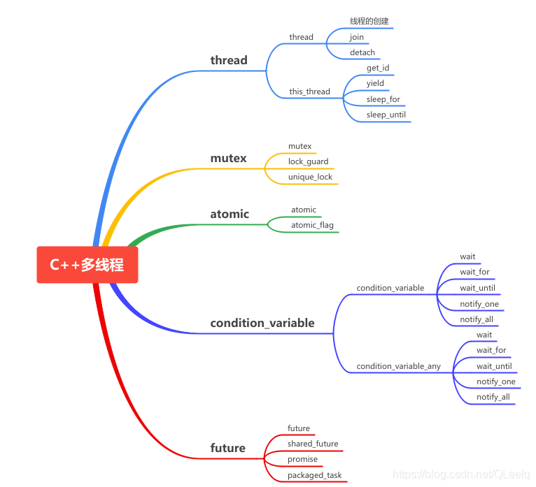

<div align="center">
    
</div>


# C++11 14 17多线程从原理到线程池实战

---

## 一. 为什么要用多线程

1. 任务分解

> 耗时的操作，任务分解，实时响应；


2. 数据分解

> 充分利用多核CPU处理数据

3. 数据流分解

> 读写分离，解耦合设计

## 二. C++11多线程快速入门

### 1. 多线程示例

```c++
#include <thread>
#include <iostream>

using namespace std;

void ThreadMain()
{
    cout << "Begin ThreadMain" << endl;
    cout << "ThreadMain ID = " << std::this_thread::get_id() << endl;
    for (int i = 0; i < 10; i++)
    {
        cout << "in thread " << i << endl;
        this_thread::sleep_for(chrono::seconds(1)); // 睡眠1秒钟
    }
    
}

int main(int argc, char* argv[])
{
    cout << "main thread ID = " << std::this_thread::get_id() << endl;
    // 线程创建启动
    std::thread th(ThreadMain);
    cout << "begin wait sub thread!" << endl;
    th.join();   // 阻塞等待子线程退出
    cout << "end wait sub thread!" << endl;
    return 0;
}
```

CMakeLists.txt 文件配置：

```cmake
cmake_minimum_required(VERSION 3.1)
project(first_thead)

set(CMAKE_CXX_STANDARD 11)

find_package(Threads REQUIRED)

add_executable(first_thread 101first_thread.cpp)

target_link_libraries(first_thread Threads::Threads)
```

<B>PS:</B> `th.join()` 阻塞等待子线程退出

创建线程对象，同时把处理函数传递给线程对象，调用`join()`方法阻塞等待线程退出。注意：线程对象创建的时候会自动启动线程，不需要调用`start()`方法。

### 2. std::thread 对象生命周期和线程等待和分离

对于线程函数，以及头文件如下：

```c++
#include <thread>
#include <iostream>

using namespace std;

void ThreadMain()
{
    std::cout << "begin ThreadMain ID = " << std::this_thread::get_id()  << std::endl;
    for (int i = 0; i < 10; i++)
    {
        std::cout << "in thread " << i << std::endl;
        std::this_thread::sleep_for(std::chrono::seconds(1));
    }
    std::cout << "end ThreadMain ID = " << std::this_thread::get_id()  << std::endl;
    
}
```

CMakeLists.txt 文件配置：

```cmake
cmake_minimum_required(VERSION 3.1)
project(thread_detach VERSION 0.1.0)

set(CMAKE_CXX_STANDARD 11)

find_package(Threads REQUIRED)

add_executable(thread_detach 102thread_detach.cpp)

target_link_libraries(thread_detach Threads::Threads)
```

示例1：

```c++
int main(int argc, char *argv[])
{
    // 示例1
    {   // 大括号结束之后，th这个线程对象就被系统自动销毁了，但此时子线程已经被执行了且没有执行完。
        std::thread th(ThreadMain); // 出错，thread对象被销毁，子线程还在运行
    }
    // 出现错误：
    // terminate called without an active exception
    // Aborted (core dumped)

    return 0;
}
```

执行结果如下所示：

```bash
terminate called without an active exception
Aborted (core dumped)
```

分析：

> 程序中，大括号结束之后，th这个线程对象就被系统自动销毁了，但此时子线程已经被执行了且没有执行完。解决方案：使用`join()`函数等待子线程执行完再销毁。

示例2：`join()`方法

```c++
// 示例2
{   // 使用join()函数，会等待子线程执行完，大括号里面的内容才算结束，所以在子线程执行完之前，线程对象th不会被销毁。
    std::thread th(ThreadMain);
    this_thread::sleep_for(std::chrono::seconds(1));
    is_exit = true; // 通知子线程退出
    std::cout << "主线程阻塞，等待子线程退出！" << std::endl;
    th.join();  // 主线程会被阻塞，等待子线程退出
    std::cout << "子线程已经退出！" << std::endl;
}
```

> 这种情况，程序可以正常执行，但依然存在一个问题，主程序被阻塞了，只有子线程执行完，主线程才会继续执行。解决方案：使用`detach()`让子线程和主线程分离，这样，主线程可以继续执行，子线程独立运行。

示例3：`detach()`方法

```c++
// 示例3
{   // 子线程与主线程分离
    thread th(ThreadMain);
    th.detach();    // 子线程与主线程分离，相当于守护线程
}
// 存在的问题：就得保证子线程不能去访问主线程的资源，否则会有错误。
// 解决方案：1.子线程不访问主线程的资源 2.用一个全局变量去通知子线程，主线程要退出了。
```

> 这种情况，大括号执行完之后，因为子线程和子线程分离了，所以不存在因为线程对象被销毁而导致子线程无法运行的情况。但是依然存在一个问题：主线程退出后，子线程不一定退出。如果子线程要访问主线程的资源就会发生错误，即使不访问主线程的资源在程序退出的时候依然会有错误。最好的解决方案就是：用一个全局变量去通知子线程，主线程要退出了。

示例4：`detach()`方法改进

```c++
bool is_exit = false;

void ThreadMain()
{
    std::cout << "begin ThreadMain ID = " << std::this_thread::get_id()  << std::endl;
    for (int i = 0; i < 10; i++)
    {
        if (is_exit) break;
        std::cout << "in thread " << i << std::endl;
        std::this_thread::sleep_for(std::chrono::seconds(1));
    }
    std::cout << "end ThreadMain ID = " << std::this_thread::get_id()  << std::endl;
    
}

int main(int argc, char *argv[])
{
    // 示例3
    {   // 子线程与主线程分离
        thread th(ThreadMain);
        th.detach();    // 子线程与主线程分离，相当于守护线程
    }

    return 0;
}
```

至此，就可以比较完美的解决线程分离的问题。


完整文件：

```cpp
#include <thread>
#include <iostream>

using namespace std;

bool is_exit = false;

void ThreadMain()
{
    std::cout << "begin ThreadMain ID = " << std::this_thread::get_id()  << std::endl;
    for (int i = 0; i < 10; i++)
    {
        if (is_exit) break;
        std::cout << "in thread " << i << std::endl;
        std::this_thread::sleep_for(std::chrono::seconds(1));
    }
    std::cout << "end ThreadMain ID = " << std::this_thread::get_id()  << std::endl;
    
}

int main(int argc, char *argv[])
{
    // 示例1
    {   // 大括号结束之后，th这个线程对象就被系统自动销毁了，但此时子线程已经被执行了且没有执行完。
        // std::thread th(ThreadMain); // 出错，thread对象被销毁，子线程还在运行
    }
    // 出现错误：
    // terminate called without an active exception
    // Aborted (core dumped)

    // 示例3
    {   // 子线程与主线程分离
        thread th(ThreadMain);
        th.detach();    // 子线程与主线程分离，相当于守护线程
    }
    // 存在的问题：主线程退出后，子线程不一定退出。就得保证子线程不能去访问主线程的资源，否则会有错误。
    // 解决方案：1.子线程不访问主线程的资源 2.用一个全局变量去通知子线程，主线程要退出了。

    // 示例2
    {   // 使用join()函数，会等待子线程执行完，大括号里面的内容才算结束，所以在子线程执行完之前，线程对象th不会被销毁。
        std::thread th(ThreadMain);
        this_thread::sleep_for(std::chrono::seconds(1));
        is_exit = true; // 通知子线程退出
        std::cout << "主线程阻塞，等待子线程退出！" << std::endl;
        th.join();  // 主线程会被阻塞，等待子线程退出
        std::cout << "子线程已经退出！" << std::endl;
    }
    // 此时存在的问题是主线程会被阻塞。

    // getchar();

    return 0;
}
```


### 3. C++11线程创建的多种方式

#### 1). 全局函数作为线程入口

<B>如何传递参数</B>

基于模板函数，优点：任何类型都可以传递。

<B>头文件</B>

1. 值传递

```c++
#include <thread>
#include <iostream>
#include <string>

class Para
{
public:
    Para() { std::cout << "Create Para" << std::endl; }
    Para(const Para& p) { std::cout << "Copy Para" << std::endl; this->name = p.name; }  // 拷贝构造函数
    ~Para() { std::cout << "Drop Para " << std::endl; }
    std::string name;
};


void ThreadMain(int p1, float p2, std::string str, Para p4)
{
    std::this_thread::sleep_for(std::chrono::milliseconds(100));    // 延时 100ms，等待大括号结束，float f2局部变量注销, 这个时候因为是拷贝的参数，所以不会有影响
    std::cout << "ThreadMain: " << p1 << " " << p2 << " " << str << " " << p4.name << std::endl;
}

int main(int argc, char* argv[])
{
    std::thread th;
    {
        float f2 = 12.1f;
        Para p;
        p.name = "test Para class";
        // 所有参数据做复制
        th = std::thread(ThreadMain, 101, f2, "test string para", p);   // 在这里参数的传递是复制
    }
    th.join();

    /*
        三次拷贝：
            1. main函数里面，大括号内，把声明的Para对象p给std::thread()构造函数形参时，会产生一次拷贝；
            2. 回调的时候，会将std::thread()函数的p拷贝到ThreadMain()函数的形参p4
            3. 还有一次是什么？？？？
            我这里出现了1次构造，3次拷贝，4次析构
    */
    return 0;
}
```

运行结果如下：

```bash
Create Para
Copy Para
Copy Para
Drop Para 
Drop Para 
Copy Para
ThreadMain: 101 12.1 test string para test Para class
Drop Para 
Drop Para 
```

可以发现，在std::thread()函数里面发生了3次拷贝，1次构造，4次析构，为什么会有3次拷贝呢？？？

<span style="background-color:red"><B>为什么是3次拷贝？</B></div>


#### 2). 成员函数作为线程入口

<B>接口调用和参数传递</B>


