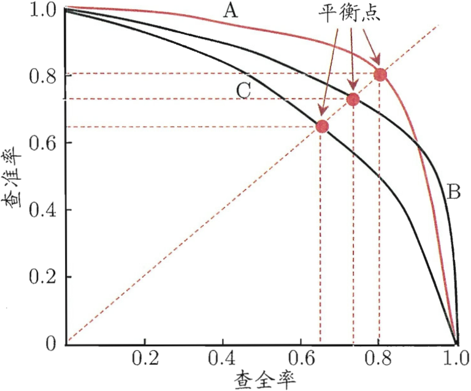
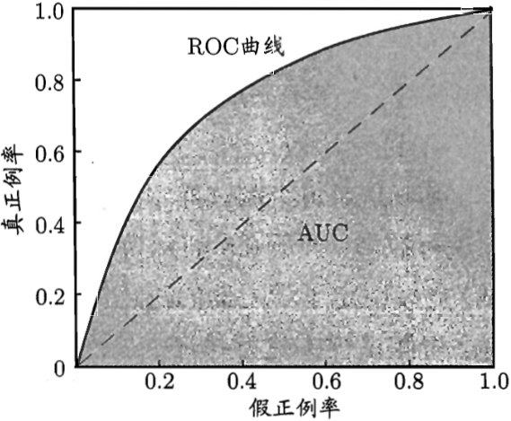
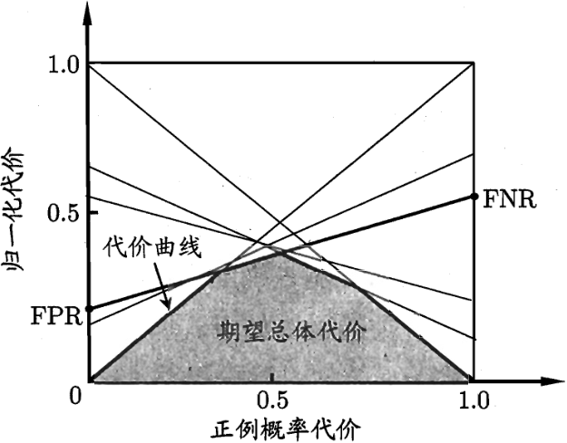
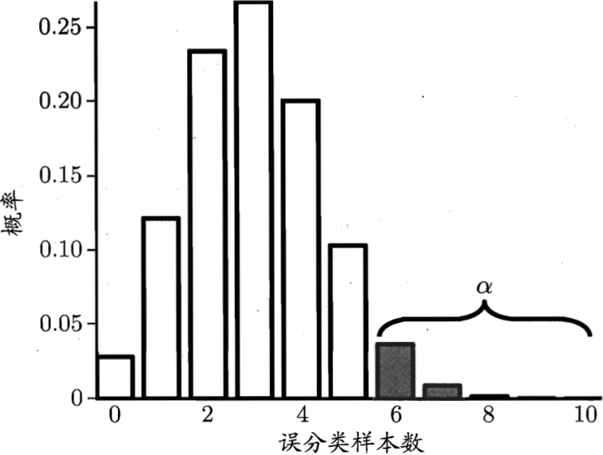
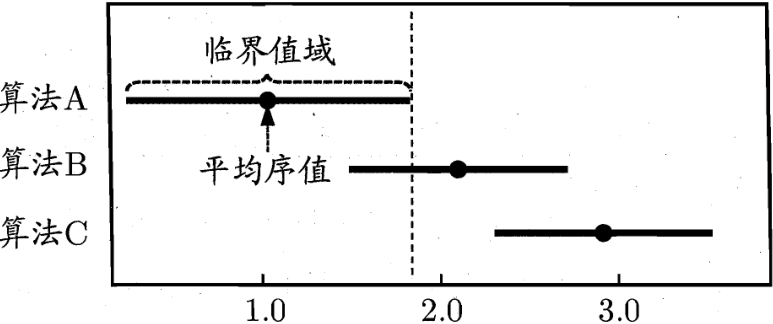
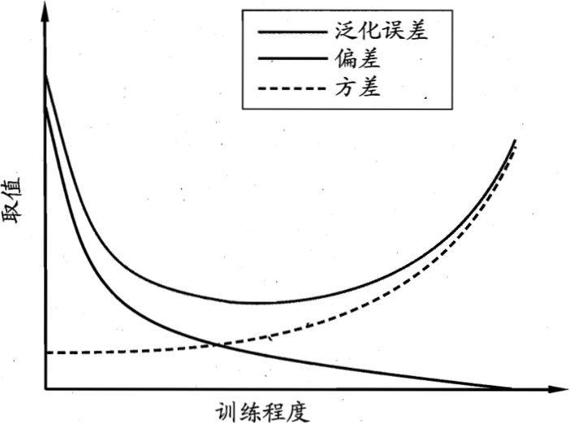

# 
<b>模型评估与选择</b>

## <b>一.经验误差与过拟合</b>

<b>错误率(error rate)</b>：分类错误的样本数 占 样本总数的比例，比如m个样本中，有a个样本分类错误，则错误率$E=a/m$;

<b>精度(accuracy)</b>：$1-a/m$即为精度，表示分类正确的样本数 占 样本总数的比例；

<b>误差(error)</b>：学习器的实际输出与样本的真实输出之间的差异称为“误差”。在训练集上的误差被称为“训练误差”或“经验误差”；在新样本上的误差被称为“泛化误差”。

>有必要解释一下误差和错误率：概念比较相似，错误率是针对整个样本来说的，统计分类错误的样本数比率，直接反应学习器的性能；误差是针对单个样本的输出与真实值之间的差异，通常在回归任务中比较重要。

>我们希望得到的学习器在新样本上表现得更好，也就是泛化误差尽可能小，但是新样本我们没有标签，无法知道新样本的泛化误差，因此能做的只有让训练误差最小化。

<b>过拟合、欠拟合</b>：学习器从训练样本中尽可能学出适用于所有潜在样本的“普遍规律”，这样才能在遇到新样本时做出正确的判别。但是，学习器把训练集学的太好，很可能已经把训练样本本身的一些特点当成了所有潜在样本的特征。这样即使训练误差非常小，在训练集上分类精度为100%，但在新样本上也有可能出现非常低的分类精度。这种现象被称为“过拟合”(overfitting)，与过拟合相对的是"欠拟合"(underfitting)，这是指对训练样本学习的不够好。

>过拟合产生的原因：学习能力过于强大，把训练集中的一般特征当成了所有样本的特征；欠拟合产生的原因：学习不到位，多增加训练的轮数。过拟合无法避免，只能缓解。

## <b>二.评估方法</b>
<b>背景</b>：在训练学习器时，不同的参数选择可以得到不同的模型，理想情况下，希望通过模型的泛化误差来选择最优的模型；但是，我们没有办法获得模型的泛化误差(不知道新样本的标签),训练误差也无法作为模型的泛化衡量标准，因为存在过拟合。 
在实际中，通过实验测试来检验算法模型的泛化误差是比较常用的方法；因此，我们需要一个“测试集”来测试学习器对新样本的判别能力，然后用测试集上的“测试误差”来近似“泛化误差”。 

>用测试误差来近似泛化误差的前提是：保证测试集是从真实样分布中独立同分布采样，且尽可能与训练集互斥。

对于包含m个样例的数据集$D={(x_1,y_1),(x_2,y_2),...,(x_m,y_m)}$，既要训练，又要测试？需要通过适当的处理，从中产生训练集S和测试集T,下面介绍分离训练集和测试集的方法。

### <b>2.1 留出法</b>
“留出法”将数据集D划分为两个互斥的集合，其中一个作为训练集S，另一个作为测试集T,即$D=S\cup T,S\cap T=\emptyset$；用S来训练模型，用T来测试训练好的模型。

<b>分层采样</b>：训练集/测试集的划分尽可能保证数据的一致性，避免因数据划分过程引入额外的偏差而对最终结果产生影响。比如在分类任务中，不能简单将数据随机分成两份，而是应该根据类别进行同比例划分。比如：假设数据集有5个类别，希望将所有数据按照7：3划分为训练集和测试集，划分规则应该是每个类别都按照7:3去划分数据，而不是所有数据随机划分为7:3。这种保留类别比例的采样方式通常称为“分层采样”.

>比如对于样本集D,二分类包含500个正例，500个反例，按照7：3的比例划分；则训练集S中应该包含350个正例、350个反例，测试集包含150个正例、150个反例。若S、T的样本类别比例差别很大，则误差估计将由于训练/测试数据分布的差异产生偏差。比如：训练集S包含所有正例，以及200个反例；则训练得到的模型将有大概率将负样本预测为正样本。

<b>问题1</b>：即使使用分层采样，依然存在多种划分方式，不同的划分(选取的样本)将导致不同的训练、测试集，相应的，模型评估的结果也会有茶杯。单次使用留出法得到的评估结果往往不够稳定可靠，在使用留出法时，一般要采用若干次随机划分、重复进行试验评估后取平均值作为留出法的评估结果。

<b>问题2</b>：如果数据集D样本比较少，我们希望评估的是用D训练出的模型的性能，但留出法需划分训练集/测试集。训练集S越大，训练出的模型可能更接近于用D训练出的模型，但由于T比较小，评估的结果可能不够稳定准确；若T包含较多的样本，则训练集S与D差别更大，被评估的模型与D训练出的模型相比可能有较大差别，从而降低了评估结果的保真性，这个问题至今没有很好的解决方案。但是对于数据量比较大的数据集，则影响越小。通常将整个数据集的2/3~4/5的样本用于训练，剩余样本用于测试。

### <b>2.2 交叉验证法</b>
“交叉验证法”先将数据集D划分为k个大小相似的互斥子集，即$D=D_1\cup D_2\cup ... \cup D_k, D_i \cap D_j = \emptyset(i \ne j)$. 每个子集$D_i$都尽可能保持数据分布的一致性，即从D中分层采样获得。每次用k-1个子集的并集作为训练集，余下的子集作为测试集；这样就可以获得k组训练集/测试集，从而可以得到k次训练和测试，最终返回k个测试结果的均值。

>交叉验证法评估结果的稳定性和保真性很大程度取决于k的取值，因此交叉验证法又叫“k折交叉验证”(k-fold cross validation)。k常取10，因此称为10折交叉验证。 
对于每次的k个子集的划分，通常需要随机使用不同的划分重复p次，最终的评估结果是这p次k折交叉验证结果的均值；换句话说，k折交叉验证法会把数据集划分为k个子集，训练k次，每次的划分又会重复p次，因此k折交叉验证法的训练次数是kxp。比如10次10折交叉验证的训练次数是100次；100次留出法的训练次数也是100次。

<b>留一法</b>：若k=m，则交叉验证法就变成了留一法。留一法不受随机样本划分的影响，因为m个样本只有唯一的方式划分为m个子集-每个子集包含一个样本；留一法使用的训练集和初始数据集相差一个样本，因此，留一法评估的模型与用D评估的模型很相似，结果比较准确。

>留一法的缺陷：数据集较大时，训练m个模型的计算开销无法忍受；另外，留一法的估计结果也未必永远比其他评估方法准确--“没有免费午餐定理”也适用于实验评估方法。

### <b>2.3 自助法</b>
留出法和交叉验证法都要求一部分数据集用于测试，因此实际训练样本的规模与使用的数据集存在差异，会引入因样本规模不同而导致的估计偏差。留一法受训练样本的规模变化的影响较小，但计算复杂度太高。

“自助法”可以比较好的解决数据规模差异造成的影响而且可以比较高效的进行实验：对于数据集D，每次从中有放回的采样一个样本，将其拷贝放入$D'$集合中，重复m次，则可以得到一个包含m个样本的集合D'。D中的部分样本会在D'中多次出现，肯定也存在一些样本不会出现，也就是说D'中包含一些重复的样本。

>使用数学公式估计一下未出现在集合D'中的数量,样本m次采样中始终不被采到的概率是$(1-\frac{1}{m})^m$，取极限得到：
$$
\lim_{a\to \infty} (1-\frac{1}{m})^m=\frac{1}{e}\approx0.368, \tag{1}
$$
>可知，初始数据集D中约有36.8%的样本未出现在集合D'中。因此可以比较科学地将D'当成训练集，D\D'用作测试集，也就是剩下的36.8%。

<b>总结</b>：自助法中训练集和原始数据集数量相同，而测试集还有约1/3的，没出现在训练集的数据。这样的测试结果亦称为“包外估计”。自助法适用于数据集较小、难以有效划分训练集/测试集的情况。且自助法中，可以从初始数据集中产生多个不同的训练集，这对集成学习等方法有很大的好处。

>缺点：自助法产生的数据集改变了初始数据集的分布，会引入估计偏差。因此，在初始数据量足够时，留出法和交叉验证法更常用。

### <b>2.4 调参与最终模型</b>
大多数机器学习算法都有些参数需要设定，参数配置不同，获得的模型性能存在显著的差别。因此，在进行模型评估与选择时，除了要对合适的学习算法进行选择外，还需要对算法参数进行设定，这个过程称为“参数调节”或“调参”.

理想状态下，参数的选择可以像算法选择一样，对每种参数配置都训练出模型，然后筛选出最好的模型参数；但在实际中，参数的范围是整个实数域，对每个参数都训练出模型算力将无法忍受。因此，常用的做法是对参数选定一个范围[0,0.2]，然后以变化的步长去训练模型，比如步长为0.05，则有5个参数需要训练。显然，这样选定的参数值或许不是“最佳”值，但这是计算开销和性能评估之间进行折中的结果。

参数的调节对于最终模型性能有关键性的影响，因此从事于机器学习的工程师又被称为调参工程师。

即使选择固定范围和步长，但一个模型有多个参数，计算量也还是比较大的，比如某个模型有3个参数，每个参数都考虑5个候选值，这样也会有$5^3=125个模型需要考察$。

<b>最终模型</b>：模型完成训练后，学习算法和参数配置已选定，此时应该用数据集D所有数据重新训练模型，得到最终的模型。

## <b>三.性能度量</b>
性能度量就是对学习器泛化性能的评估标准。对于不同的模型，使用不同的性能度量会导致不同的评判结果；意味着模型的好坏是相对的，模型的好坏不仅取决于算法和数据，还决定于任务需求。

<b>均方误差</b>：均方误差是回归任务中最常用的性能度量,(Mean Squared Error,MSE)
$$
E(f;D)=\frac{1}{m}\sum_{i=1}^{m}(f(x_i)-y_i)^2. \tag{2}
$$

对于数据分布D和概率密度函数$p(\cdot)$，均方误差可描述为：
$$
E(f;D)=\int_{x~D}(f(x)-y)^2p(x)dx. \tag{3}
$$
### <b>3.1 错误率与精度</b>
错误率和精度是分类任务中最常用的两种性能度量；

<b>错误率</b>：分类错误的样本数 占 样本总数的比例；
$$
E(f;D)=\frac{1}{m}\sum_{i=1}^{m}\mathbb{I}(f(x_i)\ne y_i). \tag{4}
$$
<b>精度</b>：分类正确的样本数占样本总数的比例
$$
\begin{aligned}
acc(f;D)&=\frac{1}{m}\sum_{i=1}^{m}\mathbb{I}(f(x_i) = y_i) \\
&=1-E(f;D). \tag{5}
\end{aligned}
$$

更一般地，对于数据分布D和概率密度函数$p(\cdot)$，错误率与精度可分别描述为：
$$
E(f;D)=\int_{x~D}\mathbb{I}(f(x_i)\ne y_i)p(x)dx. \tag{6}
$$

$$
\begin{aligned}
acc(f;D)&=\int_{x~D}\mathbb{I}(f(x_i) = y_i)p(x)dx \\
&=1-E(f;D). \tag{5}
\end{aligned}
$$

### <b>3.2 查准率、查全率与F1</b>
错误率和精度是常用的指标，但并不能满足所有任务需求。比如对于西瓜的评判，错误率可以衡量多少比例的瓜被判别为错误；有时候还需要考虑挑出的好瓜中，有多少个是真正的好瓜，这个是查准率；或者说所有好瓜中，有多少比例被挑出来了，这个是查全率。

混淆矩阵

<table align=center border="2" cellspacing="8">
<tr><td rowspan="2">真实情况</td><td colspan="2" align=center>预测结果</td></tr>
<tr><td align=center>正例</td><td>反例</td></tr>
<tr><td align=center>正例</td><td>TP(真正例)</td><td>FN(假反例)</td></tr>
<tr><td align=center>反例</td><td>FP(假正例)</td><td>TN(真反例)</td></tr>
</table>
<b>真正例(TP)</b>：正例被算法预测为正例 
<b>假正例(FP)</b>：反例被算法预测为正例 
<b>真反例(FN)</b>：反例被算法预测为反例 
<b>假反例(TN)</b>：正例被算法预测为反例 

>有TP+FP+TN+FN=样例总数。

<b>查准率P</b>：$P=\frac{TP}{TP+FP}$

<b>查全率R</b>：$R=\frac{TP}{TP+FN}$

>注：查准率和查全率是一对矛盾的度量：查全率越高，意味着会将更多的样本预测为正，但这样查准率必然下降，会有更多的样本预测错误；若希望查准率更高，就需要挑选最有把握的瓜，但这样会漏掉更多的好瓜，使得查全率下降。在一些简单任务中，才可能使查全率和查准率都很高。

<b>计算查准率和查全率</b>：
在实际应用中，对样本使用训练好的学习器进行预测后，通常根据学习器对样本的预测结果(置信度)进行排序，排在前面的是学习器认为最有可能是正例的样本，排在后面的则是学习器认为最不可能是正例的样本，按照这个顺序逐个把样本使用不同的阈值，可以得到正例的预测数量，则每次可以计算出当前的查全率、查准率。解释一下：就是排序后，可以将样本分为正样本和负样本，然后还有测试样本的实际值，就可以得到混淆矩阵，自然可以预测查全率和查准率。依次叠加正样本的个数，可以得到P-R曲线图。

<b>P-R曲线</b>：以查准率为纵轴、查全率为横轴，得到一个曲线：
>备注</b>：如果查全率为0，也就是把所有样本都定义为负样本，这时，查准率也是0；但当查全率逼近0(但不为0,假设为1)，则这时查准率为1。因此，P-R曲线图在原点位置存在一个跳变；再来看最后一个点，查全率接近1，表示所有西瓜都预测为好瓜(FN=0)，此时查准率接近0，但绝对不会为0，除非反例特别多。

    

<b>根据P-R曲线衡量学习器的性能</b>：根据前面的分析，可知P和R不可能同时都高，实际应用中，会有计划的选择查准率高或者查全率高的阈值，或者希望得到查全率和查准率都较高的判别阈值。若一个学习器的P-R曲线被另一个学习器的P-R曲线完全包裹，则认为后者学习器的性能优于前者,自然会选择后者学习器。上图中的学习器A和B就优于学习器C，如果两个学习器的P-R曲线有交叉，则难以判断哪个学习器好，这个时候就只能在具体的查准率或查全率条件下选择合适的学习器；但是如果学习器用于更普遍的情况，希望从有限数据中学习的两个学习器中选择一个更好的，一般考虑从P-R曲线下的面积大小选择学习器，面积越大代表学习器越好,但是这个指标在数学上不太容易估算。 

<b>综合考察查准率和查全率的性能度量：</b> 
<b>1.平衡点(Break-Even Point,BEP)</b>：平衡点是查准率=查全率 时的取值，平衡点越大性能越优；上图中学习器C的BEP是0.64，基于BEP可以认为学习器A优于学习器B.

<b>2.F1</b>：BEP指标过于简化，F1是较为常用的度量指标：
$$
F1=\frac{2\times P\times R}{P+R}=\frac{2\times TP}{样例总数+TP-TN}. \tag{10}
$$

<b>$F_{\beta}$</b>：F1对于查准率和查全率的重视程度一样，但是在实际应用中，对于不同的任务，对查准率和查全率的重视程度是不一样的。设计了一个F1的一般形式--$F_{\beta}$，定义如下：
$$
F_{\beta}=\frac{(1+\beta^2)\times P\times R}{(\beta^2\times P)+R}
$$

>$\beta$>0度量了查全率对查准率的相对重要性，当$\beta$=1时退化为标准的F1.$\beta$>1时，查全率有更大影响；$\beta$<1时查准率有更大的影响。 
><b>总结</b>： 
>1. P-R曲线是什么？对于同一个曲线，P-R曲线是学习器通过预测样本后，不同数量的预测正例对查全率和查准率的影响；对应着不同的判断阈值。 
>2. 获得P-R曲线后，如何选择学习器？ 
>   2.1 如果一个学习器被另一个学习器的P-R曲线完全包裹，则后者好； 
>   2.2 如果曲线有交叉，则根据BEP平衡点、F1或者$F_{\beta}$来判断。 
>3. P(precision)也就是查查准率，又叫精确率；R(Recall)也就是查准率，又叫召回率。因此，P-R曲线又叫精确率和召回率曲线。

<b>P-R曲线在多分类任务中的应用：</b>：对于前面的留出法、交叉验证法等，会对同一个学习器进行多次训练和测试，每次都可以得到一个混淆矩阵；在多个数据集上进行训练/测试，希望估计算法的“全局”性能；执行多分类任务时，每两两类别的组合都对应一个矩阵；总之，需要在n个二分类混淆矩阵上综合考察查准率和查全率。

最直接的做法就是在各混淆矩阵上分别计算出查准率和查全率，记为$(P_1,R_1),(P_2,R_2),...,(P_n,R_n)$,再计算平均值，这样就得到“宏查准率”(macro-P)、“宏查全率”(macro-R)，以及相应的“宏F1”(macro-F1):
$$
macro-P=\frac{1}{n}\sum_{1}^{n}P_i, \tag{12}
$$

$$
macro-R=\frac{1}{n}\sum_{1}^{n}R_i, \tag{13}
$$

$$
macro-F1=\frac{2\times macro-P\times macro-R}{macro-P+macro-R}. \tag{14}
$$

“宏查准率”(macro-P)、“宏查全率”(macro-R)，以及相应的“宏F1”(macro-F1)定义如下：
$$
micro-P=\frac{\overline{TP}}{\overline{TP}+\overline{FP}}, \tag{15}
$$

$$
micro-R=\frac{\overline{TP}}{\overline{TP}+\overline{FN}}, \tag{16}
$$

$$
micro-P=\frac{2\times micro-P\times micro-R}{micro-P+micro-R}. \tag{17}
$$

### <b>3.3 ROC与AUC</b>
ROC曲线是另一个衡量指标，数据来源与P-R一样，在分类任务中，得到的预测值是[0,1]之间的值；将预测值与分类阈值(threshold)进行比较，大于阈值则分为正类，否则为负类。取不同的分类阈值可以得到不同的分类结果，因此排序本身的的质量好坏，体现了综合考虑学习器在不同任务下的“期望泛化性能”的好坏。ROC曲线从这个角度来研究学习器泛化性能。

ROC曲线的横轴是“假正率”(False Positive Rate, FPR)，纵轴是“真正率”(True Positive Rate, TPR)。与P-R曲线类似，根据学习器的预测结果对样例进行排序，按此顺序逐个把样本作为正例进行预测，每次计算上述两个重要量的值就得到ROC曲线。
$$TPR=\frac{TP}{TP+FN} \tag{18}$$
$$FPR=\frac{FP}{TN+FP} \tag{19}$$

下图是ROC曲线图，点(0,1)表示将所有样本都预测为负样本，TP和FP都为0；对角线表示理想情况下的模型，？
<table align=center>
<tr><td></td><td></td></tr>
<tr><td align=center>(a)ROC曲线与AUC</td><td align=center>(b)基于有限样例绘制的ROC曲线与AUC</td></tr>
<tr><td colspan="2" align=center>ROC曲线与AUC示意图</td></tr>
</table>

现实任务中是利用有限个测试样本来绘制ROC图，获得的(假正率,真正率)数据是有限的，得到的是上图(b)所示的近似ROC曲线。

<b>绘制ROC曲线图</b>：假设样本中$m^+$个正样本，$m^-$个负样本，学习器对其进行预测，并根据预测结果排序，然后把分类阈值设为最大，即把所有样例均预测为反例，此时真正率(TPR)和假正率(FPR)均为0，得到坐标(0,0)处的点； 然后，将分类阈值依次设为每个样例的预测值，即逐个增加预测为正样本的数量。假设前一个标记点为$(x,y)$，当前样例如果为真正例，则对应标记点的坐标为$(x,y+\frac{1}{m^+})$(是正例，所以x坐标不变，预测为正例所以FP+1，得到真正率就为$y+\frac{1}{m^+}$)；如果当前样本为负例，则对应的标记点的坐标为$(x+\frac{1}{m^-},y)$.

<b>ROC曲线衡量学习器的性能</b>：1).如果一个学习器ROC曲线被另一个学习器完全包裹，则后者性能优于前者；2).若两个学习器ROC曲线发生交叉，可以通过ROC曲线下的面积来比较，即AUC(Area Under ROC Curve)。

<b>AUC估算</b>：假定ROC曲线由一系列坐标${(x_1,y_1),(x_2,y_2),...,(x_m,y_m)}$的点按顺序连接形成，则AUC可估算为：
$$AUC=\frac{1}{2}\sum_{i=1}^{m-1}(x_{i+1}-x_i)\cdot (y_i+y_{i+1}) \tag{20}$$
>问：这里为什么是$y_i+y_{i+1}$，(b)图中ROC曲线是矩形，计算矩形面积？ 
>答：文字里说明了是按点连接，所以它们是一个竖着放的直角梯形，直角梯形的面积：$S=\frac{1}{2}\cdot 高\cdot (上底+下底)=\frac{1}{2}(x_{i+1}-x_i)\cdot (y_i+y_{i+1})$.

AUC考虑的是样本预测的排序质量，因此它与排序误差有紧密联系，给定$m^+$个正例和$m^-$个反例，令$D^+$和$D^-$分别表示正、反例集合，则排序“损失(loss)”定义为：
$$\mathbb{l}_{rank}=\frac{1}{m^++m^-}\sum_{x^+\in{D^+}}\sum_{x^-\in{D^-}}\left(\mathbb{I}(f(x^+)<f(x^-))+\frac{1}{2}\mathbb{I}(f(x^+)\right) =f(x^-))) \tag{21}$$
>即考虑每一对正、反例，若正例的预测值小于反例，则记一个“罚分”，若相等，则记0.5个“罚分”.上面公式其实就是ROC曲线之上的面积：若一个正例的ROC曲线上对应标记点的坐标为$(x,y)$，则$x$恰是排序在其之前的反例所占的比例，即假正率。因此有：
$$AUC=1-\mathbb{l}_{rank}$$
>问：上面那句话红色部分怎么理解？
>答：x坐标就是假正率(FPR)。

### <b>3.4 代价敏感错误率与代价曲线</b>
前面介绍的性能度量都默认每个类别的分类错误代价是均等的，但实际情况中，分类错误的代价通常是不一样的，比如：将患者预测为正常人，会错过最佳治疗时间；但将正常人预测为患者，则只会增加检查的次数，两者代价显然是不同的。考虑错误代价，可以增加学习器的鲁棒性。

<table align=center>
<tr><td rowspan="2">真实类别</td><td colspan="3" align=center>预测类别</td></tr>
<tr><td>第0类</td><td>第1类</td></tr>
<tr><td>第0类</td><td align=center>0</td><td>$cost_{01}$</td></tr>
<tr><td>第1类</td><td align=center><math>$cost_{10}$</math></td><td align=center>0</td></tr>
</table>
上表中，假设0类是正例，1类是反例；令$D^+$和$D^-$分别代表样例D的正例子集和反例子集,则“代价敏感(cost-sensitive)”错误率为：

$$\begin{aligned}
    E(f;D;cost)=\frac{1}{m}\left(\sum_{x_i\in D^+}{\mathbb{I}(f(x_i)\ne y_i)\times cost_{01}}+\sum_{x_i\in D^-}{\mathbb{I}(f(x_i)\ne y_i)\times cost_{10}}\right) \tag{23}
\end{aligned}$$
>其中，$cost_{ij}$表示将第i类样本预测为第j类样本的代价。

<b>在非均等代价下，ROC曲线的版本：</b> 
在非均等代价下，ROC曲线不能直接反映出学习器的期望总体代价，而“代价曲线”(cost curve)则可达到该目的。代价曲线的横轴取值为[0,1]的正例概率代价：
$$P(+)cost=\frac{p\times cost_{01}}{p\times cost_{01}+(1+p)\times cost_{10}}, \tag{24}$$
其中$p$是样例为正例的概率；纵轴是取值为[0,1]的归一化代价：
$$cost_{norm}=\frac{FNR\times p\times cost_{01}+(1-p)\times cost_{10}}{p\times cost_{01}+(1-p)\times cost_{10}}, \tag{25}$$
>其中FPR是假正率，$FNR=1-TPR$是假反例率。

<b>代价曲线的绘制</b>：ROC曲线上每一点对应了代价平面上的一条线段，设ROC曲线上点的坐标为(FPR，TPR)，则可相应计算出FNR，然后在代价平面上绘制一条从(0,FPR)到(1,FNR)的线段，线段下的面积即表示了该条件下的期望总体代价；如此将ROC曲线上的每个点转化为代价平面上的一条线段，然后取所有线段的下界，围成的面积即为在所有条件下学习器的期望总体代价，如下图所示：

<b>总结</b>：对上面的代价曲线函数尚未理解？

## <b>四.比较检验</b>
前面已经有了实验评估方法和性能度量，评估学习器的性能流程：先使用某种实验评估方法测得学习器得某个性能度量结果，然后对这些结果进行比较。实际中，结果的比较并不是直接取得性能度量“比较大小”，性能的比较是一个复杂的过程，涉及几个重要因素：1).首先，我们希望比较的是泛化性能，然而通过实验评估方法获得的是测试集上的性能，两者的对比结果可能未必相同；2).测试集上的性能与测试集本身的选择有很大关系，不同大小的测试集会得到不同的结果，即使使用相同大小的测试集，若包含的测试样例不同，测试结果也可能不通；3).机器学习算法本身有一定的随机性，即便用相同的参数设置在同一个测试集上多次运行，其结果也会有不同。

基于上述特性，统计假设检验(hypothesis test)可以用于学习器性能比较。基于假设检验结果推断出，若在测试集上观察到学习器A比B好，则A的泛化性能是否在统计意义上优于B，以及这个结论的把握有多大。假设检验以错误率为性能度量你，用$\epsilon$表示。

### <b>4.1 假设检验</b>
假设检验中的“假设”是对学习器泛化错误率分布的某种判断或猜想，比如$\epsilon=\epsilon_{0}$。现实中，学习器获得的是测试集上的错误率,与泛化错误率未必相同，但两者相近因此可以作为泛化错误率。泛化错误率$\epsilon$表示学习器在一个样本上预测出错的概率是$\epsilon$；而测试错误率$\hat{\epsilon}$意味着m个测试样本中有$\hat{\epsilon}\times m$个样本被错误分类，假设为$m^{'}$，剩余样本全部分类正确的概率为$\tbinom{m}{m^{'}}\epsilon^{m^{'}}(1-\epsilon)^{m-m^{'}}$；由此可以估算其恰好将$\hat{\epsilon}\times m$个样本误分类的概率如下：
$$P(\hat{\epsilon};\epsilon)=\dbinom{m}{\hat{\epsilon}\times m}\epsilon^{\hat{\epsilon}\times m}(1-\epsilon)^{m-\hat{\epsilon}\times m}. \tag{26}$$
>上式表示泛化错误率为$\epsilon$的学习器被测得测试错误率为$\hat{\epsilon}的概率$。

<b>求解$\epsilon$</b>:
令$\frac{\partial P(\hat{\epsilon};\epsilon)}{\partial \epsilon}=0$，可得$P(\hat{\epsilon};\epsilon)$在$\epsilon=\hat{\epsilon}$时最大，且$|\epsilon - \hat{\epsilon}|$增大时$P(\hat{\epsilon};\epsilon)$减小，符合二项分布，如下图所示：

>上图展示的是样本数m=10，错误率$\epsilon = 0.3$的情况。意味着3个样本被错误分类的概率最大。 

### <b>4.2 交叉验证t检验</b>
对两个学习器A和B，若我们使用k折交叉验证法得到的测试错误率分别为$\epsilon_1^A,\epsilon_2^A,...,\epsilon_k^A$和$\epsilon_1^B,\epsilon_2^B,...,\epsilon_k^B$，其中$\epsilon_k^A$和$\epsilon_k^B$是在相同的第i折训练/测试集上得到的结果，则可用k折交叉验证“成对t检验”(paired t-test)来进行检验。这里的基本思想是，若两个学习器的性能相同，则它们使用相同的训练/测试集得到的测试错误率应相同，即$\epsilon_k^A = \epsilon_k^B$。

对k折交叉验证产生的k对测试错误率：先对每对结果求差，$\Delta_i=\epsilon_i^A-\epsilon_i^B$；若两个学习器性能相同，则差值均值应为零。因此，可根据差值$\Delta_1,\Delta_2,...,\Delta_k$来对“学习器A与B性能相同”这个假设做$\mathbb{t}$检验，计算出差值的均值$\mu$和方差$\sigma^2$，在显著度$\alpha$下，若变量
$$\tau_t=\left|\frac{\sqrt{k}\mu}{\sigma}\right| \tag{31}$$
小于临界值$t_{\alpha/2,k-1}$，则假设不能被拒绝，即认为两个学习器的性能没有显著差别；否则可认为两个学习器的性能有显著差别，且平均错误率较小的那个学习器性能较优。这里$t_{\alpha/2,k-1}$是自由度为k-1的$t$分布上尾部累计分布为$\alpha/2$的临界值。

<b>5x2交叉验证</b>：进行有效假设检验的前提是，测试错误率均为泛化错误率的独立采样。但是，在交叉验证等实验估计方法时，不同轮次的训练集会有一定程度的重叠，这就使得测试错误率实际上并不独立，会导致过高估计假设成立的概率。为解决这个问题，可采用"5x2交叉验证"法。

>$5\times2$交叉验证是做5次2折交叉验证，在每次2折交叉验证之前随机将数据打乱，使得5次交叉验证中的数据划分不重复。对两个学习器A和B，第i次2折交叉验证将产生两对测试错误率，对他们分别求差，得到第1折上的差值$\Delta_i^1$和第2折上的差值$\Delta_i^2$。为缓解测试错误率的非独立性，仅计算第1次2折交叉验证的两个结果的平均值$\mu=0.5(\Delta_1^1+\Delta_1^1)$，但对每次2折实验的结果都计算出方差$\sigma_i^2=\left(\Delta_i^1-\frac{\Delta_i^1+\Delta_i^2}{2}\right)^2+\left(\Delta_i^2-\frac{\Delta_i^1+\Delta_i^2}{2}\right)^2$.变量
$$\tau_t=\frac{\mu}{\sqrt{0.2\sum_{i=1}^{5}\sigma_i^2}} \tag{32}$$
>服从自由度为5的$t$分布，其双边检验的临界值$t_{\alpha/2,5}$当$\alpha=0.05$时为2.5706，$\alpha=0.1$时为2.0150。

### <b>4.3 McNemar</b>
对二分类问题，使用留出法不仅可估计出学习器A和B的测试错误率，还可获得两学习器分类结果的差别，即两者都正确、都错误、一个正确另一个错误的样本数，如"列联表"下图所示：
<table align=center>
<tr><td rowspan="2">算法B</td><td colspan="3" align=center>算法A</td></tr>
<tr><td>正确</td><td>错误</td></tr>
<tr><td>正确</td><td>e00</td><td>e01</td></tr>
<tr><td>错误</td><td>e10</td><td>e11</td></tr>
</table>
假设两学习器性能相同，则应有$e_{01}=e_{10}$，那么变量$|e_{01}-e_{10}|$应当服从正态分布。McNemar检验考虑变量： 

$$\tau_{\chi^2}=\frac{(|e_{01}-e_{10}|-1)^2}{e_{01}+e_{10}} \tag{33}$$
>服从自由度为1的$\chi^2$分布，即标准正态分布变量的平方。给定显著度$\alpha$，当以上变量值小于临界值$\chi_{\alpha}^2$时，不能拒绝假设，即认为两学习器的性能没有显著差别；否则拒绝假设，即认为两者性能有显著差别，且平均错误率较小的那个学习器性能较优。自由度为1的$\chi^2$检验的临界值当$\alpha=0.05$时为3.8415,$\alpha=0.1$时为2.7055.

### <b>4.4 Friedman检验与Nemenyi后续检验</b>
交叉验证t检验和McNemar检验都是在一个数据集上比较两个算法的性能，有时需要在一组数据集上对多个算法进行比较。当有多个算法参与比较时，一种做法是在每个数据集上分别列出两两比较的结果，而在两两比较时可使用前述方法；另一种方法更为直接，即使用基于算法排序的Friedman检验。

假定用$D_1,D_2,D_3,D_4$四个数据集对算法A、B、C进行比较。首先使用留出法或交叉验证法得到每个算法在每个数据集上的预测结果，然后在每个数据集上根据测试性能由好到坏排序，并赋予序值1,2,...；若算法的测试性能相同，则平分序值。例如，在$D_1$和$D_3$上，A最好、B其次、C最差，而在$D_2$上，A最好、B与C性能相同。可得到下表，最后一行对每一列的序值求平均，得到平均序值：

<table align=center>
<tr><td colspan="4" align=center>两学习器分类差别列联表</td></tr>
<tr><td>数据集</td><td>算法A</td><td>算法B</td><td>算法C</td></tr>
<tr><td>D1</td><td>1</td><td>2</td><td>3</td></tr>
<tr><td>D2</td><td>1</td><td>2.5</td><td>2.5</td></tr>
<tr><td>D3</td><td>1</td><td>2</td><td>3</td></tr>
<tr><td>D4</td><td>1</td><td>2</td><td>3</td></tr>
<tr><td>平均序值</td><td>1</td><td>2.125</td><td>2.875</td></tr>
</table>

然后使用Friedman检验来判断这些算法是否性能相同，若相同，则它们的平均序值应当相同。假定在N个数据集上比较k个算法，令$r_i$表示第i个算法的平均序值，则$r_i$的均值和方差分别为$(k+1)/2$和$(k^2-1)/12N$.变量
$$
\begin{aligned}
    \tau_{\chi^2}&=\frac{k-1}{k}\cdot\frac{12N}{k^2-1}\sum_{i=1}^k\left(r_i-\frac{k+1}{x}\right)^2 \\
    &=\frac{12N}{k(k+1)}\left(\sum_{i=1}^kr_i^2-\frac{k(k+1)^2}{4}\right) \tag{34}
\end{aligned}
$$
>在k和N都较大时，服从自由度为k-1的$\chi^2$分布。
上述的“原始Friedman检验”过于保守，现在通常使用变量
$$\tau_{\mathbb{F}}=\frac{(N-1)\tau_{\chi^2}}{N(k-1)-\tau_{\chi^2}} \tag{35}$$
>$\tau_{\mathbb{F}}$服从自由度为k-1和$(k-1)(N-1)$的$F$分布。

<b>Nemenyi后续检验</b>若“所有算法的性能相同”这个假设被拒绝，则说明算法的性能显著不同。这时需进行“后续检验”(post-hoc test)来进一步区分各算法。常用Nemenyi后续检验。

Nemenyi检验计算出平均序值差别的临界值域：
$$CD=q_{\alpha}\sqrt{\frac{k(k+1)}{6N}} \tag{36}$$
>若两个算法的平均序值之差超出了临界值域$CD$，则以相应的置信度拒绝“两个算法性能相同”这一假设。

<b>举例</b>：
以表"两学习器分类差别列联表"为例，根据式(34)(35)计算出$\tau_F=24.429$，它大于$\alpha=0.05$时的$F$检验临界值5.143，因此拒绝“所有算法性能相同”这个假设。然后使用Nemenyi后续检验，k=3时$q_{0.05}=2.344$，根据式(36)计算出临界值域$CD=1.657$,可知算法A与B的差距，以及算法B与C的差距均为超过临界值域，而算法A与C的差距超过临界值域，因此检验结果认为算法A与C的性能显著不通，而算法A与B、以及算法B与C的性能没有显著差别。
>上述检验比较可以直观地用Friedman检验图显示。纵轴表示各个算法，横轴时平均序值。对每个算法用一个圆点显示其平均序值，以圆点为中心的横线段表示临界值域的大小。然后就可从图中观察，若两个算法的横线段有交叠，则说明两个算法没有显著差别，否则即说明有显著差别。从图中可以看出，算法A与B没有显著差别，因为它们的横线段有交叠区域，而算法A显著优于算法C，因为它们的横线段没有交叠区域。

## <b>五.偏差与方差</b>
“偏差-方差分解”(bias-variance decomposition)是解释学习算法泛化性能的一种重要工具。 
假设测试样本为$\boldsymbol x$，$y_D$是$\boldsymbol x$在数据集中的标记，y为$\boldsymbol x$的真实标记，$f(x;D)$为训练集D上学得模型$f$在$x$上的预测输出。在回归任务中，学习算法的期望预测为：
$$\bar{f}(x)=\mathbb{E}[f(x;D)], \tag{37}$$
使用样本数相同的不通训练集产生的方差为
$$var(x)=\mathbb{E}\left[(f(x;D)-\bar{f}(x))^2\right] \tag{38}$$

噪声为：
$$\epsilon^2=\mathbb{E}_D[(y_D-y)^2] \tag{39}$$

期望输出与真实标记的差别称为偏差(bias)，即
$$bias^2(x)=(\bar{f}(x)-y)^2 \tag{40}$$

假定噪声期望为零，即$\mathbb{E}[y_D-y]=0$.通过简答的多项式展开合并，可对算法的期望泛化误差进行分解：
$$
\begin{aligned}
    E(f;D)&=\mathbb{E}\left[(f(x;D)-y_D)^2\right] \\
    &=\mathbb{E}\left[(f(x;D)-\bar{f}(x)+\bar{f}(x)-y_D)^2\right] \\
    &=\mathbb{E}\left[(f(x;D)-\bar{f}(x))^2\right]+\mathbb{E}\left[(\bar{f}(x)-y_D)^2\right]+\mathbb{E}_D\left[2(f(x;D)-\bar{f}(x))(\bar{f}(x)-y_D)\right] \\
    &=\mathbb{E}_D\left[(f(x;D)-\bar{f}(x))^2\right]+\mathbb{E}_D\left[(\bar{f}(x)-y_D)^2\right] \\
    &=\mathbb{E}_D\left[(f(x;D)-\bar{f}(x))^2\right]+\mathbb{E}_D\left[(\bar{f}(x)-y+y-y_D)^2\right] \\
    &=\mathbb{E}_D\left[(f(x;D)-\bar{f}(x))^2\right]+\mathbb{E}_D\left[(\bar{f}(x)-y)^2\right]+\mathbb{E}_D\left[(y-y_D)^2\right]+2\mathbb{E}\left[(\bar{f}(x)-y)(y-y_D)\right] \\
    &=\mathbb{E}_D\left[(f(x;D)-\bar{f}(x))^2\right]+\left(\bar{f}(x)-y\right)^2+\mathbb{E}_D\left[(y_D-y)^2\right], \tag{41}
\end{aligned}
$$
于是，
$$E(f;D)=bias^2(x)+var(x)+\epsilon^2 \tag{42}$$
也就是说，泛化误差可分解为偏差、方差与噪声之和。

<b>公式总结</b>： 
1. 偏差度量了学习算法的期望预测与真实结果的偏离程度，即刻画了学习算法本身的拟合能力；
2. 方差度量了同样大小的训练集的变动所导致的学习性能的变化，即刻画了数据扰动所造成的影响；
3. 噪声表达了在当前任务上任何学习算法所能达到的期望泛化误差的下界，即刻画了学习问题本身的难度。

>偏差-方差的分解说明泛化性能是由学习算法的能力、数据的充分性以及学习任务本身的难度共同决定。给定学习任务，为了取得好的泛化性能，则需使方差较小，即能够充分拟合数据，并且使方差较小，即使得数据扰动产生的影响小。

<b>偏差-方差窘境</b>： 
偏差与方差是有冲突的，如下图所示：给定学习任务，控制学习算法的训练程度，则在训练不足时，学习器的拟合能力不够强，训练数据的扰动不足与使学习器产生显著变化，此时偏差主导了泛化错误率；随着训练程度的加深，学习器的拟合能力逐渐增强，训练数据发生的扰动渐渐能被学习器学到，方差逐渐主导了泛化错误率；在训练程度充足后，学习器的拟合能力已非常强，训练数据发生的轻微扰动都会导致学习器发生显著变化，若训练数据自身的、非全局的特性被学习器学到了，则将会发生过拟合。

