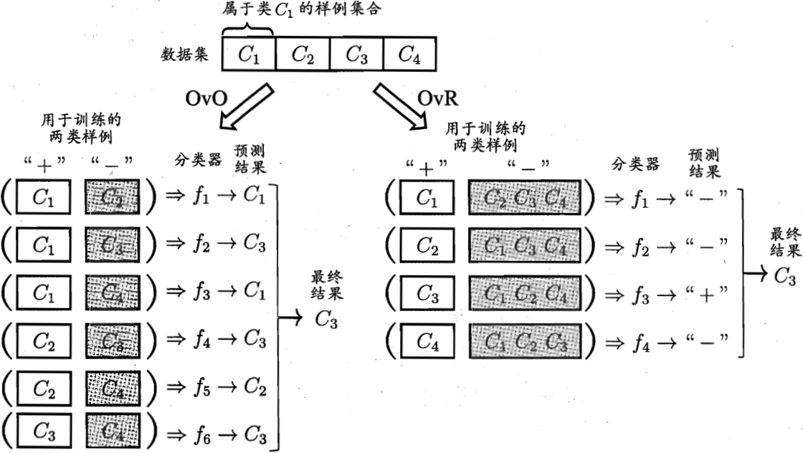

# <b>一.基本形式</b>
给定由d个属性描述的示例$x=(x_i;x_2;...;x_d)$，其中$x_i$是$x$在第$i$个属性上的取值，线性模型试图学得一个通过属性的线性组合来进行预测的函数，即
$$f(x)=w_1x_1+w_2x_2+...+w_dx_d+b, \tag{1}$$
一般用向量形式写成
$$f(x)=w^Tx+b, \tag{2}$$
>其中$w=(w_1;w_2;...;w_d)$.$w$和$d$学得之后，模型就得以确定。

线性模型蕴涵着机器学习中一些重要的基本思想，许多强大的非线性模型(nonlinear model)可在线性模型的基础上通过引入层级结构或高维映射而得。$w$直观表达了各属性在预测中的重要性，因此线性模型在数学上有很好的解释性。
>比如：$f_{好瓜}(x)=0.2\cdot x_{色泽}+0.5\cdot x_{根蒂}+0.3\cdot x_{敲声}+1$，公式表明可通过综合考虑色泽、根蒂和敲声来判断瓜的好乖，其中根蒂最要紧，敲声比色泽重要。

# <b>二.线性回归</b>
给定数据集$D={(x_1,y_1),(x_2,y_2),...,(x_m,y_m)}$，其中$x_i=(x_{i1};x_{i2};...;x_{id})$，$y_i\in\mathbb{R}$。“线性回归”试图学得一个线性模型以尽可能准确地预测实值输出标记。

线性回归试图学得，(以下详解都只考虑特征只有一个属性的情况)
$$f(x_i)=wx_i+b,使得f(x_i)\simeq y_i. \tag{3}$$

问题转化为求$w$和$b$，求$w$和$b$在于如何衡量$f(x)$与$y$之间的差别。均方误差是回归任务中最常用的性能度量，因此让均方误差最小化，即可获得$w$和$b$的值：
$$
\begin{align}
    (w^*,b^*)=argmin_{(w,b)}\sum_{i=1}^{m}(f(x_i)-y_i)^2=argmin_{w,b}\sum_{i=1}^m(y_i-wx_i-b)^2.\tag{4}
\end{align}
$$
>基于均方误差最小化来进行模型求解的方法称为"最小二乘法"。在线性回归中，最小二乘法就是试图找到一条直线，使所有样本到直线上的欧式距离之和最小。 
>均方误差对应了常用的欧几里得距离/欧氏距离。

求解$w$和$b$使$E_{(w,b)}= \sum_{i=1}^m(y_i-wx_i-b)^2$最小化的过程，称为线性回归模型的最小二乘"参数估计"。可将$E_{(w,b)}$分别对$w$和$b$求导，得到：
$$\frac{\partial{E_{(w,b)}}}{\partial{w}}=2\left(w\sum_{i=1}^mx_i^2-\sum_{i=1}^m(y_i-b)x_i\right), \tag{5}$$
$$\frac{\partial{E_{(w,b)}}}{\partial{b}}=2\left(mb-\sum_{i=1}^m(y_i-wx_i)\right), \tag{6}$$
令上面偏导为0，可得到$w$和$b$最优解的闭式解：
$$w=\frac{\sum_{i=1}^my_i(x_i-\bar{x})}{\sum_{i=1}^{m}x_i^2-\frac{1}{m}\left(\sum_{i=1}^mx_i\right)^2} \tag{7}$$
$$b=\frac{1}{m}\sum_{i=1}^{m}(y_i-wx_i) \tag{8}$$
>其中，$\bar{x}=\frac{1}{m}\sum_{i=1}^mx_i$为$x$的均值。

---
上述分析都假设数据样本只有一个属性，接下来分析通用的包含多个属性的数据样本集$D$，样本由$d$各属性描述。此时，试图学得
$$f(x_i)=w^Tx_i+b,使得f(x_i)\simeq y_i,$$
>称为“多元线性回归”；

同样使用最小二乘法来对$w$和$b$进行估计。通常会把$w$和$b$写成一个向量$\hat{w}=(w;b)$，相应地，数据集$D$表示为一个$m\times(d+1)$大小的矩阵$X$，其中每行对应于一个样本，该行前$d$各元素对应于示例的$d$个属性值，最后一个元素置为1，即
$$
\begin{pmatrix}
    x_{11} & x_{12} &... &x_{1d} & 1 \\
    x_{21} & x_{22} &... &x_{2d} & 1 \\
    \vdots & \vdots &\ddots&\vdots&\vdots\\
    x_{m1} & x_{m2} &\ldots&x_{md}&1
\end{pmatrix}=
\begin{pmatrix}
    x_1^T&1\\
    x_2^T&1\\
    \vdots&\vdots\\
    x_m^T&1
\end{pmatrix},          
$$
再把标记也写成向量形式$y=(y_1;y_2;...;y_m)$，则可以将$\hat{w}^*$表示成如下公式：
$$\bar{w}^*=argmin_{\bar{w}}(y-X\bar{w})^T(y-X\hat{w}). \tag{9}$$
令$E_{\hat{w}}=(y-X\hat{w})^T(y-X\hat{w})$，对$\hat{w}$求导得到
$$\frac{\partial E_{\hat{w}}}{\partial \hat{w}}=2X^T(X\hat{w}-y). \tag{10}$$
>令上面的偏导为零，可得$\hat{w}$最优解的闭式解，涉及矩阵的计算，比单变量复杂，下面讨论一下： 
当$X^TX$为满秩矩阵或正定矩阵时，偏导为零，可得：
$$\hat{w}^*=(X^TX)^{-1}X^Ty, \tag{11}$$
其中$(X^TX)^{-1}$是矩阵$(X^TX)$的逆矩阵。令$\hat{x}_i=(x_i;1)$，则最终学得的多元线性回归模型为
$$f(\hat{x}_i)=\hat{x}_i^T(X^TX)^{-1}X^Ty。 \tag{12}$$

但现实中，$X^TX$往往不是满秩矩阵。此时可解出多个$\hat{w}$都能使均方误差最小化。选择哪一个解作为输出，将由学习算法的归纳偏好决定，常见的做法是引入正则化(regularization)项.

把线性回归模型简写成
$$y=w^Tx+b. \tag{13}$$
根据上式，也可以令模型预测值逼近$y$的衍生物，比如让结果输出在指数尺度上，将输出标记的对数作为线性模型逼近的目标，即“对数线性回归”
$$lny=w^Tx+b, \tag{14}$$
对数线性回归实质上是让$e^{w^Tx+b}$逼近$y$。上式在形式上仍然是线性回归，但实质上已是在求取输入空间到输出空间的非线性函数映射，如下图所示：

>这里的对数函数起到了将线性回归模型的预测值与真实标记联系起来的作用。

<b>广义线性模型</b>：更一般地，考虑单调可微函数$g(\cdot)$，令
$$y=g^{-1}(w^Tx+b), \tag{15}$$
>这样的模型称为"广义线性模型",$g(\cdot)$称为联系函数。可知，对数线性回归是广义线性模型在$g(\cdot)=ln(\cdot)$时的特例。

# <b>三.对数几率回归</b>
上面分析了回归任务中使用线性模型来进行学习，针对分类任务，同样也可以使用线性模型，但要求预测结果可微；使用公式(15)的广义模型，找一个单调可微函数将分类任务的真实标记$y$与线性回归模型的预测值联系起来。

<b>二分类任务</b>： 
先考虑二分类任务，其输出标记为$y\in{0,1}$，而线性回归模型产生的预测值$z=w^Tx+b$是实值，因此需要将$x$转换为0/1值。最理想的函数是"单位阶跃函数"：
$$
y=
\begin{cases}
    0,&z<0;\\
    0.5,&z=0; \\
    1,&z>0,
\end{cases} \tag{16}
$$
>单位阶跃函数如下图所示，预测值为临界值零则可任意判别：

>从上图可知，单位阶跃函数不连续，因此不能直接用作广义线性模型中的$g^-(\cdot)$，需要找到一个近似单位阶跃函数的"替代函数"，要求单调可微。对数几率函数正好符合这个要求。

$$y=\frac{1}{1+e^{-z}} \tag{17}$$
对数几率函数是一种"Sigmoid函数"，它将$z$值转化为一个接近0或1的$y$值，并且其输出值在$z=0$附近变化很陡，将对数几率函数作为$g^-(\cdot)$代入广义线性模型(式15)中，得到：
$$y=\frac{1}{1+e^{-(w^Tx+b)}}. \tag{18}$$
>变化后可得：
$$ln\frac{y}{1-y}=w^Tx+b. \tag{19}$$

将$y$视为样本$x$预测为正例的可能性，则$1-y$是反例的可能性，两者的比值
$$\frac{y}{1-y} \tag{20}$$
>称为“几率”,反映了$x$作为正例的相对可能性。对几率取对数得到"对数几率"
$$ln\frac{y}{1-y} \tag{21}$$

<b>logistic regression</b>：式(18)是在用线性回归模型的预测结果取逼近真实标记的对数几率，其对应的模型称为“对数几率回归”(logistic regression)。虽然名字是回归，但确是一个分类学习方法。
>优点: 
>   1. 直接对分类可能性进行建模，无需事先假设数据分布，避免了假设分布不准确所带来的问题；
>   2. 不仅预测出"类别",还可以得到近似概率预测，方便有些需要概率辅助决策的任务；
>   3. 对率回归求解的目标函数是任意阶可导的凸函数，现有的许多数值优化算法都可直接用于求取最优解。

<b>求解对数几率函数</b>：求解式(18)中的$w$和$b$

1. 将y视为类后验概率估计$p(y=1|x)$，式(19)可重写为：
$$ln\frac{p(y=1|x)}{p(y=0|x)}=w^Tx+b. \tag{22}$$
可得如下公式：
$$p(y=1|x)=\frac{e^{w^Tx+b}}{1+e^{w^Tx+b}}, \tag{23}$$
$$p(y=0|x)=\frac{1}{1+e^{w^Tx+b}}, \tag{24}$$
>可以通过"极大似然法"来估计$w$和$b$.给定数据集$\{(x_i,y_i)\}_{i=1}^m$，对率回归模型最大化"对数似然"
$$\ell(w,b)=\sum_{i=1}^{m}lnp(y_i|x_i;w,b), \tag{25}$$
>令每个样本属于其真实标记的概率越大越好，令$\beta=(w;b),\hat{x}={x;1}$，则$w^Tx+b$可简写成$\beta^T\hat{x}$;再令$p_1(\hat{x;\beta})=p(y=1|\hat{x};\beta),p_0(\hat{x};\beta)=p(y=0|\hat{x};\beta)=1-p_1(\hat{x};\beta)$,则上式中的似然项可重写为
$$p(y_i|x_i;w,b)=y_ip_1(\hat{x}_i;\beta)+(1-y_i)p_0(\hat{x}_i;\beta) \tag{26}$$
>将上式代入(25)，并根据式子(23)(24)可知，最大化式(25)等价于最小化：
$$\ell(\beta)=\sum_{i=1}^{m}\left(-y_i\beta^T\hat{x}_i+ln\left(1+e^{\beta^T\hat{x}_i}\right)\right) \tag{27}$$
>上式是关于$\beta$的高阶可导连续凸函数，根据凸优化理论，经典的数值优化算法如梯度下降法、牛顿法等都可求得其最优解，于是就得到：
$$\beta^*=argmin_{\beta}\ell(\beta) \tag{28}$$

<b>求解最优解</b>： 

1. 以牛顿法为例，其第$t+1$轮迭代解的更新公式为：
$$\beta^{t+1}=\beta^t-\left(\frac{\partial^2\ell(\beta)}{\partial{\beta}\partial\beta^T}\right)^{-1}\frac{\partial\ell{\beta}}{\partial\beta}, \tag{29}$$ 
>其中关于$\beta$的一阶、二阶导数分别为
$$\frac{\partial\ell(\beta)}{\partial\beta}=-\sum_{i=1}^{m}\hat{x}_i(y_i-p_1(\hat{x}_i;\beta)), \tag{30}$$
$$\frac{\partial^2\ell(\beta)}{\partial{\beta}\partial\beta^T}=\sum_{i=1}^m\hat{x}_i\hat{x}_i^{T}p_1(\hat{x}_i;\beta)(1-p_1(\hat{x}_i;\beta)), \tag{31}$$

# <b>四.线性判别分析</b>
线性判别器分析(Linear Discriminant Aanlysis,简称LDA)是一种经典的线性学习方法，总体思想如下：
1).给定训练样例集，设法将样例投影到一条直线上，使得同类样例的投影点尽可能接近、异类样例的投影点尽可能远离；2).在对新样本进行分类时，将其投影到同样的这条直线上，再根据投影点的位置来确定新样本的类别。如下图所示：

>"+"表示正例，"-"表示反例，线表示投影；红色实心圆和实心三角表示两类样本投影的中心点。

给定数据集$D={(x_i,y_i)}_{i=1}^{m},y_i\in{0,1}$，令$X_i$、$\mu_i$、$\Sigma_i$分别表示第$i\in{0,1}$类示例的集合、 均值向量、协方差矩阵。投影直线$w$上，两类样本的中心在直线$w$上的投影分别为$w^T\mu_0$和$w^T\mu_1$；协方差分别为$w^T\Sigma_0w$和$w^T\Sigma_1w$；若$w$是一维空间，则$w^T\mu_0$、$w^T\mu_1$、$w^T\Sigma_0w$和$w^T\Sigma_1w$均为实数。

希望同类样例的投影点尽可能接近，则需要让同类样例的投影点的协方差尽可能小，即$w^T\Sigma_0w+w^T\mu_1$尽可能小；同时希望异类样例的投影点尽可能远离，需要让类中心的距离尽可能小，即$\lVert w^T\mu_0-w^T\mu_1\rVert_{2}^{2}$尽可能大，得到最大化的目标如下：
$$
\begin{aligned}
    J&=\frac{\lVert w^T\mu_0-w^T\mu_1\rVert_2^2}{w^T\Sigma_0w+w^T\Sigma_1w} \\
    &=\frac{w^T(\mu_0-\mu_1)(\mu_0-\mu_1)^Tw}{w^T(\Sigma_0+\Sigma_1)w}
\end{aligned} \tag{32}
$$

定义“类内散度矩阵”(within-class scatter matrix)
$$
\begin{aligned}
    S_w&=\Sigma_0+\Sigma_1 \\
    &=\sum_{x\in X_0}(x-\mu_0)(x-\mu_0)^T+\sum_{x\in X_1}(x-\mu_1)(x-\mu_1)^T
\end{aligned} \tag{33}
$$

以及"类间散度矩阵"(between-class scatter matrix)
$$
S_b=(\mu_0-\mu_1)(\mu_0-\mu_1)^T, \tag{34}
$$

对式(32)重写如下：
$$
J=\frac{w^TS_bw}{w^TS_ww}. \tag{35}
$$
得到LDA欲最大化的目标，即$S_b$和$S_w$的“广义瑞丽商”。

<b>求解LDA</b>： 
求解LDA最大化目标就是要求解$w$，分子和分母都是关于$w$的二次项，因此式(35)的解与$w$的长度无关，只与方向有关。令$w^TS_ww=1$，则式(35)等价于
$$min_{w}-w^TS_bw, s.t. w^TS_ww=1. \tag{36}$$
根据拉格朗日乘子法，上式等价于
$$S_bw=\lambda S_ww, \tag{37}$$
其中，$\lambda$是拉格朗日乘子，注意到$S_bw$的方向恒为$\mu_0-\mu_1$，不妨令
$$S_bw=\lambda (\mu_0-\mu_1) \tag{38}$$
代入式(37)，即得：
$$w=S_w^{-1}(\mu_0-\mu_1). \tag{39}$$

考虑数值解得稳定性，在实践中通常是对$S_w$进行奇异值分解，即$S_w=U\Sigma V^T$，这里$\Sigma$是一个实对角矩阵，其对角线上的元素是$S_w$的奇异值，然后再由$S_w^{-1}=V\Sigma^{-1}U^T$得到$S_w^{-1}$。
>当两类数据同先验、满足高斯分布且协方差相等时，LDA可达到最优分类。

<b>将LDA推广到多分类任务中</b>： 
假定存在$N$个类，且第$i$类示例数为$m_i$，先定义"全局散度矩阵"
$$
\begin{aligned}
    S_t&=S_b+S_w\\
    &=\sum_{i=1}^{m}(x_i-\mu)(x_i-\mu)^T
\end{aligned} \tag{40}
$$
>其中$\mu$是所有样本的均值向量。将类内散度矩阵$S_w$重定义为每个类别的散度矩阵之和，即：
$$S_w=\sum_{i=1}^{N}S_{w_i} \tag{41}$$
其中
$$S_{w_i}=\sum_{x\in{X_i}}(x-\mu_i)(x-\mu_i)^T. \tag{42}$$

由式(40)~(42)可得：
$$
\begin{aligned}
    S_b&=S_t-S_w \\
    &=\sum_{i=1}^{N}m_i(\mu_i-\mu)(\mu_i-\mu)^T.
\end{aligned} \tag{43}
$$

可见，多分类LDA可以有多种实现方法：使用$S_b$、$S_w$、$S_t$三者中的任何两个即可。常见的一种实现是采用优化目标：
$$max_W=\frac{tr(W^TS_bW)}{tr(W^TS_wW)}, \tag{44}$$
>其中$W\in\mathbb{R}^{d\times(N-1)}$，$tr(\cdot)$表示矩阵的迹(trace)。上式可通过如下广义特征值问题求解：
$$S_bW=\lambda S_wW. \tag{45}$$
>$W$的闭式解则是$S_w^{-1}S_b$的$d^{\prime}$个最大非零广义特征值所对应的特征向量组成的矩阵，$d^{\prime}\le N-1.$

若将$W$视为一个投影矩阵，则多分类LDA将样本投影到$d^{\prime}$维空间，$d^{\prime}$通常远小于数据原有的属性数d。于是，可通过这个投影来减小样本点的维数，且投影过程中使用了类别信息，因此LDA也常被视为一种经典的监督降维技术。

# <b>五.多分类学习</b>
将上面描述的二分类方法推广到多分类任务中，考虑$N$个类别$C_1,C_2,...,C_N$，多分类学习的基本思路是"拆解法",即将多分类任务拆分为若干个二分类任务求解，为每个二分类任务训练一个分类器；测试时，对这些分类器的预测结果进行集成以获得最终的多分类结果。因此，对多分类问题如何拆解？以及如果对多个分类器进行集成？是需要解决的问题。

<b>拆解多分类任务</b>： 
经典的拆分策略有：“一对一”、“一对其余”和“多对多”。给定数据集$D={(x_1,y_1),(x_2,y_2),...,(x_m,y_m)},y_i\in\{C_1,C_2,...,C_N\}$。1.一对一拆解将这$N$个类别两两配对，从而产生$N(N-1)/2$个二分类任务，举例：针对类别$C_i$和$C_j$，将$C_i$作为正例，$C_j$作为反例。在测试阶段新样本会提交给所有分类器，得到$N(N-1)/2$个分类结果，最终结果通过投票产生：即把被预测最多的类别作为最终分类结果，下图给出了投票产生最终结果的示意图:

2.一对其余则是每次将一个类的样例作为正例、所有其他类的样例作为反例，训练得到$N$个分类器；在测试时，若仅有一个分类器预测为正类，则对应的类别标记作为最终分类结果；若有多个分类器预测为正类，则通常考虑分类器的预测置信度，选择置信度最大的类别标记为分类结果，如上图所示。

<b>一对一和一对其余拆分策略性能对比</b>： 
一对其余只需要训练$N$个分类器，而一对一需训练$N(N-1)/2$个分类器，因此一对一的存储开销和测试时间比一对其余更大。但在训练时，一对其余的每个分类器均使用全部训练样例，而一对一的每个分类器仅用到两个类的样例，因此，在类别很多时，一对一对的训练时间开销通常比一对其余更小。至于预测性能，则取决于具体的数据分布，在多数情形下两者差不多。

3.多对多时每次将若干个类作为正类，其余类作为反类，一对一和一对其余是多对多的一个特列；为了在测试中能预测出结果，多对多的正、反类构造有特殊的涉及，比如"纠错输出码"(Error Correcting Output Codes, ECOC)。ECOC是将编码的思想引入类别拆分，并尽可能在解码中具有容错性。ECCOC工作过程主要分为两步：

    1. 编码：对$N$个类别做$M$次划分，每次划分将一部分类别划为正类，一部分划为反类，从而形成一个二分类训练集；这样一共产生$M$个训练集，可训练出$M$个分类器。
    2. 解码：$M$个分类器分别对测试样本进行预测，这些预测标记组成一个编码。将这个预测编码与每个类别各自的编码进行比较，返回其中距离最小的类别作为最终预测结果。

类别划分通过"编码矩阵"指定，下图给出两种典型的编码矩阵：二元码和三元码。二元码将每个类别分别指定为正类和反类，三元码还会指定一个“停用类”。在下图(a)中，分类器$f_2$将$C_1$类和$C_3$类的样例作为正例，$C_2$和$C_4$类的样例作为反例。下图(b)中，分类器$f_4$将$C_1$和$C_4$作为正例，$C_3$类的样例作为反例。在解码阶段，各分类器的预测结果联合起来形成了测试样本的编码，该编码与各类所对应的编码进行比较，将距离最小的编码所对应的类别作为预测结果。比如：在下图(a)中，若基于欧氏距离，预测结果将是$C_3$。

<b>为什么称为纠错输出码</b>： 
因此在测试阶段ECOC编码对分类器的错误有一定的容忍和修正能力，上图(a)中对测试示例的正确预测编码是$(-1,+1,+1,-1,+1)$，假设在预测时某个分类器出错了，例如$f_2$出错从而导致了错误编码$(-1,-1,+1,-1,+1)$,但基于这个编码仍可以产生正确的最终分类结果$C_3$。ECOC编码越长，纠错能力越强，然而编码越长，意味着所需训练的分类器越多，计算、存储开销都会增大；另一方面，对有限类别数，可能的组合数目是有限的，码长超过一定范围后就失去了意义。

同等长度的编码，理论上来说，任意两个类别之间的编码距离越远，则纠错能力越强。因此，在码长较小时可根据这个原则计算出理论最优编码。然而，码长稍大一些就难以有效地确定最优编码，这是一个NP难问题。通常并不需要获得理论最优编码，因为非最优编码在实践中往往已能产生足够好的分类器。

# <b>六.类别不平衡问题</b>
前面的分析都基于不同类别的训练样本数目相当的前提，但实际中，存在一些不同类别数目差别很大的任务，比如998个反例，2个正例，如果将所有的新样本都预测为反例，也可以达到99.8%的精度。但这样的学习器没有价值，因为它预测正例的能力比较弱。

令$m^+$表示正例数目，$m^-$表示反例数目；在用$y=w^Tx+b$对新样本$x$进行分类时，实际上是用$y$值与一个阈值进行比较，比如$y>0.5$时判别为正例，否则为反例。$y$其实也是正例的可能性，几率$\frac{y}{1-y}$反映了正例可能性与反例可能性的比值。阈值0.5恰表明分类器认为正、反例可能性相同，即分类器决策规则为：
$$若\frac{y}{1-y}>1则预测为正例 \tag{46}$$

当训练集中正、反例的数目不同时，观测几率是$\frac{m^+}{m^-}$，于是，只要分类器的预测几率高于观测几率就应判定为正例，即
$$若\frac{y}{1-y}>\frac{m^+}{m^-}，则预测为正例。$$

<b>再缩放</b>：分类器基于式(46)进行决策，因此需要对预测值进行调整，类别不平衡学习的一个基本策略就是"再缩放"：
再缩放是基于"训练集是真实样本总体的无偏采样"的假设，但这个假设并不一定是成立的，因此，实践中未必可以基于训练集观测几率来推断出真实几率。 

因此，在处理类被不平衡问题上，通常有以下三类做法(假设正例样本少)：

1. 直接对训练集里的反类样例进行"欠采样"，使得正、反例数目接近，然后再进行学习；
2. 对训练集里正样本进行"过采样",即增加一些正例使正、反例数目接近，然后再进行学习；
3. 直接基于原始训练集进行学习，但在用训练好的分类器进行预测时，将上面式(48)嵌入到决策过程中，称为“阈值移动”。

>欠采样时间开销远小于过采样，因为丢弃了很多样本，使得分类器训练集小于初始训练集；过采样增加了很多正例，训练集大于初始训练集，过采样不是重复采样，而是使用插值法来产生额外的正例。欠采样丢弃一些反例样本，有可能丢失一些重要信息，欠采样的代表性算法是利用集成学习机制，将反例划为若干个集合供不同学习器使用，这样对每个学习器都进行了欠采样，但在全局看来却不会丢失重要信息。

“再缩放”也是“代价敏感学习”的基础。在代价敏感学习中将式(48)中的$m^-/m^+$用$cost^+/cost^-$代替即可，其中$cost^+$是将正例误分为反例的代价，$cost^-$是将反例误分为正例的代价。

