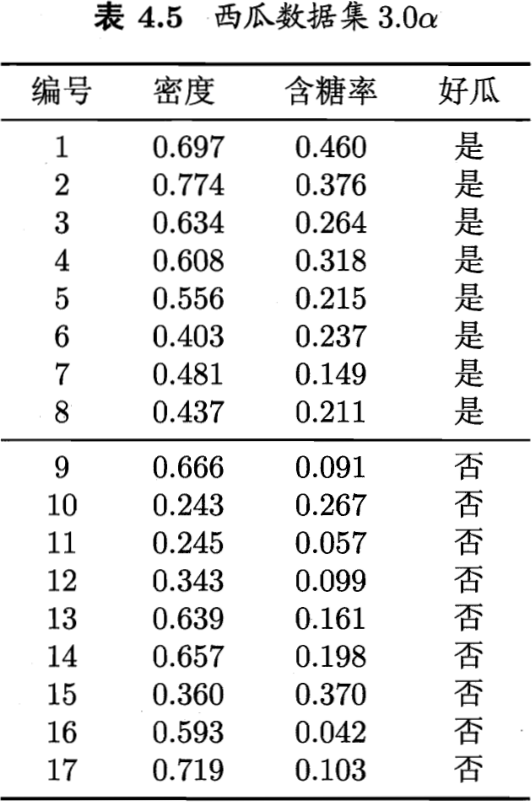

# <b>一.基本流程</b>
决策树是一类常见的机器学习方法，用于分类任务。如下图所示，决策树是基于树结构，根节点包含样本全集，每个节点对应于一个属性的决策，叶子节点对应于决策结果。每个测试的结果或是导出最终结论，或是导出进一步的判定问题，其考虑范围是在上一次决策结果的限定问题之内，例如若在“色泽=青绿”之后再判断“根蒂=？”，则仅考虑青绿色瓜的根蒂。

<b>决策树流程</b>：决策树的学习的目的是为了产生一棵泛化能力强，即处理未见示例能力强的决策树，其基本流程遵循简单且直观的“分而治之”策略。如下图所示：

决策树的生成是一个递归过程，有三种情形会导致递归返回：(1)当前节点包含的样本全属于同一类别，无需划分；(2)当前属性为空，或是所有样本在所有属性上取值相同，无法划分；(3)当前节点包含的样本集合为空，不能划分。

>上述情形(2)会把当前节点标记为叶节点，其类别设定为该节点所含样本最多的类别；情形(3)同样把该节点标记为叶结点，但将其类别设定为其父节点所含样本最多的样本。

# <b>二.划分选择</b>
决策树算法流程中，最关键的是第8行：从A中选择最优划分属性$a_*$，如何选择最优划分属性？随着划分的进行，通常希望决策树的分支节点所包含的样本尽可能属于同一类别，即结点的“纯度”越来越高。

## <b>2.1 信息增益</b>
"信息熵"用来衡量样本集合纯度，假设当前样本集合$D中第$k$类样本所占的比例为$p_k (k=1,2,...,|y|)$，则$D$的信息熵定义如下：
$$Ent(D)=-\sum_{k=1}^{|y|}p_klog_2{p_k}. \tag{1}$$
>信息熵越小，也就是$Ent(D)$越小，样本集$D$的纯度越高。

假定离散属性$a$有$V个可能的取值${a^1,a^2,...,a^V}$，若使用$a$来对样本集$D$进行划分，则会产生$V个分支结点，其中第$v$个分支节点包含了$D$中所有在属性$a$上取值为$a^v$的样本，记为$a^v$。根据式(1)可计算出$D^v$的信息熵，再考虑不同的分支节点所包含的样本数不同，给分支结点赋予权重$|D^v|/|D|$，即样本数越多的分支结点的影响越大，于是可计算出用属性$a$对样本集$D$进行划分所获得的“信息增益”：
$$Gain(D,a)=Ent(D)-\sum_{v=1}^{V}\frac{|D^v|}{|D|}Ent(D^v). \tag{2}$$
>信息增益越大，则意味着使用属性$a$来进行划分所获得的“纯度提升”越大，因此可以用信息增益来进行决策树的划分属性选择，选择属性$a_*=argmax_{a\in A}Gain(D,a)$。
<table align=center>
    <tr><td>编号</td><td>色泽</td><td>根蒂</td><td>敲声</td><td>纹理</td><td>脐部</td><td>触感</td><td>好瓜</td></tr>
    <tr><td>1</td><td>青绿</td><td>蜷缩</td><td>浊响</td><td>清晰</td><td>凹陷</td><td>硬滑</td><td>是</td></tr>
    <tr><td>2</td><td>乌黑</td><td>蜷缩</td><td>沉闷</td><td>清晰</td><td>凹陷</td><td>硬滑</td><td>是</td></tr>
    <tr><td>3</td><td>乌黑</td><td>蜷缩</td><td>浊响</td><td>清晰</td><td>凹陷</td><td>硬滑</td><td>是</td></tr>
    <tr><td>4</td><td>青绿</td><td>蜷缩</td><td>沉闷</td><td>清晰</td><td>凹陷</td><td>硬滑</td><td>是</td></tr>
    <tr><td>5</td><td>浅白</td><td>蜷缩</td><td>浊响</td><td>清晰</td><td>凹陷</td><td>硬滑</td><td>是</td></tr>
    <tr><td>6</td><td>青绿</td><td>稍蜷</td><td>浊响</td><td>清晰</td><td>稍凹</td><td>软粘</td><td>是</td></tr>
    <tr><td>7</td><td>乌黑</td><td>稍蜷</td><td>浊响</td><td>稍糊</td><td>稍凹</td><td>软粘</td><td>是</td></tr>
    <tr><td>8</td><td>乌黑</td><td>稍蜷</td><td>浊响</td><td>清晰</td><td>稍凹</td><td>硬滑</td><td>是</td></tr>
    <tr><td>9</td><td>乌黑</td><td>稍蜷</td><td>沉闷</td><td>稍糊</td><td>稍凹</td><td>硬滑</td><td>否</td></tr>
    <tr><td>10</td><td>青绿</td><td>硬挺</td><td>清脆</td><td>清晰</td><td>平坦</td><td>软粘</td><td>否</td></tr>
    <tr><td>11</td><td>浅白</td><td>硬挺</td><td>清脆</td><td>模糊</td><td>平坦</td><td>硬滑</td><td>否</td></tr>
    <tr><td>12</td><td>浅白</td><td>蜷缩</td><td>浊响</td><td>模糊</td><td>平坦</td><td>软粘</td><td>否</td></tr>
    <tr><td>13</td><td>青绿</td><td>稍蜷</td><td>浊响</td><td>稍糊</td><td>凹陷</td><td>硬滑</td><td>否</td></tr>
    <tr><td>14</td><td>浅白</td><td>稍蜷</td><td>沉闷</td><td>稍糊</td><td>凹陷</td><td>硬滑</td><td>否</td></tr>
    <tr><td>15</td><td>乌黑</td><td>稍蜷</td><td>浊响</td><td>清晰</td><td>稍凹</td><td>软粘</td><td>否</td></tr>
    <tr><td>16</td><td>浅白</td><td>蜷缩</td><td>浊响</td><td>模糊</td><td>平坦</td><td>硬滑</td><td>否</td></tr>
    <tr><td>17</td><td>青绿</td><td>蜷缩</td><td>沉闷</td><td>稍糊</td><td>稍凹</td><td>硬滑</td><td>否</td></tr>
</table>
以上面表格为例，数据集包含17个训练样例，其中$|y|=2$，类别为2；正例样本占比$p_1=\frac{8}{17}$，反例占比$p_2=\frac{9}{17}$；

<b>1.根节点信息熵</b>：可计算出样本集$D$也就是根节点的信息熵为：

$$Ent(D)=-\sum_{k=1}^{2}p_klog_2p_k=-(\frac{8}{17}log_2\frac{8}{17}+\frac{9}{17}log_2\frac{9}{17})=0.998.$$

<b>2.当前属性的信息增益</b>：当前属性集合{色泽，根蒂，敲声，纹理，脐部，触感},计算每个属性的信息增益，以“色泽”为例，存在3个可能的取值：{青绿、乌黑、浅白},首先计算每个属性取值的信息熵，然后计算属性色泽的信息增益： 
 - 属性值青绿集合$D^1包含编号为{1,4,6,10,13,17}$共6个，正例占比$p_1=\frac{3}{6}，反例占比p_2=\frac{3}{6}$； 
 - 属性值乌黑集合$D^2包含编号为{2,3,7,8,9,15}$共6个，正例占比$p_1=\frac{4}{6}，反例占比p_2=\frac{2}{6}$； 
 - 属性值浅白集合$D^3包含编号为{5,11,12,14,16}$共5个，正例占比$p_1=\frac{1}{5}，反例占比p_2=\frac{4}{5}$； 

计算根据属性"色泽"划分之后所获得的3个分支结点的信息熵为： 
$$Ent(D^1)=-\left(\frac{3}{6}log_2\frac{3}{6}+\frac{3}{6}log_2\frac{3}{6}\right)=1.000$$
$$Ent(D^2)=-\left(\frac{4}{6}log_2\frac{4}{6}+\frac{2}{6}log_2\frac{2}{6}\right)=0.918$$
$$Ent(D^3)=-\left(\frac{1}{5}log_2\frac{1}{5}+\frac{4}{5}log_2\frac{4}{5}\right)=0.722$$
计算属性“色泽”的信息增益为：
$$Gain(D,色泽)=Ent(D)-\sum_{v=1}^{3}\frac{|D^v|}{|D|}Ent(D^v)=0.998-\left(\frac{6}{17}\times1.000+\frac{6}{17}\times0.918+\frac{5}{17}\times0.722\right)-0.109$$
使用相同的计算流程，可以计算出其他属性的信息增益：
$$Gain(D,根蒂)=0.143；Gain(D,敲声)=0.141；Gain(D,纹理)=0.381；Gain(D,脐部)=0.289；Gain(D,触感)=0.006.$$

可以看出，上述属性中，“纹理”的信息增益最大，在创建决策树时应该选择它作为划分属性。下图展示了基于“纹理”对根节点进行划分的结果：

>接下来，把上图每个叶子结点重新定义为一个根节点，根据属性取值重复上述步骤计算每个属性的信息增益，再选择新的属性值作为划分属性，比如计算$D^1$结点各属性的信息增益如下： 

$$Gain(D^1,色泽)=0.043；Gain(D^1,根蒂)=0.458；Gain(D^1,敲声)=0.331；Gain(D^1,脐部)=0.458；Gain(D^1,触感)=0.458.$$ 
>上述信息增益显示，“根蒂”、“脐部”、“触感”3个属性都取得了最大的信息增益，可任意选择其中一个作为划分属性，重复上述划分属性的选择步骤最终得到如下的决策树：

## <b>2.2 增益率</b>
根据信息增益的原理可知，信息增益准则对属性值的数量较多的属性有偏好，为减少这种偏好可能带来的影响，[C4.5决策树算法]使用“增益率”来代替信息增益作为划分属性的选择方式，增益率定义如下：
$$Gain_ratio(D,a)=\frac{Gain(D,a)}{IV(a)}. \tag{4.3}$$
>其中$IV(a)$定义如下，称为属性$a$的“固有值”，属性$a$的取值数目越多(V越大),则$IV(a)$的值通常会越大。
$$IV(a)=-\sum_{v=1}^{V}\frac{|D^v|}{|D|}log_2\frac{|D^v|}{|D|}. \tag{4}$$
>对上面表格中的例子，有$IV(触感)=0.874(V=2),IV(色泽)=1.580(V=3),IV(编号)=4.088(V=17)$。

<b>需要注意</b>：增益率准备可能对取值数目较少的属性有偏好，因此，[C4.5决策树算法]并不是直接选择增益率最大的候选划分属性，而是使用了一个启发式：先从候选划分属性中找出信息增益大于平均水平的属性，再从中选择增益率最高的。

## <b>2.3 基尼指数</b>
[CART决策树]使用“基尼系数”来选择划分属性，采用与式(1)相同的符号，数据集$D$的纯度可用基尼值来度量：
$$Gini(D)=\sum_{k=1}^{|y|}\sum_{k^\prime\ne k}p_kp_{k^\prime}=1-\sum_{k=1}^{|y|}p_k^2. \tag{5}$$
>直观来说，Gini(D)反映了从数据集$D$中随机抽取两个样本，其类别标记不一致的概率，因此Gini(D)越小，则数据集$D$的纯度越高。

属性a的基尼指数定义为：
$$Gini_index(D,a)=\sum_{v=1}^{V}\frac{|D^v|}{|D|}Gini(D^v). \tag{6}$$
在候选属性集合A中，选择那个使得划分后基尼指数最小的属性作为最优划分属性，即$a_*=argmin_{a\in A}Gini_index(D,a).$

# <b>三.剪枝处理</b>
剪枝是决策树学习算法对付“过拟合”的主要手段。而决策树“过拟合”的主要原因是在不断重复划分结点过程中，造成决策树分支过多，会导致决策树将训练样本学得太好，把训练集自身的一些特点当作所有数据都具有的一般性质。处理方法就是剪枝，去掉一些分支来降低过拟合。

决策树剪枝的基本策略：预剪枝和后剪枝。
- 预剪枝：是在决策树生成过程中，对每个结点在划分前先进行估计，若当前结点的划分不能带来决策树的泛化性能提升，则停止划分并将当前结点标记为叶结点；
- 后剪枝：是先从训练集生成一棵完整的决策树，然后自底向上地对非叶子节点进行考察，若该结点对应的子树替换为叶结点能带来泛化性能提升，则将该子树替换为叶结点。

综上可知，剪枝的关键工作是判断决策树泛化能力是否提升？泛化性能自然是采用测试集来衡量的，采用前面章节学习到的性能评估方法，采用留出法，一部分数据集用来做训练集，另一部分用来做测试集。

如下图所示，将第2小结的数据集划分为两部分：

>前半部分数据用来生成决策树，采用2.1节介绍的信息增益准则来划分属性选择将会生成一棵决策树(如下图(5)所示)，后半部分数据用来验证决策树的泛化性能。
<table align=center>
    <tr><td align=center></td></tr>
    <tr><td align=center><b>图(5) 基于表4.2生成的未剪枝决策树</b></td></tr>
</table>

## <b>3.1 预剪枝</b>
对于上图所示的数据集，基于信息增益准则，会选择属性“脐部”来对训练集进行划分，并产生3个分支，如下图(6)所示；是否要对这个属性进行划分，预剪枝会对这个结点进行评估.
<table align=center>
    <tr><td align=center></td></tr>
    <tr><td align=center><b>图(6) 基于表4.2生成的预剪枝决策树</b></td></tr>
</table>

>如果该结点不进行划分，就需要将该结点标记为叶结点，其类别标记为训练样例数最多的类别，这个叶结点会被标记为“好瓜”。用表4.2的验证集对这个单节点决策树进行评估，则编号为{4,5,8}的样例被分类正确，另外4个样例分类错误，于是验证集精度为$\frac{3}{7}\times100\%=42.9\%$.
>用属性“脐部”划分之后，图(6)中的结点②、③、④分别包含编号为{1,2,14}、{6,7,15,17}、{10，16}的训练样例，因此这3个结点分别被标记为叶结点“好瓜”、“好瓜”、“坏瓜”。此时，验证集中编号为{4,5,8,11,12}的样例被分类正确，验证集精度为$\frac{5}{7}\times100\%=71.4\%>42.9\%$。
>综上，用“脐部”进行划分是合理的。

1. 接下来使用相同的方法对结点②进行划分，基于信息增益准则将挑选出划分属性“色泽”.使用色泽划分后，编号为{5}的验证集样本分类结果会由正确转化为错误，使得验证集下降为57.1%.于是根据预剪枝策略，将禁止结点②被划分。

2. 对结点③，最优划分属性为“根蒂”,划分后验证集精度仍为71.4%。这个划分不能提升验证集精度，根据预剪枝策略禁止结点③的划分。

3. 对结点④，其所包含的训练样例已属于同一类，不再进行划分。

因此，图(6)所示的决策树，就是根据数据集4.2生成的最终决策树模型，验证集精度为71.4%。这是一棵仅有一层划分的决策树，亦称“决策树桩”。

<b>预剪枝风险</b>：预剪枝使得很多分支没有展开，不仅有效避免了过拟合，还显著减少了决策树的训练时间开销和测试时间开销。但是，有些分支的当前划分虽不能提升泛化性能、甚至可能导致泛化性能暂时下降，但在其基础上进行的后续划分却有可能导致性能显著提高；预剪枝基于“贪心”本质禁止这些分支展开，给预剪枝决策树带来了欠拟合的风险。(比如剪掉了结点②，有可能结点②继续划分下去会提升泛化性能)

## <b>3.2 后剪枝</b>
后剪枝是需要先根据训练数据集生成一棵完整的决策树，如图(5)所示，该决策树的验证集精度为42.9%。

<b>后剪枝流程</b> 

1. 首先考虑结点⑥。若将其整个分支剪掉，就相当于把结点⑥当成叶子结点，根据决策树策略该结点被标记为“好瓜”，此时决策树的验证集精度提高至57.1%。根据后剪枝策略需要剪枝，如图(7)所示。
2. 然后考虑结点⑤，若将其整个分支替换为叶结点，根据决策树策略标记为“好瓜”,此时验证集精度仍为57.1%，后剪枝策略可以不剪枝。
3. 对结点②，若将其分支替换为叶子节点，根据决策树策略，标记为“好瓜”;此时决策树的验证集精度为71.4%。后剪枝策略可以剪枝。
4. 对结点③和①，若将其替换为叶子结点，根据决策树的验证集精度分别为71.4%和42.9%,均未得到提高，根据后剪枝策略，不剪枝。

>最终得到图(7)所示的后剪枝决策树，验证集精度为71.4%。相比预剪枝决策树，可以发现后剪枝决策树保留了更多的分支。

<b>总结(预剪枝和后剪枝决策树优缺点)</b>：一般情形下，后剪枝决策树的欠拟合风险很小，泛化性能往往优于预剪枝决策树。但后剪枝过程是在生成完全决策树之后进行的，并且要自底向上地对树中的所有非叶结点进行逐一观察，因此其训练时间开销比未剪枝决策树和预剪枝决策树要大很多。

<table align=center>
    <tr><td align=center></td></tr>
    <tr><td align=center><b>图(7) 基于表4.2生成的后剪枝决策树</b></td></tr>
</table>

# <b>四.连续与缺失值</b>
## <b>4.1 连续值处理</b>
前面的讨论都是基于离散属性值来生成决策树，现实任务中常遇到连续属性，在决策树生成中如何使用连续属性？

因为连续值范围不是有限的，不能根据连续属性的可取值来对结点进行划分，通常使用连续属性离散化技术； 
最简单的策略是采用“二分法”对连续属性进行处理，二分法也是[C4.5决策树]算法中采用的机制。

<b>二分法</b>： 
给定样本集$D$和连续属性$a$，假定$a$在$D$上出现了$n$个不同的取值，将这些值从小到大进行排序，记为${a^1,a^2,...,a^n}$。基于划分点$t$可将$D$分为子集$D_t^-$和$D_t^+$，其中$D_t^-$包含那些在属性$a$上取值不大于$t$的样本，而$D_t^+$则包含那些在属性上取值大于$t$的样本。显然，对相邻的属性取值$a^i$和$a^{i+1}$来说，$t$在区间$[a^i,a^{i+1})$中取任意值所产生的划分结果相同。因此，对连续属性$a$，我们可考察包含$n-1$个元素的候选划分点集合

$$T_a=\left \{ \frac{a^i+a^{i+1}}{2}|1\le i \le n-1 \right \}, \tag{7}$$
>即把区间$[a^i,a^{i+1})$的中位点$\frac{a^i+a^{i+1}}{2}$作为候选划分点。然后，就可以像离散值一样来考察这些划分点，选取最优的划分点进行样本集合的划分。例如，可对式子(2)稍加改造：
$$Gain(D,a)=max_{t\in T_a}Gain(D,a,t)=max_{t\in T_a}Ent(D)-\sum_{\lambda\in\{-,+\}}\frac{|D_t^\lambda|}{|D|}Ent(D_t^\lambda) \,\tag{8}$$
>其中，$Gain(D,a,t)$是样本集$D$基于划分点$t$二分后的信息增益。最终选择使$Gain(D,a,t)$最大化的划分点。

举个例子,如下表所示，添加了两个连续属性"密度"和"含糖率"：
<table align=center>
    <tr><td align=center></td></tr>
</table>

<b>连续值处理</b>： 
1.对属性"密度"，在决策树学习开始时，根节点包含的17个训练样本在该属性上取值均不同。根据式(7)，计算有序值两两之间的均值，得到该属性的候选划分点集合包含16个候选值：$T_{密度}={0.244,0.294,0.351,0.381,0.420,0.459,0.518,0.574,0.600,0.621,0.636,0.648,0.661,0.681,0.708,0.746}$。由式(8)可计算出属性"密度"的信息增益为0.262，对应于划分点0.381.

2.对属性“含糖量”，根据式(7)得到该属性的候选划分点集合包含16个候选值：$T_{含糖量}={0.049,0.074,0.095,0.101,0.126,0.155,0.179,0.204,0.213,0.226,0.250,0.265,0.292,0.344,0.373,0.418}$.类似的，根据式(8)可计算出其信息增益为0.349，对应于划分点0.126.

3.再由2.1节可知，表4.3的数据上各属性的信息增益为
$$Gain(D,色泽)=0.109；Gain(D,根蒂)=0.146；Gain(D,敲声)=0.141；Gain(D,纹理)=0.381；$$
$$Gain(D,脐部)=0.289；Gain(D,触感)=0.006；Gain(D,密度)=0.262；Gain(D,含糖量)=0.349；$$
“纹理”被选作根节点划分属性，循环执行决策树生成策略，得到如下图(8)所示的最终决策树。
<table align=center>
    <tr><td align=center></td></tr>
    <tr><td align=center><b>图(8) 表4.3基于信息增益生成的决策树</b></td></tr>
</table>

## <b>4.2 缺失值处理</b>
分类任务中经常碰到不完整样本，存在大量样本在某些属性上取值未知。如果放弃不完整样本，仅使用无缺失值样本，很有可能会浪费数据信息。本章学习利用有缺失值的样本来进行学习。
<table align=center>
    <tr><td align=center></td></tr>
</table>
>如果放弃含缺失值的样本，那么只剩下4个样本可供使用。

<b>需要解决两个问题</b>：

1. 如何在属性值缺失的情况下进行划分属性选择？
2. 给定划分属性，若样本在该属性上的值缺失，如何对样本进行划分?

<b>分析</b>：

给定训练集$D$和属性$a$，令$\tilde{D}$表示$D$中在属性$a$上没有缺失值的样本子集。对问题1，仅根据$\tilde{D}$来判断属性$a$的优劣。

假设属性$a$有$V$个可取值${a^1,a^2,...,a^V}$，令$\tilde{D}^v$表示$\tilde{D}$中在属性$a$上取值为$a^v$的样本子集，$\tilde{D}_k$表示$\tilde{D}$属于第$k类(k=1,2,..,|y|)$的样本子集。有$\tilde{D}=\bigcup_{k=1}^{|y|}\tilde{D}_k$，$\tilde{D}=\bigcup_{v=1}^V\tilde{D}^v$.

假定为每个样本$x$赋予一个权重$w_x$，并定义：

$$\rho=\frac{\sum_{x\in\tilde{D}}w_x}{\sum_{x\in D}w_x}，\tag{9}$$
$$\tilde{\rho}_k=\frac{\sum_{x\in\tilde{D}_k}w_x}{\sum_{x\in \tilde{D}}w_x}，(1\le k \le |y|)\tag{10}$$
$$\tilde{r}_v=\frac{\sum_{x\in\tilde{D}^v}w_x}{\sum_{x\in D}w_x}，(1\le v \le V) \tag{11}$$

对属性$a,\rho$表示无缺失值样本所占的比例；$\tilde{p}_k$表示无缺失值样本中第$k$类所占的比例，$\tilde{r}_v$表示无缺失值样本中在属性$a$上取值$a^v$的样本所占的比例。有，$\sum_{k=1}^{|y|}\tilde{p}_k=1,\sum_{v=1}^{V}\tilde{r}_v=1$.

基于上述定义，信息增益计算公式(2)推广为：
$$Gain(D,a)=\rho\times Gain(\tilde{D},a)=\rho\times\left(Ent(\tilde{D})-\sum_{v=1}^V\tilde{r}_vEnt(\tilde{D}^v)\right), \tag{12}$$
其中，
$$Ent(\tilde{D})=-\sum_{k=1}^{|y|}\tilde{p}_k\log_2\tilde{p}_k.$$

对问题2，若样本$x$在划分属性$a$上的取值已知，则将$x$划入与其取值对应的子节点，且样本权值在子结点中保持为$w_x$。若样本$x$在划分属性$a$上的取值未知，则将$x$同时划入所有子结点，且样本权值在与属性值$a^v$对应的子结点中调整为$\tilde{r}_v\cdot w_x$；这就是让同一个样本以不同的概率划入到不同的子结点中去。(C4.5算法使用了上述解决方案。)

<b>举例</b>(以表4.4的数据集为例来生成一个决策树)：
学习开始时，根结点包含样本集$D$中全部17个样例，各样例的权值均为1。以属性“色泽”为例，该属性上无缺失值的样例子集$\tilde{D}$包含编号$\{2,3,4,6,7,8,9,10,11,12,14,15,16,17\}$的14个样例。$\tilde{D}$的信息熵为
$$Ent(\tilde{D})=-\sum_{k=1}^{2}\tilde{p}_k\log_2\tilde{p}_k=-(\frac{6}{14}\log_2\frac{6}{14}+\frac{8}{14}\log_2\frac{8}{14})=0.985$$
令$\tilde{D}^1,\tilde{D}^2$与$\tilde{D}^3$分别表示在属性"色泽"上取值为“青绿”、“乌黑”以及“浅白”的样本子集，有
$$Ent(\tilde{D}^1)=-(\frac{2}{4}\log_2\frac{2}{4}+\frac{2}{4}\log_2\frac{2}{4})=1.000,$$
$$Ent(\tilde{D}^2)=-(\frac{4}{6}\log_2\frac{4}{6}+\frac{2}{6}\log_2\frac{2}{6})=0.918,$$
$$Ent(\tilde{D}^3)=-(\frac{0}{4}\log_2\frac{0}{4}+\frac{4}{4}\log_2\frac{4}{4})=0.000,$$
样本子集$\tilde{D}$上属性“色泽”的信息增益为
$$Gain(\tilde{D},色泽)=Ent(\tilde{D})-\sum_{v=1}^{3}\tilde{r}_v Ent(\tilde{D}^v)=0.985-(\frac{4}{14}\times1.000+\frac{6}{14}\times0.918+\frac{4}{14}\times0.000)=0.306.$$
于是，样本集$D$上属性"色泽"的信息增益为
$$Gain(D,色泽)=\rho\times Gain(\tilde{D},色泽)=\frac{14}{17}\times0.306=0.252.$$
类似地可计算出所有属性在$D$上的信息增益：
$$Gain(D,色泽)=0.252；Gain(D,根蒂)=0.171；Gain(D,敲声)=0.145；$$
$$Gain(D,纹理)=0.424；Gain(D,脐部)=0.289；Gain(D,触感)=0.006.$$

根据上面计算，选择“纹理”作为根节点的划分属性，划分结果是使编号为${1,2,3,4,5,6,15}$的样本进入“纹理=清晰”分支；编号为${7,9,13,14,17}$的样本进入“纹理=稍糊”分支；编号${11,12,16}$的样本进入“纹理=模糊”分支，且样本在各结点中的权重保持为1.
>编号为$\{8\}$的样本在属性“纹理”上出现了缺失值，因此它将同时进入三个分支中，但权重在三个子结点中分别调整为$\frac{7}{15}、\frac{5}{15}$和$\frac{3}{15}$。编号为$\{10\}$的样本有类似的划分。

最终生成的决策树如下图(9)所示。
<table align=center>
    <tr><td align=center></td></tr>
    <tr><td align=center><b>图(9) 表4.4基于信息增益生成的决策树</b></td></tr>
</table>

# <b>五.多变量决策树</b>
将样本的每个属性视为坐标空间中的一个坐标轴，$d$个属性描述的样本就对应了$d$维空间中的一个数据点，对样本分类意味着在这个坐标空间中寻找不同类样本之间的分类边界。

决策树所形成的分类边界有一个明显的特点：轴平行，即它的分类边界由若干个与坐标轴平行的分段组成。

以表4.5中的西瓜数据$3.0\alpha$为例，将它作为训练集可学得图10所示的决策树，这棵树所对应的分类边界如图11所示：

<table align=center>
    <tr><td align=center></td></tr>
</table>

<table align=center>
    <tr><td align=center></td></tr>
    <tr><td align=center><b>图(10) 表4.5基于信息增益生成的决策树</b></td></tr>
</table>
<table align=center>
    <tr><td align=center></td></tr>
    <tr><td align=center><b>图(11) 决策树对应的分类边界</b></td></tr>
</table>
从上图(11)可知，分类边界的每一段都与坐标轴平行，这种划分使得学习结果有较好的可解释性，每一段划分都直接对应了某个属性的取值。但在学习任务的真实分类边界比较复杂时，必须使用很多段划分才能获得较好的近似。

使用下图(12)所示，图中决策树非常复杂，由于要进行大量的属性测试，预测时间开销很大。

若使用图(12)所示红色斜线来划分边界，决策树模型将简化很多。
<table align=center>
    <tr><td align=center></td></tr>
    <tr><td align=center><b>图(12) 决策树对复杂分类边界的分段近似划分</b></td></tr>
</table>

<b>多变量决策树</b>： 
多变量决策树可以实现“斜划分”边界，在多变量决策树中，非叶子结点不再是针对单个属性，而是对属性的线性组合进行测试，每个非叶结点是一个形如$\sum_{i=1}^{d}w_ia_i=t$的线性分类器，其中$w_i$是属性$a_i$的权重，$w_i$和$t$可在该结点所含的样本集和属性集上学得。在多变量决策树的学习过程中，不是为每个非叶结点寻找一个最优划分属性，而是试图建立一个合适的线性分类器。

<b>多变量决策树示例</b>： 
对数据集4.5，可学得下图(13)所示的多变量决策树，其分类边界如下图(14)所示。

<table align=center>
    <tr><td align=center></td></tr>
    <tr><td align=center><b>图(13) 表4.5生成的多变量决策树</b></td></tr>
</table>
<table align=center>
    <tr><td align=center></td></tr>
    <tr><td align=center><b>图(14) 多变量决策树对应的分类边界</b></td></tr>
</table>

