# <b>一.神经元模型</b>

<b>神经网络</b>：由具有适应性的简单单元组成的广泛并行互连的网络，模拟生物神经系统，基本单位是神经元。

<b>神经元</b>：神经网络中的神经元如下图(1)所示，接受$n$个其他神经元的输入信号，每个输入信号通过带有权重的连接进行传递，总输入与神经元阈值进行比较，然后通过“激活函数”处理以产生神经元的输出。

<table align=center>
    <tr><td align=center>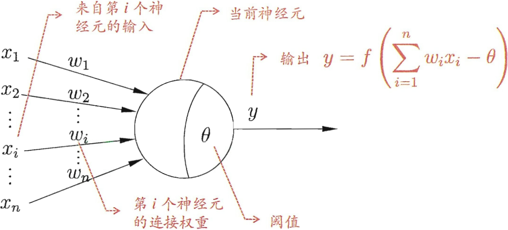</td></tr>
    <tr><td align=center><b>图(1) M-P神经元模型</b></td></tr>
</table>

<b>激活函数</b>：也称为“挤压函数”，用于将较大范围的输入值挤压到$(0,1)$范围，阶跃函数是一个典型的“挤压函数”,但它不连续、不光滑、不好求导；实际中都使用$Sigmoid$函数作为激活函数。
<table align=center>
    <tr><td align=center>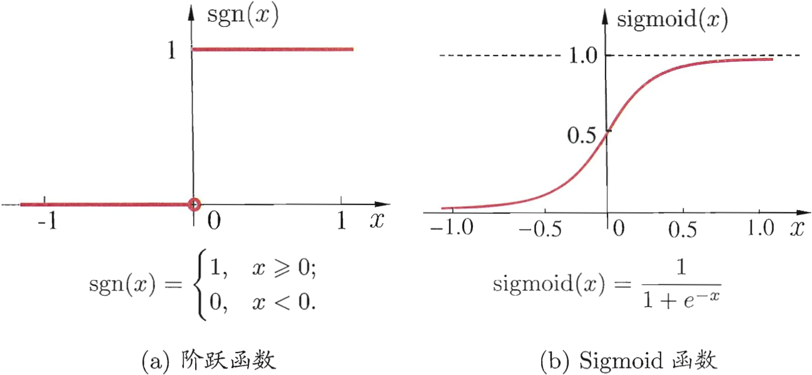</td></tr>
    <tr><td align=center><b>图(2) 典型的神经元激活函数</b></td></tr>
</table>

>把许多上述的神经元按一定的层次结构连接起来就得到了神经网络。整个神经网络模型就是若干个函数$y_i=f(\sum_iw_ix_i-\theta_j)$相互嵌套得到。

# <b>二.感知机与多层网络</b>
<b>感知机</b>： 
感知机由两层神经元组成，如下图(3)所示，输入层接收外界输入信息后传递给输出层，输出层是$M-P$神经元，也称为"阈值逻辑单元"。

感知机可以实现逻辑与、或、非运算，例如，以$y_i=f(\sum_iw_ix_i-\theta_j)$为例(f是阶跃函数)。 

>* “与”$(x_1 \land x_2)$：令$w1=w2=1,\theta=2,则y=f(1\cdot x_1+1\cdot x_2-2)$，仅在$x_1=x_2=1$时，$y=1$.(这里$x_1,x_2$只能取值0、1，因为是实现的逻辑运算。)
>* “或”$(x_1 \lor x_2)$：令$w1=w2=1,\theta=0.5,则y=f(1\cdot x_1+1\cdot x_2-0.5)$，当$x_1=1$或$x_2=1$时，$y=1$.
>* “非”$(\lnot x_1)$：令$w1=0.6,w_2=0,\theta=-0.5,则y=f(-0.6\cdot x_1+0\cdot x_2+0.5)$，当$x_1=1$时，$y=0$；当$x_1=0$时，$y=1$.

在机器学习中，给定数据集，权重$w_i(i=1,2,...,n)$以及阈值$\theta$可通过学习得到。阈值$\theta$可看作一个固定输入为-1.0的“哑结点”所对应的连接权重$w_{n+1}$，这样，权重和阈值的学习就可统一为权重的学习。

<b>感知机学习规则</b>：对训练样例$(x,y)$，若当前感知机的输出为$\^y$，则感知机权重将按如下流程调整：
$$w_i\leftarrow w_i+\Delta w_i, \tag{1}$$
$$\Delta w_i=\eta (y-\^y)x_i, \tag{2}$$
>$\eta\in (0,1)$称为学习率。感知机将根据预测差异$\^y-y$进行权重调整；如果预测正确($\^y=y$)，感知机不会发生变化。

感知机学习能力有限，因为只有输出层神经元经过激活函数处理，即只有一层功能神经元。

<b>多层网络</b>： 
上述与、或、非问题都是线性可分问题，若两类模式线性可分的，即存在一个线性超平面能将它们分开，意味着感知机的学习一定会收敛，可以求得适当的权向量$w=(w_1;w_2;...;w_{n+1})$。否则感知机的学习过程将会发生振荡，$w$难以稳定下来，无法求得合适解。如下图4(a)-(c)所示的与、或、非问题线性可分，存在一个线性平面将它们分开；图4(d)所示的异或模型是非线性可分的，不存在一个线性平面将它们分开。
<table align=center>
    <tr><td align=center>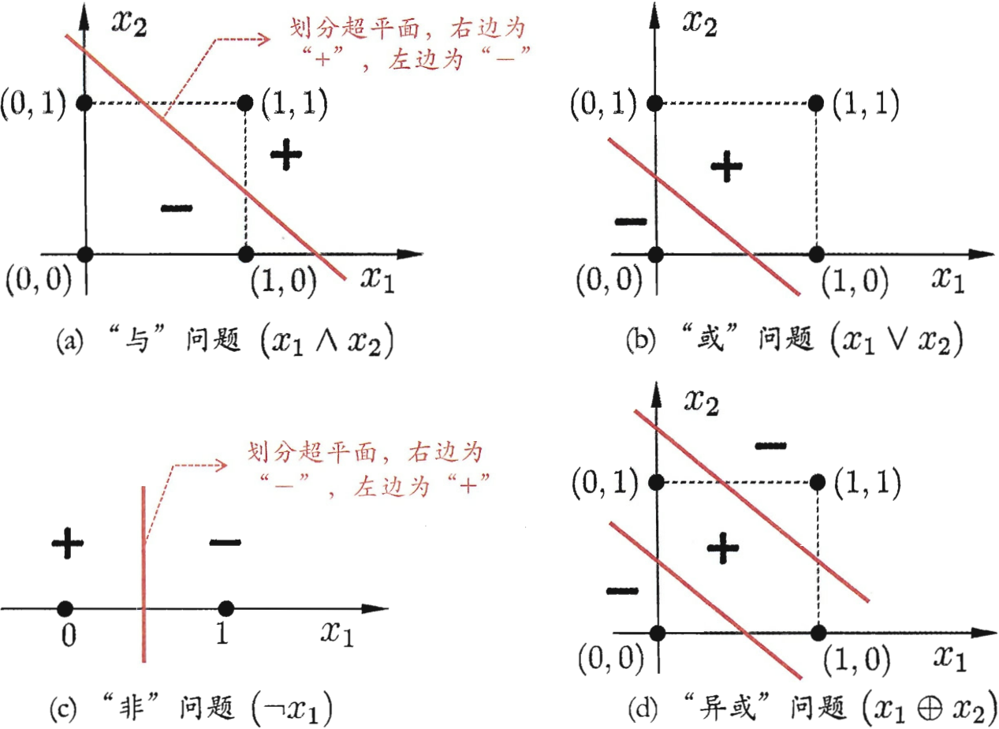</td></tr>
    <tr><td align=center><b>图(4) 线性可分的与、或、非问题与非线性可分的异或问题</b></td></tr>
</table>

要解决非线性可分问题，要使用多层功能神经元，如下图(5)所示的两层感知机可以解决异或问题。输出层和输入层之间的一层神经元，被称为隐层或隐含层，隐含层和输出层神经元都是有激活函数的功能神经元。
<table align=center>
    <tr><td align=center>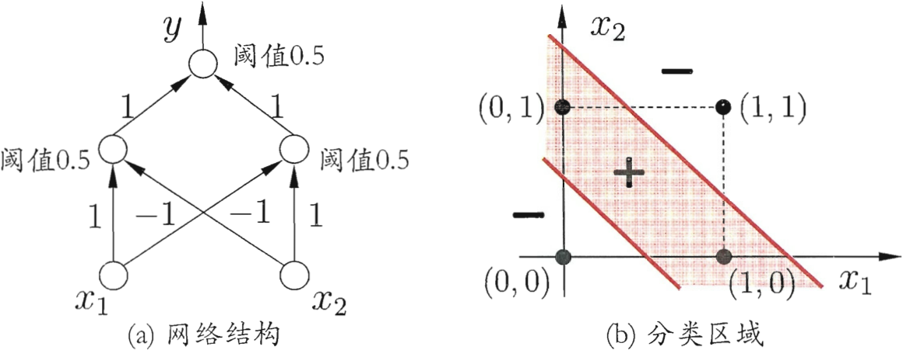</td></tr>
    <tr><td align=center><b>图(5) 能解决异或问题的两层感知机</b></td></tr>
</table>

常见的神经网络是形如下图(6)所示的层级结构，每层神经元与下一层神经元全互连，同层神经元之间不存在连接，也没有跨层连接，称为“多层前馈神经网络”。
<table align=center>
    <tr><td align=center>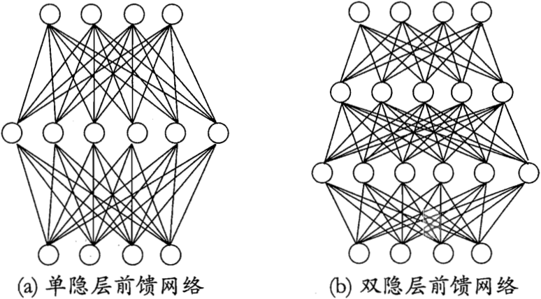</td></tr>
    <tr><td align=center><b>图(6) 多层前馈神经网络结构示意图</b></td></tr>
</table>

>输入层神经元只接受输入，不进行函数处理，隐层和输出层包含功能神经元。图6(a)所示的网络，有一层隐藏层，也被称为“两层网络”(两层存在功能神经元，输入层不算)，也称为“单隐层网络”。 
>只要网络中存在一层隐藏层即可称为多层网络； 
>神经网络的学习过程，就是根据训练数据来调整神经元之间的“连接权”以及每个功能神经元的阈值，也就是学习$w$和$\theta$。

# <b>三.误差逆传播算法</b>
多层网络的学习能力比单层感知机强很多，使用式(1)和式(2)的简单感知机学习规则无法训练多层网络。误差逆传播(BackPropagation, BP)是最杰出的训练多层网络的算法，通常称为"BP神经网络"，指的就是用BP算法训练的多层前馈神经网络。

<b>BP算法</b>： 
给定训练集$D=\{(x_1,y_1),(x_2,y_2),...,(x_m,y_m)\},x_i\in\mathbb{R}^d,y_i\in\mathbb{R}^l$,输入示例由$d$个属性描述，输出$l$维实值向量。

如下图(7)所示的BP神经网络，每个输入结点输入的是样本的属性，因此拥有$d$个输入神经元；$l$个输出神经元；$q$个隐层神经元。 
输出层第$j$个神经元的阈值用$\theta_j$表示，隐层第$h$个神经元的阈值用$\gamma_h$表示。 
输入层第$i$个神经元与隐层第$h$个神经元之间的连接权记为$v_{ih}$，隐层第$h$个神经元与输出层第$j$个神经元之间的连接权为$w_{hj}$。 
<table align=center>
    <tr><td align=center>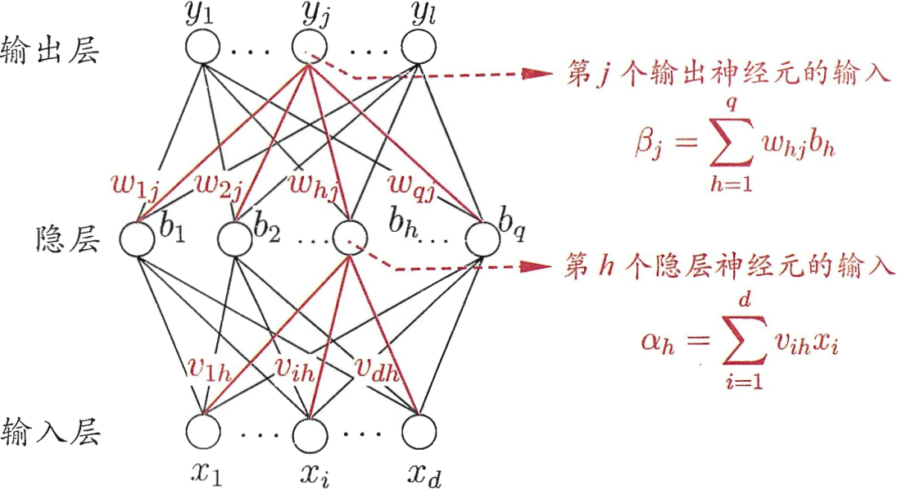</td></tr>
    <tr><td align=center><b>图(7) BP网络及算法中的变量符号</b></td></tr>
</table>

记隐层第$h$个神经元接收到的输入为$\alpha_h=\sum_{i=1}^{d}v_{ih}x_{i}$，输出层第$j$个神经元接收到的输入为$\beta_j=\sum_{h=1}^{q}w_{hj}b_h$，其中$b_h$为隐层第$h$为隐层第$h$个神经元的输出。假设隐层和输出层神经元都使用Sigmoid函数。

对训练集$(x_k,y_k)$，假定神经网络的输出为$\^y_k=(\^y_1^k,\^y_2^k,...,\^y_l^k)$，即
$$\^y_j^k=f(\beta_j-\theta_j), \tag{3}$$
则网络在$(x_k,y_k)$上的均方误差为
$$E_k=\frac{1}{2}\sum_{j=1}^{l}(\^y_{j}^{k}-y_j^k)^2. \tag{4}$$

<b>BP网络参数数量</b>：图(7)所示的网络中有$(d+l+1)q+l$个参数需确定：输入层到隐层的$d\times q$个权值、隐层到输出层的$q\times l$个权值、$q$个隐层神经元的阈值、$l$个输出层阈值。

BP是一个迭代学习算法，在迭代的每一轮中采用广义的感知机学习规则对参数进行更新估计，任意参数$v$的更新估计式为(与式(1)类似)：
$$v\leftarrow v+\Delta v. \tag{5}$$

<b>参数推导示例</b>：推导隐层到输出层的连接权$w_{hj}$ 
BP算法基于梯度下降(gradient descent)策略，以目标的负梯度方向对参数进行调整，对式(4)的误差$E_k$，给学习率$\eta$，有：
$$\Delta w_{hj}=-\eta\frac{\partial E_k}{\partial w_{hj}}. \tag{6}$$

>$w_{hj}$先影响到第$j$个输出层神经元的输入值$\beta_j$,再影响到其输出值$\^y_j^k$，然后影响到$E_k$，有
$$\frac{\partial E_k}{\partial\^y_j^k}=\frac{\partial E_k}{\partial\^y_j^k}\cdot\frac{\partial\^y_j^k}{\partial\beta_j}\cdot\frac{\partial\beta_j}{\partial w_{hj}}. \tag{7}$$

>根据$\beta_j$的定义，显然有：
$$\frac{\partial\beta_j}{\partial w_{hj}}=b_h. \tag{8}$$

>Sigmoid函数有一个很好的性质：
$$f\prime(x)=f(x)(1-f(x)). \tag{9}$$

>根据式(4)和(3)，有：
$$
\begin{aligned}
    g_j&=-\frac{\partial E_k}{\partial\^y_j^k}\cdot\frac{\partial\^y_j^k}{\partial\beta_j} \\
    &=-(\^y_j^k-y_j^k)f'(\beta_j-\theta_j) \\
    &=\^y_j^k(1-\^y_j^k)(y_j^k-\^y_j^k)
\end{aligned} \tag{10}
$$

将式(10)和式(8)代入式(7)，再代入式(6)，得到BP算法中关于$w_{hj}$的更新公式：
$$\Delta w_{hj}=\eta g_j b_h. \tag{11}$$

类似可得：
$$\Delta\theta_j=-\eta g_j, \tag{12}$$
$$\Delta v_{ih}=\eta e_h x_i, \tag{13}$$
$$\Delta \gamma_h=-\eta e_h, \tag{14}$$

式(13)和式(14)中：
$$
\begin{aligned}
    e_h&=-\frac{\partial E_k}{\partial b_h}\cdot\frac{\partial b_h}{\partial\alpha_h} \\
    &=-\sum_{j=1}^{l}\frac{\partial E_k}{\partial\beta_j}\cdot\frac{\partial\beta_j}{\partial b_h}f'(\alpha_h-\eta_h) \\
    &=\sum_{j=1}^{l}w_{hj}g_jf'(\alpha_h-\eta_h) \\
    &=b_h(1-b_h)\sum_{j=1}^{l}w_{hj}g_j.
\end{aligned} \tag{15}
$$
>学习率$\eta\in(0,1)$控制着算法每一轮迭代中的更新步长，若太大容易振荡，太小则收敛速度又会过慢。有时为了做精细化调节，可令式(11)和式(12)使用$\eta_1$，式(13)和式(14)使用$\eta_2$，两者不相同。

下图(8)给出了BP算法的工作流程，对每个训练样例，BP算法执行以下操作：
<table align=center>
    <tr><td align=center>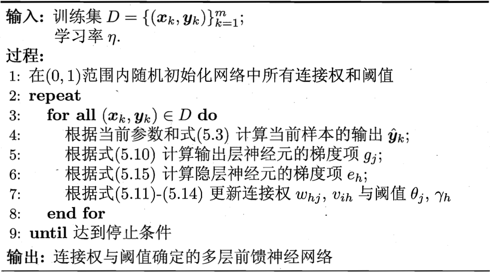</td></tr>
    <tr><td align=center><b>图(8) 误差逆传播算法</b></td></tr>
</table>

>1. 先将输入示例提供给输入层神经元，然后逐层将信号前传，直到产生输出层的结果；
>2. 然后计算输出层的误差(4-5行)，再将误差逆向传播至隐层神经元(6行)；
>3. 最后根据隐层神经元的误差来对连接权和阈值进行调整(7行)。 
>迭代运行上述流程，直到达到某些停止条件为止。

下图(9)给出了2个属性、5个样本的西瓜数据上，随着训练轮数的增加，网络参数和分类边界的变化情况。
<table align=center>
    <tr><td align=center>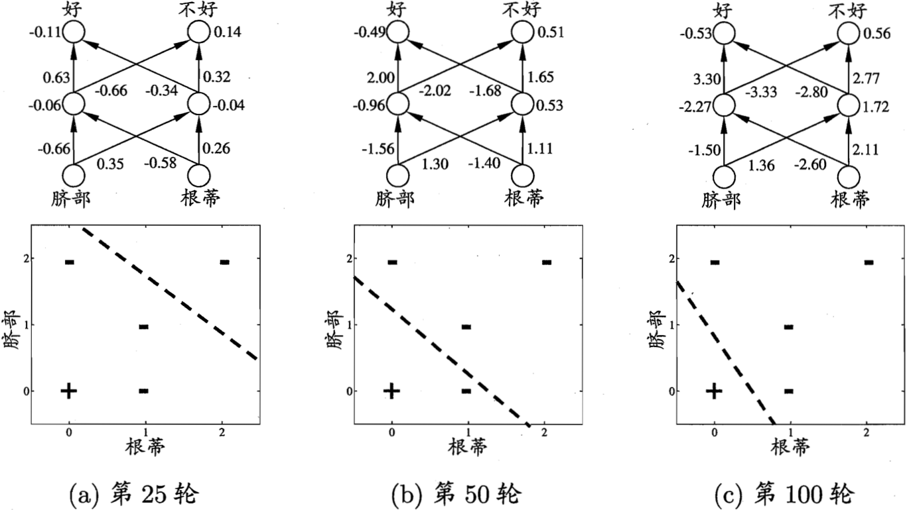</td></tr>
    <tr><td align=center><b>图(9) 在2个属性、5个样本的西瓜数据上，BP网络参数更新和分类边界的变化情况</b></td></tr>
</table>

BP算法的目标是要最小化训练集$D$上的累计误差
$$E=\frac{1}{m}\sum_{k=1}^{m}E_k, \tag{16}$$
但上面介绍的"标准BP算法"每次仅针对一个训练样例更新连接权和阈值，也就是基于单个$E_k$推导得到，类似地推导出基于累计误差最小化的更新规则，就得到累计误差逆传播算法。

<b>标准BP算法与累积BP算法</b>： 
标准BP算法每次更新只针对单个样例，参数更新非常频繁，对不同样例进行更新的效果可能出现"抵消"现象；为了达到同样的累积误差极小点，标准BP算法需要进行更多次数的迭代； 
累积BP算法直接针对累积误差最小化，它在读取整个训练集$D$一遍后才对参数进行更新，其参数更新的频率低很多； 
在很多任务中，累积误差下降到一定程度之后，进一步下降会非常缓慢，这时标准BP往往会更快获得较好的解，尤其是在训练集$D$非常大时。

如果一个神经网络隐藏层中包含足够多的神经元，多层前馈网络就能以任意精度逼近任意复杂度的连续函数。但如何设置隐层神经元的个数仍是一个未决问题，实际应用中通常靠“试错法”调整。

<b>BP网络过拟合</b>： 
因为BP网络强大的拟合能力，经常遭遇过拟合，其训练误差持续降低，但测试误差却可能上升。有两种策略来缓解BP网络的过拟合。

* 策略一“早停”：将数据分成训练集和验证集，训练集用来计算梯度、更新连接权和阈值，验证集用来估计误差，若训练集误差降低但验证集误差升高，则停止训练，同时返回具有最小验证集误差的连接权和阈值。
* 策略二“正则化”：在误差目标函数中增加一个用于描述网络复杂度的部分，比如连接权与阈值的平方和。仍令$E_k$表示第$k$个训练样例上的误差，$w_i$表示连接权和阈值，则误差目标函数式(16)改变为：
$$E=\lambda\frac{1}{m}\sum_{k=1}^{m}E_k+(1-\lambda)\sum_{i}w_i^2, \tag{17}$$
>其中$\lambda\in(0,1)$用于对经验误差与网络复杂度这两项进行折中，常通过交叉验证法来估计。

# <b>四.全局最小与局部极小</b>
用$E$表示神经网络在训练集上的误差，则它是关于连接权$w$和阈值$\theta$的函数。此时，神经网络在训练过程中可看作一个参数寻优过程，即在参数空间中，寻找一组最优参数使得$E$最小。

<b>局部极小和全局最小</b>：常会谈论两种最优：“局部极小”和“全局最小”。

对$w^*$和$\theta^*$，若存在$\epsilon>0$使得$\forall(w;\theta)\in\{(w;\theta)|\lVert(w;\theta)-(w^*;\theta^*)\rVert\le\epsilon\}$都有$E(w;\theta)\ge E(w^*;\theta^*)$成立，则$(w^*;\theta^*)$为局部极小值； 
若对参数空间中的任意$(w;\theta)$都有$E(w;\theta)\ge E(w^*;\theta^*)$，则$(w^*;\theta^*)$为全局最小值。

<b>参数寻优</b>：在参数寻优过程中希望找到全局最小，使用最广泛的参数寻优方法是基于梯度搜索：从某些初始解出发迭代寻找最优解，每次迭代中，先计算误差函数在当前点的梯度，然后根据梯度确定搜索方向。负梯度方向是函数值下降最快的方向，因此梯度下降法就是沿着负梯度方向搜索最优解。若误差函数在当前点的梯度为零，则已达到局部最小，更新量为零，迭代停止。如果误差函数仅有一个局部极小，那么此时找到的局部极小就是全局最小；如果误差函数具有多个局部极小，则不能保证找到的是全局最小。

<b>局部最优解决策略</b>： 
陷入局部最优是需要避免的，以下策略常用来试图跳出局部最优，从而进一步接近全局最小：

* 以多组不同参数值初始化多个神经网络，按照标准方法训练后，取其中误差最小的解作为最终参数，这相当于从多个不同的初始点开始搜索，这样就可能陷入不同的局部极小，从中进行选择有可能获得更接近全局最小的结果。
* 使用“模拟退火”技术，在每一步都以一定概率接受比当前解更差的结果，从而有助于“跳出”局部极小。在每步迭代过程中，接受“次优解”的概率要随着时间的推移而逐渐降低，从而保证算法稳定。
* 使用随机梯度下降，与标准梯度下降法精确计算梯度不同，随机梯度下降法在计算梯度时加入了随机因素。于是，即使陷入局部极小点，它计算出的梯度仍可能不为零，这样就有机会跳出局部极小继续搜索。

>遗传算法也常用来训练神经网络以更好地逼近全局最小；上述用于跳出局部极小的技术大多数是启发式的，没有理论保障。

# <b>五.其他常见神经网络</b>
## <b>5.1 RBF网络</b>
RBF(Radial Basisi Function, 径向基函数)网络是一种单隐层网络，使用径向基函数作为隐层神经元激活函数，输出层是对隐层神经元输出的线性组合，假定输入为$d$维向量$x$，输出为实值，则RBF网络可表示为
$$\varphi(x)=\sum_{i=1}^{q}w_i\rho(x_i,c_i), \tag{18}$$
>$q$为隐层神经元个数，$c_i$和$w_i$是第$i$个隐层神经元所对应的中心和权重，$\rho(x,c_i)$是径向基函数，这是某种沿径向对称的标量函数，定义为样本$x$到数据中心$c_i$之间欧氏距离的单调函数。常用的高斯径向基函数形式如下：
$$\rho(x,c_i)=e^{-\beta_i\lVert x-c_i\rVert^2}. \tag{19}$$
>具有足够多隐层神经元的RBF网络能以任意精度逼近任意连续函数。

<b>训练RBF网络</b>：1).确定神经元中心$c_i$，常用的方式包括随机采样、聚类等；2).利用BP算法等来确定参数$w_i$和$\beta_i$。

## <b>5.2 ART网络</b>
ART(Adaptive Resonance Theory, 自适应谐振理论)网络是竞争型学习网络，竞争型学习网络是一种无监督学习策略，网络的输出神经元相互竞争，每一时刻仅有一个竞争获胜的神经元被激活，其他神经元的状态被抑制，亦称为“胜者通吃”原则。

该网络由比较层、识别层、识别阈值和重置模块构成；比较层负责接收输入样本，并将其传递给识别层神经元。识别层每个神经元对应一个模式类，神经元数目可在训练过程中动态增长以增加新的模式类。

在接收到比较层的输入信号后，识别层神经元之间相互竞争以产生获胜神经元。竞争方式：计算输入向量与每个识别层神经元所对应的模式类的代表向量之间的距离，距离最小者胜。

* 获胜神经元将向其他识别层神经元发送信号，抑制其激活。若输入向量与获胜神经元所对应的代表向量之间相似度大于识别阈值，则当前输入样本将被归为该代表向量所属类别，同时网络连接权将会更新，使得以后在接收到相似输入样本时该模式类会计算出更大的相似度，从而使该获胜神经元有更大的可能获胜。
* 若相似度不大于识别阈值，则重置模块将在识别层增设一个新的神经元，其代表向量就设置为当前输入向量。

识别阈值对ART网络的性能至关重要，识别阈值较高时，输入样本将会被分成比较多、比较精细的模式类；识别阈值较低时，则会产生较少、比较粗略的模式类。

## <b>5.3 SOM网络</b>
SOM(Self-Organizing Map, 自组织映射)网络是一种竞争学习型的无监督神经网络，它能将高维输入数据映射到低维空间(二维)，同时保持输入数据在高维空间的拓扑结构，即将高维空间中相似的样本点映射到网络输出层中的邻近神经元。

如下图(11)所示是SOM网络结构，网络中的输出层神经元以矩阵方式排列在二维空间中，每个神经元都拥有一个权向量，网络在接收输入向量后，将会确定输出层获胜神经元，它决定了该输入向量在低维空间中的位置。SOM的训练目标就是为每个输出层神经元找到合适的权向量，以达到保持拓扑结构的目的。
<table align=center>
    <tr><td align=center>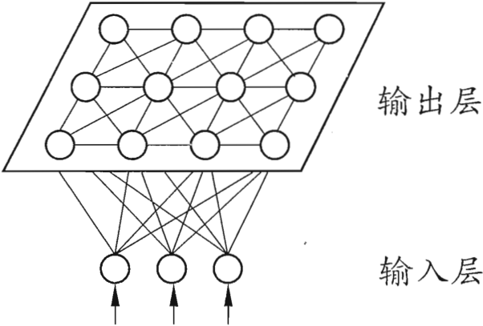</td></tr>
    <tr><td align=center><b>图(11) SOM网络结构</b></td></tr>
</table>

<b>SOM训练过程</b>：在接收到一个训练样本后，每个输出层神经元会计算该样本与自身携带的权向量之间的距离，距离最近的神经元成为竞争获胜者，称为最佳匹配单元。然后，最佳匹配单元及其邻近神经元的权向量将被调整，以使得这些权向量与当前输入样本的距离缩小；迭代上述过程，至收敛。

## <b>5.4 级联相关网络</b>
一般的神经网络是固定网络结构，学习权重和阈值；结构自适应性网络不仅学习阈值和权重，还需要学习网络结构，希望在训练过程中找到最符合数据特点的网络结构。级联相关网络是结构自适应网络的代表。

<b>级联相关网络的主要成分</b>：“级联”和“相关” 

* 级联是指建立层次连接的层级结构，在开始训练时，网络只有输入层和输出层，处于最小拓扑结构；随着训练的进行，如下图(12)所示，新的隐层神经元逐渐加入，从而创建起层次结构。当新的隐层神经元加入时，其输入端连接权值是冻结固定的。
* 相关是指通过最大化新神经元的输出与网络误差之间的相关性来训练相关的参数。

>与一般的前馈神经网络相比，级联相关网络无需设置网络层数、隐层神经元数目，且训练速度较快，但其在数据较小时易陷入过拟合。

<table align=center>
    <tr><td align=center>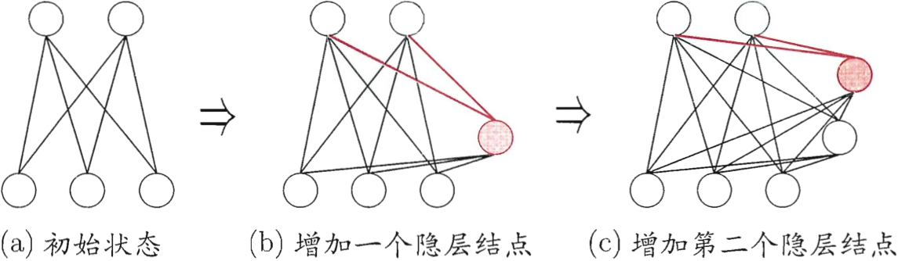</td></tr>
    <tr><td align=center><b>图(12) 级联相关网络的训练过程。新的隐结点加入时，红色连接权通过最大化新节点的输出与网络误差之间的相关性来进行训练</b></td></tr>
</table>

## <b>5.5 Elman网络</b>
Elman网络是常用的递归神经网络，递归神经网络允许网络中出现环形结构，从而让一些神经元的输出反馈回来作为输入信号，这样的结构与信息反馈过程，使得网络在$t$时刻的输出状态不仅与$t$时刻的输入有关，还与$t-1$时刻的网络状态有关，从而能处理与时间有关的动态变化。

Elman网络结构如下图(13)所示，它的结构与多层前馈网络相似，但隐层神经元的输出被反馈回来，与下一时刻输入层神经元提供的信号一起，作为隐层神经元在下一时刻的输入。隐层神经元通常采用Sigmoid激活函数，而网络的训练则通过推广的BP算法进行。
<table align=center>
    <tr><td align=center>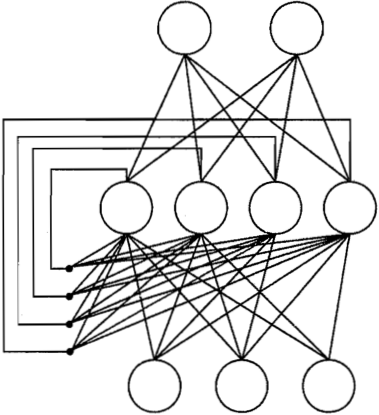</td></tr>
    <tr><td align=center><b>图(13) Elman网络结构</b></td></tr>
</table>

## <b>5.6 Boltzmann机</b>
Boltzmann机是一种“基于能量的模型”，能量最小化时网络达到理想状态，网络训练就是最小化这个能量函数；常见结构如下图(14a)所示，其神经元分为两层：显层与隐层。
* 显层用于表示数据的输入与输出，隐层则被理解为数据的内在表达。
* Boltzmann机中的神经元都是布尔型的，只有0、1两种状态，状态1表示激活，0表示抑制。

令向量$s\in\{0,1\}^n$表示$n$个神经元的状态，$w_{ij}$表示神经元$i$与$j$之间的连接权，$\theta_i$表示神经元$i$的阈值，则状态向量$s$所对应的Boltzmann机能量定义为
$$E(s)=-\sum_{i=1}^{n-1}\sum_{j=i+1}^{n}w_{ij}s_is_j-\sum_{i=1}^{n}\theta_is_i. \tag{20}$$

若网络中的神经元以任意不依赖于输入值的顺序进行更新，则网络最终将达到Boltzmann分布，此时状态量$s$出现的概率将仅由其能量与所有可能状态向量的能量确定：
$$P(s)=\frac{e^{-E(s)}}{\sum_te^{E(t)}}. \tag{21}$$

Boltzmann机的训练过程就是将每个训练样本视为一个状态向量，使其出现的概率尽可能大，标准的Boltzmann机是一个全连接图，训练网络的复杂度很高，这使其难以用于解决现实任务。现实中常用受限Boltzmann机(Restricted Boltzmann Machine, RBM)。

如下图(14b)所示是RBM网络结构图，仅保留显层与隐层之间的连接，从而将Boltzmann机结构由完全图简化为二部图。
<table align=center>
    <tr><td align=center>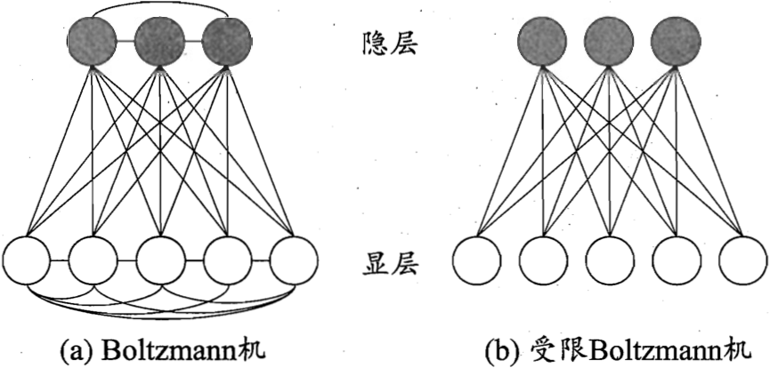</td></tr>
    <tr><td align=center><b>图(14) Boltzmann机与受限Boltzmann机</b></td></tr>
</table>

<b>受限Boltzmann机</b>：常用“对比散度”(Contrastive Divergence, CD)算法进行训练。假定网络中有$d$个显层神经元和$q$个隐层神经元，令$v$和$h$分别表示显层与隐层的状态向量，则由于同一层内不存在连接，有
$$P(v|h)=\prod_{i=1}^{d}P(v_i|h). \tag{22}$$
$$P(h|v)=\prod_{j=1}^{q}P(h_j|v). \tag{23}$$

CD算法对每个训练样本$v$，先根据式(23)计算出隐层神经元状态的概率分布，然后根据这个概率分布采样得到$h$；此后，类似地根据式(22)从$h$产生$v'$，再从$v'$产生$h'$；连接权的更新公式为
$$\Delta w=\eta(vh^T-v'h'^T). \tag{24}$$

# <b>六.深度学习</b>
参数越多的模型，复杂度越高，可以完成更复杂的任务。但是如果数据量少，训练的模型容易陷入过拟合；如果数据量多，训练效率低。随着训练能力的大幅提升，可以采用大量数据来训练复杂模型，以“深度学习”为代表的复杂模型受到广大关注。

单隐层的多层网络已经具有很强的学习能力，模型的复杂度可以通过增加隐层神经元数目来实现，但通过增加隐藏层数目的效果比增加隐层神经元数目更好，因为增加隐层数目不仅增加了拥有激活函数的神经元数目，还增加了激活函数嵌套的层数。

多隐层神经网络难以直接用经典算法(如BP算法)进行训练，因为误差在多隐层内逆传播时，往往会“发散”而不能收敛到稳定状态。

无监督逐层训练时多隐层网络训练的有效手段，其基本思想是每次训练一层隐结点，训练时将上一层隐结点输出作为输入，而本层隐结点的输出作为下一层隐结点的输入，这称为“预训练”；在预训练全部完成后，再对整个网络进行“微调”训练。
>比如在深度信念网络(deep belief network, DBN)中，每层都是一个受限Boltzmann机，即整个网络可视为若干个RBM堆叠而得。在使用无监督逐层训练时，首先训练第一层，这是关于训练样本的RBM模型，可按标准的RBM训练；然后，将第一层预训练好的隐结点视为第二层的输入结点，对第二层进行预训练；...各层预训练完成后，再利用BP算法对整个网络进行预训练。

“预训练+微调”的做法可视为将大量参数分组，对每组先找到局部看起来比较好的设置，然后再基于这些局部较优的结果联合起来进行全局寻优。这样就在利用了模型大量参数所提供的自由度的同时，有效地节省了训练开销。

另一种节省训练开销的策略是“权共享”,即让一组神经元使用相同的连接权。这个策略在卷积神经网路(CNN)中发挥了重要作用。以CNN进行手写数字识别任务为例，如下图(15)所示，网络输入是一个$32\times32$的手写数字图像，输出是其识别结果，CNN符合多个“卷积层”和“采样层”对输入信号进行加工，然后在连接层实现与输出目标之间的映射。

<table align=center>
    <tr><td align=center>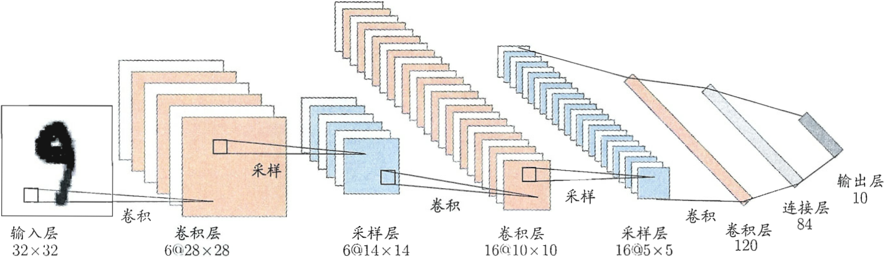</td></tr>
    <tr><td align=center><b>图(15) 卷积神经网络用于手写数字识别</b></td></tr>
</table>

每个卷积层都包含多个特征映射，每个特征映射是一个由多个神经元构成的“平面”，通过一种卷积滤波器提取输入的一种特征。例如，图(15)中第一个卷积层由6个特征映射构成，每个特征映射是一个$28\times 28$的神经元阵列，其中每个神经元负责从$5\times5$的区域通过卷积滤波器提取局部特征。

采样层亦称为“汇合”层，其作用是基于局部相关性原理进行亚采样，从而在减少数据量的同时保留有用信息。如图(15)中第一个采样层有6个$14\times14$的特征映射，其中每个神经元与上一层中对应特征映射的$2\times2$，并据此计算输出。

通过复合卷积层和采样层，图中CNN将原始图像映射成120维特征向量，最后通过一个由84个神经元构成的连接层和输出层连接完成识别任务。

CNN可用BP算法进行训练，但在训练中，卷积层和采样层，其每一组神经元都是用相同的连接权，从而大幅减少了需要训练的参数数目。

无论是DBN还是CNN，其多层堆叠、每层对上一层的输出进行处理的机制，可看作是在对输入信号进行逐层加工，从而把初始的、与输出目标之间联系不太密切的输入表示，转化成与输出目标联系更密切的表示，使得原来仅基于最后一层输出映射难以完成的任务成为可能。换言之，通过多层处理，逐渐将初始的“低层”特征表示转化为“高层”特征表示后，用“简单模型”即可完成复杂的分类等学习任务。由此可将深度学习理解为进行“特征学习”或“表示学习”。

