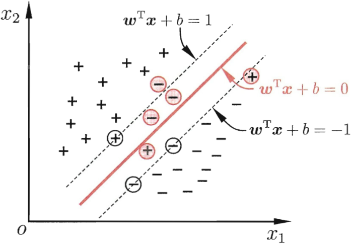

# <b>一.间隔与支持向量</b>
给定样本集$D=\{(x_1,y_1),(x_2,y_2),...,(x_m,y_m)\},y_i\in\{-1,+1\}$，分类学习器基于数据集$D$可以找到如下图(1)所示的多个划分超平面，图中位于两类训练样本"正中间"的粗线，是我们努力寻找的最优划分超平面。
<table align=center>
    <tr><td align=center></td></tr>
    <tr><td align=center><b>图(1) 存在多个划分超平面将两类训练样本分开</b></td></tr>
</table>

<b>最优超平面的特点</b>：对训练样本局部扰动的“容忍”性最好。

在样本空间中，划分超平面可通过如下线性方程来描述：
$$w^Tx+b=0, \tag{1}$$

>$w=(w_1;w_2;...;w_d)$为法向量，决定了超平面的方向；$b$为位移项，决定了超平面与原点之间的距离。因此超平面由法向量$w$和位移$b$确定,记为$(w,b)$。

样本空间中任意点$x$到超平面$(w,b)$的距离可写成：
$$r=\frac{|w^Tx+b|}{\lVert w\rVert}. \tag{2}$$

若超平面$(w,b)$可以将训练样本正确分类，则对于$(x_i,y_i)\in D$，若$y_i=+1$，则有$w^Tx_i+b>0$；若$y_i=-1$，则有$w^Tx_i+b<0$，令
$$
\begin{cases}
    w^Tx_i+b\ge+1,  & y_i=+1; \\
    w^Tx_i+b\le-1, & y_i=-1.
\end{cases} \tag{3}
$$

<table align=center>
    <tr><td align=center></td></tr>
    <tr><td align=center><b>图(2) 支持向量与间隔</b></td></tr>
</table>
如上图(2)所示，距离超平面最近的几个样本点可以使上式(3)成立，这几个样本也被称为支持向量，两个不同类支持向量到超平面的距离之和为:

$$\gamma=\frac{2}{\lVert w\rVert}, \tag{4}$$
>它被称为"间隔"。 
>向量$u$在向量$v$上的投影$d=\overrightarrow{u}cos\theta=\frac{\overrightarrow{u}\overrightarrow{v}}{\lVert v\rVert}$;  

---
---
假设 $x'$，$x''$在超平面上
根据式(1)可得： 
①$w^Tx'=-b,w^Tx''=-b$ 
②w$\bot$hyperplane 
$(w^T(x''-x'))=0$ 
$\left(w^T\begin{matrix} \underbrace{ (x''-x') } \\ vector on huperplane\end{matrix}\right)=0$ 
③distance=project$(x-x')$to$\bot$hyperplane 
$distance(x,b,w)=\left\lvert\frac{w^T}{\lVert w \rVert}(x-x')\right\rvert=\frac{1}{\lVert w \rVert}(w^Tx-w^Tx')=\frac{1}{\lVert w \rVert}(w^Tx+b)$
>因此，对于支持向量，$w^Tx+b=1$, 所以，式子(4)可以根据上式推算出来。添加2只是为了后面公式(6)求导可以消去一个参数。

---
---

要找最大间隔的划分超平面，也就是要找到能满足式(3)中约束的参数$w$和$b$，使得$\gamma$最大，即
$$
\begin{aligned}
    &max_{w,b}\frac{2}{\lVert w\rVert} \\
    &s.t. y_i(w^Tx_i+b)\ge1,i=1,2,...,m
\end{aligned} \tag{5}
$$
>显然，最大化间隔，仅需最大化$\lVert w\rVert^{-1}$，等价于最小化$\lVert w\rVert^2$。于是，式(5)可重写为
$$
\begin{aligned}
    &min_{w,b}\frac{1}{2}{\lVert w\rVert}^2 \\
    &s.t. y_i(w^Tx_i+b)\ge1,i=1,2,...,m
\end{aligned} \tag{6}
$$
>以上是支持向量机的基本型。

# <b>二.对偶问题</b>
求解式(6)获得大间隔划分超平面的模型如下：
$$f(x)=w^Tx+b, \tag{7}$$
>式(6)使用拉格朗日乘子法可得到“对偶问题”，拉格朗日乘子法是对每个约束条件添加拉格朗日乘子$\alpha_i\ge 0$,得到如下拉格朗日函数：
$$L(w,b,\alpha)=\frac{1}{2}\lVert w \rVert^2+\sum_{i=1}^{m}\alpha_i(1-y_i(w^Tx_i+b)), \tag{8}$$
>$L(w,b,\alpha)$对$w$和$b$求偏导：

___
___
$$
\begin{aligned}
    L(w,b,\alpha)&=\frac{1}{2}\lVert w \rVert^2+\sum_{i=1}^{m}\alpha_i(1-y_i(w^Tx_i+b)) \\
    &=\frac{1}{2}\lVert w \rVert^2 + \sum_{i=1}^{m}(\alpha_i - \alpha_iy_iw^Tx_i - \alpha_iy_ib) \\
    &=\frac{1}{2}\lVert w \rVert^2 + \sum_{i=1}^{m}\alpha_i - \sum_{i=1}^{m}\alpha_iy_iw^Tx_i - \sum_{i=1}^{m}\alpha_iy_ib
\end{aligned}
$$

$$
    \frac{\partial L}{\partial w} =\frac{1}{2}\times 2 \times w + 0 - \sum_{i=1}^{m}\alpha_iy_ix_i - 0 = 0\Rightarrow w=\sum_{i=1}^{m}\alpha_iy_ix_i
$$

$$
    \frac{\partial L}{\partial b} = 0 + 0 - 0 - \sum_{i=1}^{m}\alpha_iy_i = 0 \Rightarrow \sum_{i=1}^{m}\alpha_iy_i=0
$$
___
___
得到如下：
$$w=\sum_{i=1}^{m}\alpha_iy_ix_i, \tag{9}$$
$$\sum_{i=1}^{m}\alpha_iy_i=0, \tag{10}$$

将式(9)和式(10)代入式(8)，可得：
$$
\begin{aligned}
    L(w,b,\alpha) &= \frac{1}{2}\lVert w \rVert^2 + \sum_{i=1}^{m}\alpha_i(1-y_i(w^Tx_i+b)) \\
    &=\frac{1}{2} w^Tw+\sum_{i=1}^{m}\alpha_i - \sum_{i=1}^{m}\alpha_iy_iw^Tx_i-\sum_{i=1}^{m}\alpha_iy_ib \\
    &=\frac{1}{2}w^T\sum_{i=1}^{m}\alpha_iy_ix_i + \sum_{i=1}^{m}\alpha_i - w^T\sum_{i=1}^{m}\alpha_iy_ix_i - b\sum_{i=1}^{m}\alpha_iy_i \\
    &=-\frac{1}{2}w^T\sum_{i=1}^{m}\alpha_iy_ix_i + \sum_{i=1}^{m}\alpha_i \\
    &=-\frac{1}{2}(\sum_{i=1}^{m}\alpha_iy_ix_i)^T\sum_{i=1}^{m}\alpha_iy_ix_i + \sum_{i=1}^{m}\alpha_i \\
    &=-\frac{1}{2}\sum_{i=1}^{m}\alpha_iy_ix_i^T\sum_{i=1}^{m}\alpha_iy_ix_i + \sum_{i=1}^{m}\alpha_i \\
    &=\sum_{i=1}^{m}\alpha_i - \frac{1}{2}\sum_{i=1}^{m}\sum_{j=1}^{m} \alpha_i\alpha_jy_iy_jx_i^Tx_j \\
\end{aligned} \\ 
\longrightarrow \\
$$

$$
\begin{aligned}
    \max_{\alpha} \sum_{i=1}^{m}\alpha_i - &\frac{1}{2}\sum_{i=1}^{m}\sum_{j=1}^{m} \alpha_i\alpha_jy_iy_jx_i^Tx_j \\
    s.t. &\sum_{i=1}^{m}\alpha_iy_i=0, \\
    &\alpha_i\ge0, i=1,2,...,m.  
\end{aligned} \tag{11} 
$$
解出$\alpha$后，求出$w$和$b$即可得到模型
$$
\begin{aligned}
    f(x) &= w^Tx+b \\
    &=\sum_{i=1}^{m}\alpha_iy_ix_i^Tx+b
\end{aligned} \tag{12}
$$

从对偶问题(11)解出的$\alpha_i$是式(8)中的拉格朗日乘子，对应着训练样本$(x_i,y_i)$，式(6)还有不等式约束，因此上述过程需满足KKT(Karush-Kuhn-Tucker)条件，即要求：
$$
\begin{cases} 
\alpha_i\ge  0; \\
y_if(x_i)-1 \ge 0; \\
\alpha_i(y_if(x_i)-1) = 0.
\end{cases} \tag{13}
$$
>任意$(x_i,y_i)$，有$\alpha_i = 0$或$y_if(x_i)=1$.若$\alpha_i = 0$，则该样本不会在式(12)的求和中出现，也不会对$f(x_i)$有影响； 
>若$\alpha_i \ge 0$，则必有$y_if(x_i)=1$，所对应的样本点位于最大间隔边界上，是一个支持向量。 
>重要性质：训练完成后，大部分的训练样本都不需要保留，最终模型仅与支持向量有关。

求解式(11)，这是一个二次规划问题，可使用通用的二次规划算法来求解；该求解方式正比于训练样本，会在实际任务中造成很大的开销。为了解决这个问题，提出了SMO(Sequential Minimal Optimization)算法。

<b>SMO基本思路</b>： 

先固定$a_i$之外的所有参数，然后求$\alpha_i$之外的所有参数，然后求$\alpha_i$上的极值；由于存在约束$\sum_{i=1}^{m}\alpha_iy_i=0$，若固定$\alpha_i$之外的其他变量，则$\alpha_i$可由其他变量导出；SMO每次选择两个变量$\alpha_i$和$\alpha_j$，并固定其他参数。在参数初始化后，SMO不断执行如下两个步骤至收敛：
1. 选取一对需要更新的变量$\alpha_i$和$\alpha_j$；
2. 固定$\alpha_i$和$\alpha_j$以外的参数，求解式(11)获得更新后的$\alpha_i$和$\alpha_j$。

$\alpha_i$和$\alpha_j$中只要有一个不满足KKT条件，目标函数就会在迭代后增大。KKT条件违背的程度越大，则变量更新后可能导致的目标函数值增幅越大。 

SMO先选择一个使目标函数值增长最快的变量，但由于比较各变量所对应的目标函数值增幅的复杂度过高，因此SMO采用了启发式：使选取的两变量所对应样本之间的间隔最大。

SMO算法之所以高效，因为其在固定其他参数后，仅优化两个参数的过程很高效。仅考虑$\alpha_i$和$\alpha_j$时，式(11)中的约束可重写为：
$$\alpha_iy_i + \alpha_jy_j = c, \alpha_i \ge 0, \alpha_j \ge 0, \tag{14}$$
其中
$$c = -\sum_{k\ne i,j}\alpha_ky_k \tag{15}$$
是使$\sum_{i=1}^{m}\alpha_iy_i=0$成立的常熟。用
$$\alpha_iy_i + \alpha_jy_j = c. \tag{16}$$

消去式(11)中的变量$\alpha_j$，则得到一个关于$\alpha_i$的单变量二次规划问题，仅有的约束是$\alpha_i\ge 0$.这样的二次规划问题具有闭式解，于是不必调用数值优化算法即可高效地计算出更新后的$\alpha_i$和$\alpha_j$。

<b>确定偏移项b</b>： 
对任意支持向量$(x_s,y_s)$都有$y_sf(x_s)=1$，即
$$y_s\left(\sum_{i\in S}\alpha_iy_ix_i^T+b\right) = 1, \tag{17}$$

>其中$S={i|\alpha_i>0, i=1,2,...,m}$为所有支持向量的下标集。理论上可选任意支持向量并通过求解式(17)获得$b$，但现实任务中常采用一种更鲁棒的做法：使用所有支持向量求解的平均值
$$b=\frac{1}{\lvert S\rvert}\sum_{s\in S}\left(1/y_s-\sum_i\in S \alpha_iy_ix_i^Tx_s\right). \tag{18}$$

# <b>三.核函数</b>
前面的讨论都假设训练样本线性可分，可以用一个超平面将所有样本正确分类。但在现实任务中，样本空间中可能不存在这样的超平面。对于这样的问题，可以将样本从原始空间中映射到一个更高维的特征空间，使得样本在新的特征空间中线性可分。
>如果原始空间是有限维，即属性数有限，那么一定存在一个高维特征空间使样本可分。

令$\phi(x)$表示将$x$映射后的特征向量，在特征空间中划分超平面所对应的模型可表示为：
$$f(x)=w^T\phi(x)+b, \tag{19}$$

其中$w$和$b$是模型参数，类似式(6)，有
$$
\begin{aligned}
    &\min_{w,b} \frac{1}{2}\lVert w \rVert ^2 \\
    &s.t. y_i(w^T\phi(x_i)+b)\ge 1, i=1,2,...,m.
\end{aligned} \tag{20}
$$

其对偶问题是
$$
\begin{aligned}
    \max_{\alpha}\sum_{i=1}^{m}\alpha_i - \frac{1}{2}&\sum_{i=1}^{m}\sum_{j=1}^{m}\alpha_i\alpha_jy_iy_j\phi(x_i)^T\phi(x_j) \\
    s.t. &\sum_{i=1}^{m}\alpha_iy_i = 0, \\
    &\alpha_i \ge 0, i=1,2,...,m.
\end{aligned} \tag{21}
$$
>求解$\phi(x_i)^T\phi(x_j)$，这是样本$x_i$和$x_j$映射到特征空间之后的内积，由于特征空间维数可能很高，甚至是无穷维，因此直接计算很困难，为了避免这个障碍，可以使用核函数。
$$\kappa (x_i, x_j) = \langle \phi(x_i), \phi(x_j) \rangle = \phi(x_i)^T\phi(x_j), \tag{22}$$
>$x_i$和$x_j$在特征空间的内积等于它们在原始样本空间中通过函数$\kappa (\cdot, \cdot)$计算的结果。

式(21)可重写为
$$
\begin{aligned}
    \max_{\alpha}&\sum_{i=1}^{m}\alpha_i - \frac{1}{2}\sum_{i=1}^{m}\sum_{j=1}^{m}\alpha_i\alpha_jy_iy_j\kappa(x_i,x_j) \\
    s.t. &\sum_{i=1}^{m}\alpha_iy_i=0, \\
    &\alpha_i \ge 0, i=1,2,...,m.
\end{aligned} \tag{23}
$$

求解后即可得到

$$
\begin{aligned}
    f(x) &= w^T\phi(x) + b \\
    &=\sum_{i=1}^{m}\alpha_iy_i\phi(x_i)^T\phi(x) + b \\
    &=\sum_{i=1}^{m}\kappa(x,x_i) + b.
\end{aligned} \tag{24}
$$
>这里$\kappa(\cdot, \cdot)$就是“核函数”。式(24)显示出模型最优解可通过训练样本的核函数展开。这一展式称为“支持向量展式”.

若已知合适的映射$\phi(\cdot)$的具体形式，则可写出核函数$\kappa(\cdot,\cdot)$。

常用核函数如下所示：
<table align=center>
    <tr><td align=center></td></tr>
</table>

<b>还可以多个核函数组合得到新的核函数</b>：

* 若$\kappa_1$和$\kappa_2$为核函数，则对于任意正数$\gamma_1$、$\gamma_2$，其线性组合也是核函数
* 若$\kappa_1$和$\kappa_2$为核函数，则核函数的直积也是核函数
$$\kappa_1 \bigotimes \kappa_2(x,z) = \kappa_1(x,z)\kappa_2(x,z \tag{26})$$
* 若$\kappa_1$为核函数，则对于任意函数$g(x)$，也是核函数
$$\kappa(x,z) = g(x)\kappa_1(x,z)g(z) \tag{27}$$

# <b>四.软间隔与正则化</b>
现实任务中，往往很难确定合适的核函数使训练样本在特征空间中线性可分；缓解的办法是允许支持向量在一些样本上出错，引入“软间隔”的概念，如下图(4)所示
<table align=center>
    <tr><td align=center></td></tr>
    <tr><td align=center><b>图(4) 软间隔示意图. 红色圈出了一些不满足约束的样本</b></td></tr>
</table>
>满足约束式(3)的是“硬间隔”,要求严格划分；软间隔允许某些样本不满足约束

$$y_i(x^Tx_i + b) \ge 1. \tag{28}$$

在最大化间隔的同时，不满足约束的样本应尽可能少。于是，优化目标可写为
$$\min_{w,b} \frac{1}{2}\lVert w \rVert ^2 + C\sum_{i=1}^{m}\ell_{0/1}(y_i(w^Tx_i + b) - 1), \tag{29}$$

其中$C > 0$是一个常数，$\ell_{0/1}$是“0/1损失函数”
$$
\ell_{0/1}=
\begin{cases}
    1, &if {x < 0} \\
    0, &otherwise
\end{cases}
$$

# <b>五.支持向量回归</b>
# <b>六.核方法</b>
# <b>七.软间隔与正则化</b>

<b></b>
<b></b>
<b></b>
<b></b>
<b></b>
