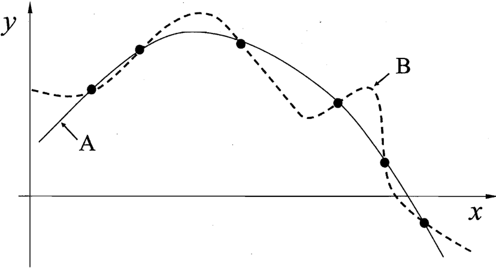
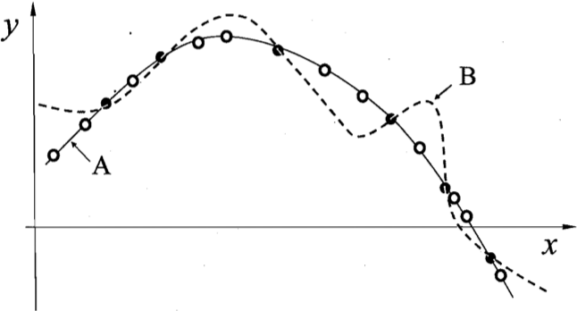
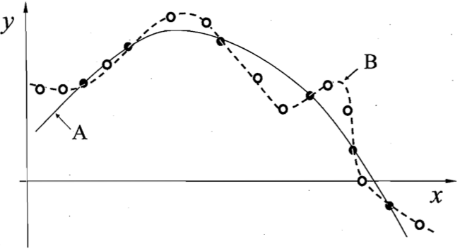

# 绪论
## 一.机器学习是什么?
我们人类可以通过过往的经验，结合一些条件对未来的事做出一些判断，这个判断有很大的概率是正确的。比如，根据当晚天空星星和晚风的情况的可以基本判断出明天的天气；根据西瓜的状态(色泽、根蒂、敲声等)可以预测西瓜的成熟度、甜度等。这些判断依赖我们的经验，对经验的利用就能对新情况做出有效的决策。

机器学习致力于研究如何通过计算的手段，利用经验来改善系统自身的性能。“经验”在计算机中以“数据”形式存在，因此机器学习就是从数据中产生“模型的”的算法,即“学习算法”。有了这个学习算法，我们只需要提供经验数据，它就能通过学习算法产生模型，在面对新的数据时，模型就可以对其提供一个判断。总结来说，机器学习就是研究“学习算法”。

## 二.机器学习基本术语
### 2.1 分类和回归
<b>数据集</b>：也就是前面提到的一条条经验，每条经验是一个数据，多条经验组成的一个集合就是数据集。举例：关于西瓜的描述{(色泽=浅白;根蒂=蜷缩;敲声=浊响),(色泽=乌黑;根蒂=蜷缩;敲声=沉闷),(色泽=浅白;根蒂=硬挺;敲声=清脆),...}；

<b>样本</b>：上面对于西瓜的描述，每一个小括号代表一条数据，也就是一条经验，在机器学习中，统称为“示例”或“样本”;也可以叫“特征向量”。

<b>属性</b>：样本中有色泽、根蒂和敲声来描述一个样本，这些描述被称为样本的“属性”或“特征”，反映了样本在某方面的表现或性质，这些样本特征的选择在数学上必须是正交的，也就是独一无二，不能由其他属性叠加获得，属性的选择将直接影响模型的性能；

<b>属性值</b>：属性上的取值就是属性值。

<b>样本空间</b>：属性张成的空间被称为“属性空间”、“样本空间”或“输入空间”。从数学上来说，就是把色泽、根蒂、敲声作为三个坐标轴，张成一个用于描述西瓜的三维空间，每个西瓜的描述都可以在这个三维空间中找到对应的位置。由于空间中每个点对应一个坐标向量，因此也把示例、样本称为“特征向量”。

用数学上的方式表示：令$D=\{x_1,x_2,...,x_m\}$表示包含$m$个示例的数据集，每个示例由$d$个属性描述(上面对西瓜的描述使用了3个属性)，则每个示例$x_i=(x_{i1},x_{i2},...x_{id})$是$d$维样本空间$\chi$中的一个向量(这个$\chi$空间就是前面提到的样本空间，由属性张成。)，$x_i\in{\chi}$，其中$x_{ij}$是$x_i$在第j个属性上的取值，d称为样本$x_i$的维数，也就是属性的数量。

>从数据中学得模型的过程称为“学习”或“训练”，这个过程通过执行某个学习算法来完成。

<b>训练数据和训练样本</b>：训练过程使用的数据称为训练数据，其中的每个样本称为“训练样本”。

<b>训练集</b>：训练样本的集合

<b>ground-truth</b>:训练得到的模型其实是根据数据的属性，学得了某种假设得规律；对于一个新的数据，根据这种规律可以得到一个预测，这个预测称为“假设”(hypothesis)；这个新的数据本身会有一个真实的结果，这个结果称为“真相”或“真实”(ground-truth)。学习的目的是为了让模型预测尽量逼近ground-truth。

<b>标记空间</b>：经验数据中，对所有的样本通常都会有一个结果，比如((色泽=青绿；根蒂=蜷缩；敲声=浊响)，好瓜),这个“好瓜”就是结果，也可以称为一个样本的“标记”（label）。训练模型需要有一个结果，才能用来衡量预测结果和实际结果之间的差异。

>在数学上，用$(x_i,y_i)$表示第$i$个样例，其中$y_i\in{Y}$是样本$x_i$的标记，$Y$是所有标记的集合，也就是“标价空间”或“输出空间”。 

 
<b>分类</b>：模型预测的是离散值，例如“好瓜”、“坏瓜”；

<b>回归</b>：若模型预测的是连续值，比如西瓜成熟度0.95、0.37。
>二分类任务表示只涉及两个类别的分类任务，这种任务通常称其中一个为“正类”(positive class)，另一个称为“反类”(negative calss)； 
涉及多个类别的分类任务称为“多分类”(multi-class)。

<b>总结</b>：预测任务是希望通过对训练集${(x_1,y_1),(x_2,y_2),...,(x_m,y_m)}$进行学习，建立一个从输入空间$\chi$到输出空间$Y$的映射$f:\chi\rightarrow Y$。对二分类任务，通常令$Y=\{-1,+1\}或{}$\{0,1\};对多分类任务，$|Y|>2$；对回归任务，$Y=\Re,\Re$为实数集。

>模型训练完之后，使用该模型对新数据进行预测的过程叫“测试”，被测试的样本称为“测试样本”。例如在学得$f$后，对测试例$x$，可得其预测标记$y=f(x)$。

### 2.2 聚类
除了对西瓜做分类，还可以使用“聚类”的方法将训练集中的西瓜分成若干组，每组称为一个“簇”；划分依据对应一些潜在的概念，比如在西瓜中，划分依据可以是“浅色瓜”、“深色瓜”，甚至“本地瓜”、“外地瓜”。聚类的学习过程有助于了解数据内在的规律，能为更深入地分析数据建立基础。但是这些划分依据，在实际数据中并没有相应的标记，也就是说，数据会有好瓜和坏瓜的区分，但不会对西瓜的浅色瓜、深色瓜等进行标记。

### 2.3 监督学习和无监督学习
根据训练数据是否拥有标记信息可以将机器学习任务划分为“监督学习”和“无监督学习”两大类，分类和回归任务是“监督学习”的典型代表，聚类是“无监督学习”的典型代表。

<b>泛化能力</b>：机器学习的目标是让训练的模型更好的适用于“新样本”(也就是测试集结果更好)；对聚类这种无监督的学习任务，簇的划分应该也需要更好的适用于测试集。学得的模型适用于新样本的能力，称为“泛化能力”。
>从数学上来说，假设所有样本都服从一个分布$D$，从其中获取一些训练集，这些样本都是独立从样本空间中独立采用的，即“独立同分布”。通常，训练样本越多，模型得到关于$D$的信息就越多，这样越有可能学习到具有强泛化能力的模型。整个过程就是从特殊到泛化的过程，特殊是指对训练集的学习，泛化是指模型对测试集的预测，因此也称为归纳学习。

## 三.假设空间
假设空间就是样本中的每个属性x每个属性对应的可能取值(也就是属性值数量),以下表西瓜数据集为例：
<table align=center>
    <tr><td>编号</td><td>色泽</td><td>根蒂</td><td>敲声</td><td>好瓜</td></tr>
    <tr><td>1</td><td>青绿</td><td>蜷缩</td><td>浊响</td><td>是</td></tr>
    <tr><td>2</td><td>乌黑</td><td>蜷缩</td><td>浊响</td><td>是</td></tr>
    <tr><td>3</td><td>青绿</td><td>硬挺</td><td>清脆</td><td>否</td></tr>
    <tr><td>4</td><td>乌黑</td><td>蜷缩</td><td>沉闷</td><td>否</td></tr>
</table>
把整个学习过程看成一个在所有假设空间中进行搜索的过程，搜索目标就是找到与训练集“匹配”的假设，即能够将训练集中的瓜判断正确的假设。假设的表示一旦确定，假设空间及其规模大小就确定了。在西瓜这个例子中，属性值有色泽、根蒂、敲声；色泽有青绿、乌黑、浅白3种可能的取值，还有可能色泽取任何值都合适；若根蒂和敲声都有3种可能的取值。还存在一种任何值都合适的情况，则假设空间规模大小为4x4x4=64种，还有一种可能：没有好瓜这种概念，因此假设空间规模为4x4x4+1=65种。

<b>版本空间</b>：可能有多个假设与训练集一致，即存在一个与训练集一致的“假设集合”,称之为“版本空间”.比如，对于上表的训练集，版本空间可以有如下假设样本：(色泽=\*；根蒂=蜷缩；敲声=\*)、(色泽=\*；根蒂=\*；敲声=浊响)、(色泽=\*；根蒂=蜷缩；敲声=浊响)

## 归纳偏好
对于假设样本(色泽=\*；根蒂=蜷缩；敲声=\*)、(色泽=\*；根蒂=\*；敲声=浊响)、(色泽=\*；根蒂=蜷缩；敲声=浊响),假设新的样本为(色泽=青绿；根蒂=蜷缩；敲声=沉闷)，如果采用假设"$好瓜\leftrightarrow(色泽=*；根蒂=蜷缩；敲声=*)$"，则会判断这个瓜是好瓜，但如果采用另外两个假设空间，则判断的结果不是好瓜，应该如何选择模型(假设)?

按照上表中的训练集，无法判断哪个假设更好，但是在模型中必须要有一个判断结果。此时，模型本身的“偏好”就会起关键作用。如果模型喜欢“尽可能特殊”的模型，会选择(色泽=\*；根蒂=蜷缩；敲声=浊响)这个假设；若模型喜欢“尽可能一般”的模型，会选择(色泽=\*；根蒂=蜷缩；敲声=\*)。 
机器学习算法在学习过程中对某种类型假设的偏好，称为“归纳偏好”或简称为“偏好”。

任何一个有效的机器学习算法必有其偏好，如果没有偏好，对于某些新数据的预测，每次抽取训练集的等效假设，时而判断为好瓜，时而判断为不是好瓜。这样的机器学习算法没有意义。

下图展示了两个算法偏好，都包含了所有的训练集。曲线A认为相似的样本应有相似的输出(各种属性上都很相像的西瓜，成熟度比较接近),则对应的曲线比较平滑。

    

<b>奥卡姆剃刀</b>:归纳偏好是学习算法自身在一个可能很庞大的假设空间中对假设进行选择的启发式或“价值观”。那么有没有一般性原则来引导算法确立“正确的”偏好呢？“奥卡姆剃刀”是一种常用、自然科学研究中最基本的原则：若有多个假设与观察一致，则选最简单的那个。在上图的例子中，假设最简单代表“更平滑”,则选择曲线A。
>奥卡姆剃刀并非是唯一可行的原则，或者说“最简单”的定义存在不同的诠释，比如“假设1：好瓜$\leftrightarrow$(色泽=*)^(根蒂=蜷缩)^(敲声=浊响)”和“假设2：好瓜$\leftrightarrow$(色泽=*)^(根蒂=蜷缩)^(敲声=*)”哪个更简单，不好确定，需要其他机制才能解决。

下面使用数学的方式来分析归纳偏好的选择：
假设学习算法$\wp_a$基于某种归纳偏好产生了对应于曲线A的模型，学习算法$\wp_b$基于另一种归纳偏好产生了对应于曲线B的模型。下图(a)显示出与B相比，A与训练集外的样本更一致，换句话说，A的泛化能力比B强。
<table align=center>
    <tr><td align=center></td><td align=center></td></tr>
    <tr><td align=center>(a)</td><td align=center>(b)</td></tr>
</table>

但是也有可能出现(b)图所示的情况：与A相比，B与训练集外的样本更一致。

>结论：由此可以得到结论，对于一个学习算法$\wp_a$，若它在某些问题上比学习算法$\wp_b$好，则必然存在另一些问题，$\wp_b$比$\wp_a$；这个结论对任何算法都成立。

<b>没有免费午餐(NFL)定理</b>:

假设样本空间$\chi$和假设空间$H$都是离散的。令$P(h|X,\wp_a)$代表算法$wp_a$基于训练数据$X$产生假设$h$的概率，再令$f$代表我们希望学习的真实目标函数。$\wp_a$的“训练集外误差”，即$\wp_a$在训练集之外的所有样本上的误差为：

$$E_{ote}(\wp_a|X,f)=\sum_h{\sum_{x\in{\chi-X}}{P(x)\prod(h(x)\ne f(x))P(h|X,\wp_a)}} \tag{1}$$
>其中，$\prod$ 表示指示函数，若$\cdot$为真则取值为1，否则取值0.

考虑二分类问题，且真实目标函数可以是任何函数$\chi \rightarrowtail {0,1}$，函数空间为$\{0,1\}^{\chi}$。对所有可能的f按均匀分布对误差求和，有：

$$
\begin{aligned}
\sum_f{E_{ote}(\wp_a|X,f)}&=\sum_f{\sum_h}{\sum_{x\in\chi-X}{P(x)\prod(h(x)\ne f(x))P(h|X,\wp_a)}} \\
&=\sum_{x\in\chi-X}{P(x)\sum_h{P(h|X,\wp_a)sum_f{P(x)\prod(h(x)\ne f(x))}}} \\
&=\sum_{x\in\chi-X}{P(x)\sum_h{P(h|X,\wp_a)\frac{1}{2}2^{|\chi|}}} \\
&=\frac{1}{2}2^{|\chi|}\sum_{x\in\chi-X}{P(x)}\sum_h{P(h|X,\wp_a)} \\
&=2^{||\chi|-1}\sum_{x\in{\chi-X}}P(x)\cdot1
\end{aligned} \tag{2}
$$

>上面公式表明，总误差与学习算法$f$无关！对于任意两个学习算法$\wp_a$和$\wp_b$，我们有： 
$$
\sum_f{E_{ote}(\wp_a|X,f)=\sum_f{E_{ote}(\wp_b|X,f)}},
$$
也就是说，无论学习算法$\wp_a$多么聪明，学习算法$\wp_b$多笨拙，它们的期望性能竟然相同！这就是"没有免费的午餐"定理(NFL定理)

结论：在假设f的均匀分布的情况下，所有机器学习算法的期望性能跟随机胡猜差不多。但是，实际情况中所有假设并非是随机分布的，它存在一个自然的偏好。比如："(根蒂=蜷缩；敲声=浊响)"的好瓜很常见，而“(根蒂=硬挺；敲声=清脆)”的好瓜罕见，甚至不存在。 
"没有免费的午餐"定理(NFL定理)最重要的寓意：脱离具体问题，空泛地谈“什么学习算法更好”没有意义，要谈论算法的相对优劣，必须要针对具体的学习问题。

